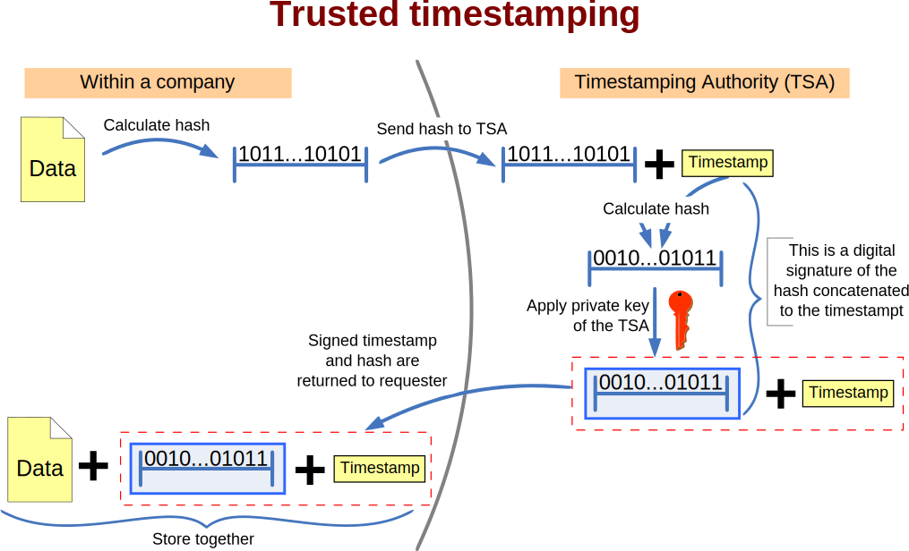

In security monitoring environments, log files are not just activity records; they are often the primary evidence in incident response, threat investigations, and compliance audits. However, without cryptographic protections, logs can be altered, backdated, or tampered with. This may undermine the integrity of your detection pipeline and may compromise forensic investigations or regulatory compliance.

This guide documents a practical, standards-based approach to ensuring **log integrity and proof of existence** using **RFC 3161 cryptographic timestamps**. It applies specifically to **Wazuh server logs**, but the pattern is adaptable to other platforms.

## Problem: Can you prove your logs are untampered?

Standard log rotation and backup practices don’t provide cryptographic proof that a log file:

- Existed at a specific point in time.
- Has not been altered since.

Timestamps from filesystems (`mtime`, `ctime`) are easy to spoof. Even centralized log management cannot prevent insider or post-compromise manipulation without some cryptographic anchor.

While this may not be a security requirement, it could be necessary for compliance in some cases. For instance, [PCI DSS](https://www.pcisecuritystandards.org/standards/pci-dss/) 4.0.1 Req. 10.3.2 says *"Audit log files are protected to prevent modifications by individuals"*. While this generally means creating controls to provide a sufficient level of security for logs at rest, there is still room for improvement.

The Wazuh log archive process contains [a simple checksum operation](https://documentation.wazuh.com/current/getting-started/architecture.html#archival-data-storage). This operation generates a `.sum` file that contains a log file's checksum value generated with multiple algorithms along with the previous file's checksum values under the `Chained checksum:` section.

```shell
cat ossec-archive-02.log.sum
Current checksum:
MD5  (logs/archives/2025/May/ossec-archive-02) = d41d8cd98f00b204e9800998ecf8427e
SHA1 (logs/archives/2025/May/ossec-archive-02) = da39a3ee5e6b4b0d3255bfef95601890afd80709
SHA256 (logs/archives/2025/May/ossec-archive-02) = e3b0c44298fc1c149afbf4c8996fb92427ae41e4649b934ca495991b7852b855

Chained checksum:
MD5  (logs/archives/2025/May/ossec-archive-01.log.sum) = 8605de59af5963c7cdeeac594d01d968
SHA1 (logs/archives/2025/May/ossec-archive-01.log.sum) = bc41fe5cf968d339bdf187fb553ba3d19f3cf4f3
SHA256 (logs/archives/2025/May/ossec-archive-01.log.sum) = d7b3157b8729915865fa6896c2086c02d87aa669151ea7fabf62f5e5abaca082
```

Do you see the issue there? When a user or an attacker tamper with a log file, they can also tamper with the previous checksum file. It is helpful for simple checks but insufficient for complex scenarios by and of itself[^1].

## Solution: RFC 3161 timestamping with OpenSSL

[Trusted timestamping](https://en.wikipedia.org/wiki/Trusted_timestamping) refers to the secure method of recording the creation and modification times of a document. Security in this context implies that no individual, including the document's owner, can alter it once it has been documented, assuming the integrity of the timestamp provider remains intact.

By incorporating a trusted timestamp into code or an electronic signature, a digital assurance of data integrity is provided, along with a reliable date and time for when the transaction occurred. Recipients of documents and code that include a trusted timestamp can confirm when the document or code was digitally or electronically signed, as well as ascertain that it has not been modified since the time the timestamp is confirmed.

If you are a visual thinker, this graph may help you better than any description I can write out[^2]:


We use the Time-Stamp Protocol (TSP) defined in [RFC 3161](https://www.ietf.org/rfc/rfc3161.txt), which allows a client to:

1. Hash a file using SHA-512.
2. Submit the hash to a trusted **Timestamping Authority (TSA)**.
3. Receive a cryptographically signed **Timestamp Response (TSR)** proving that the file existed in that form at that time.

This method:

- Never transmits the log file itself - only its hash.
- Produces portable `.tsr` files that can be verified independently.
- Works with any TSA that supports RFC 3161 (in this article, we use [FreeTSA](https://freetsa.org/)).

## Architecture: How we protect Wazuh archive logs

Wazuh has two formats for archive logging: plain text and JSON. Depending on your configuration, each Wazuh node writes logs to:

```shell
/var/ossec/logs/archives/archives.log      # if you have <logall>yes<\logall> in ossec.conf
/var/ossec/logs/archives/archives.json     # if you have <logall_json>yes<\logall_json> in ossec.conf
```

See [Wazuh documentation](https://documentation.wazuh.com/current/user-manual/manager/event-logging.html#archiving-event-logs) for internals and configuration.
{: .notice--info}

These logs are compressed nightly. Here we begin with a few assumptions to provide a background for log timestamping. You need cheap long-term storage to store logs for archive purposes, and that is not *on* your Wazuh nodes. You can use a dedicated server for this and use SMB or NFS file share. You can make use of a NAS or SAN storage that has NFS file server capabilities. You can push the logs to S3 buckets or S3-compatible solutions. Here, we are assuming a file share mounted on `/archive`- such a creative name!

We need a Bash script that:

- Moves archive logs to the NFS share mount for central retention.
- Renames them as: `YYYY-MM-DD-hostname.log.gz` (e.g., `2025-05-01-node1.log.gz`,`2025-05-01-node1.json.gz`)

This creates one new file per node per day, simplifying inventory and making it easy to track which node produced which file. This script should run on EVERY node. You can use a cron job to run your script daily. Select a suitable time after the logs are compressed by Wazuh.

```cron
0 5 * * * /opt/retention/wazuh-archive.sh
```

You can find this script and the rest in the [accompanying Github repository](https://github.com/zbalkan/wazuh-log-timestamping).
{: .notice--info}

## Integration: How to build the workflow

### Step 1: Timestamp Logs

A cron job runs `sign_all.sh` every night after archive logs are compressed and moved to file share:

```cron
0 7 * * * /opt/timestamping/sign_all.sh
```

- Signs all `.log.gz` files that don't have an associated `.tsr`.
- Stores `.tsr` files in a specified output directory.
- Logs each action in `/var/log/timestamping/sign_all.jsonl`.[^3]

On day one, it signs all historical files. After that, it signs only new files. You can see the action in the logs:

```json
{"timestamp": "2025-05-02T03:00:02Z", "event": "already_signed", "file": "/archives/2025-04-30-node2.json.gz"}
{"timestamp": "2025-05-02T03:00:09Z", "event": "signed", "file": "/archives/2025-05-01-node1.json.gz"}
{"timestamp": "2025-05-02T03:00:18Z", "event": "signed", "file": "/archives/2025-05-01-node2.json.gz"}
{"timestamp": "2025-05-02T03:00:18Z", "event": "task_summary", "details": {"signing": {"total": 717, "signed": 2, "already_signed": 715, "sign_failed": 0}}}
```

I'd like to mention the TSR files briefly. They are DER encoded files. So you cannot just use `cat` to see the content. You can make use of `openssl` as this is what the bash scripts essentially use.

```shell
openssl ts -reply -in  2025-05-01-node2.json.gz.tsr -text

Using configuration from /etc/pki/tls/openssl.cnf
Status info:
Status: Granted.
Status description: unspecified
Failure info: unspecified

TST info:
Version: 1
Policy OID: tsa_policy1
Hash Algorithm: sha512
Message data:
    0000 - df 1b c4 e9 22 58 45 fb-28 cb d5 bc 7e ad 97 fb   ...."XE.(...~...
    0010 - c5 e2 35 b9 30 51 de 5a-75 a0 1c a8 82 36 0c eb   ..5.0Q.Zu....6..
    0020 - 9d 28 f4 ae 63 15 55 fe-f0 d2 20 e8 08 44 67 ee   .(..c.U... ..Dg.
    0030 - 42 fe 4e 85 09 c2 45 b4-f1 4c 5c 00 3a f8 1d 92   B.N...E..L\.:...
Serial number: 0x0678466E
Time stamp: May  2 03:00:18 2025 GMT
Accuracy: unspecified
Ordering: yes
Nonce: 0x2B53CFE3CFD58CB0
TSA: DirName:/O=Free TSA/OU=TSA/description=This certificate digitally signs documents and time stamp requests made using the freetsa.org online services/CN=www.freetsa.org/emailAddress=busilezas@gmail.com/L=Wuerzburg/C=DE/ST=Bayern
Extensions:
```

### Step 2: Verify Logs

Later each day, a second cron job verifies the `.tsr` signatures:

```bash
0 9 * * * /opt/timestamping/verify_all.sh
```

- Verifies integrity of each file using its `.tsr`.
- Logs output to `/var/log/timestamping/verify_all.jsonl`.
- Exits with error codes for missing or failed evidence.

You can also verify more frequently but if you are using a free service like FreeTSA, try not to execute a Denial-of-Service (DoS) against their systems.

These two scripts, `sign_all.sh` and `verify_all.sh` should run on ONLY ONE node of your cluster.
{: .notice--info}

### Step 3: Validate Log Format and Evidence Retention

Each `.tsr` file is specific to one `.log.gz` file. These files must be retained together:

- Original log: `2025-05-01-node1.log.gz`
- Timestamp response: `2025-05-1015-node1.log.gz.tsr`
- TSA certificates: `tsa.crt` and `cacert.pem`

**Without these**, future verification is not possible.

Sample log entry from `verify_all.jsonl`:

```json
{"timestamp": "2025-05-01T05:04:33Z", "event": "verified", "file": "/archives/2025-05-01-node1.log.gz", "details": { "timestamp": "May 01 02:01:29 2025 GMT", "serial": "0x0647C009"}}
```

### Step 4: Configure Wazuh for log collection

To detect failures or tampering attempts within the timestamping pipeline itself, we configured Wazuh to ingest all timestamping logs:

```xml
  <!--Logs for secure file timestamping using RFC 3161-compliant Timestamping Authorities (TSA)  -->
  <localfile>
    <log_format>json</log_format>
    <only-future-events>no</only-future-events>
    <location>/var/log/timestamp/*</location>
    <out_format>{"timestamping": $(log) }</out_format>
    <label key="type">timestamping</label>
  </localfile>
```

This feeds all JSONL logs -such as `sign_all.jsonl`, `verify_all.jsonl`, task summaries, and error reports- directly into the Wazuh event pipeline.

### Step 5: Add custom rules

Wazuh rules inspect the `event` field in each log. For example, a `verify_failed` or `missing_tsr` event may indicate tampering or broken evidence chains.

You can utilize these rules, just remember to update the rule IDs and groups to align your environment:

```xml
<group name="custom,timestamping,">
    <rule id="100000" level="2">
        <decoded_as>json</decoded_as>
        <field name="timestamping.type">timestamping</field>
        <description>Log timestamping event</description>
    </rule>

    <rule id="100001" level="3">
        <if_sid>100000</if_sid>
        <field name="timestamping.event">files_found</field>
        <description>Log timestamping: Timestamp target scan completed, files found.</description>
     </rule>

    <rule id="100002" level="3">
        <if_sid>100000</if_sid>
        <field name="timestamping.event">task_start</field>
        <description>Log timestamping: Timestamp task started.</description>
     </rule>

    <rule id="100003" level="3">
        <if_sid>100000</if_sid>
        <field name="timestamping.event">task_summary</field>
        <description>Log timestamping: Timestamp task completed.</description>
     </rule>

    <rule id="100004" level="2">
        <if_sid>100000</if_sid>
        <field name="timestamping.event">already_signed</field>
        <description>Log timestamping: Log file is already signed.</description>
     </rule>

    <rule id="100005" level="3">
        <if_sid>100000</if_sid>
        <field name="timestamping.event">signed</field>
        <description>Log timestamping: Timestamping succeeded for file.</description>
     </rule>

    <rule id="100006" level="10">
        <if_sid>100000</if_sid>
        <field name="timestamping.event">sign_failed</field>
        <description>Log timestamping: Timestamp operation failed.</description>
     </rule>

    <rule id="100007" level="12" frequency="5" timeframe="60">
        <if_matched_sid>100001</if_matched_sid>
        <description>Log timestamping: Timestamp operation failed multiple times.</description>
    </rule>

    <rule id="100008" level="3">
        <if_sid>100000</if_sid>
        <field name="timestamping.event">verification_ok</field>
        <description>Log timestamping: Timestamp verification succeeded.</description>
     </rule>

    <rule id="100009" level="2">
        <if_sid>100000</if_sid>
        <field name="timestamping.event">missing_evidence</field>
        <description>Log timestamping: Timestamp request (TSR) does not exist for target file.</description>
     </rule>

    <rule id="100010" level="12">
        <if_sid>100000</if_sid>
        <field name="timestamping.event">verification_failed</field>
        <description>Log timestamping: Timestamp verification failed. Check for log tampering.</description>
     </rule>

    <rule id="100011" level="5">
        <if_sid>100000</if_sid>
        <field name="timestamping.event">error</field>
        <description>Log timestamping: Unknown error during timestamp verification.</description>
     </rule>
</group>
```

### Step 6: Build your dashboard (Optional)

The rules above allow the SOC to receive alerts and respond to issues in the evidence lifecycle immediately. But that may not be enough as you may need a better, human-readable monitoring experience. Below you can find a sample dashboard. Since it was tried in a lab environment where I tried signing and verifying multiple times, the numbers are a bit arbitrary. You can build better ones with your creativity.



## Summary

This RFC 3161-based process provides:

- **Cryptographic proof of existence** for each log file
- **Automated verification** of log integrity
- **SIEM integration and alerting** for failures or anomalies

The solution is standards-based, non-intrusive, and requires only minimal infrastructure. It can be extended to other log types, rotated data, or audit artefacts with no change to the core logic.

---
[^1]: There is an open issue for [an integrated trusted timestamping feature](https://github.com/wazuh/wazuh/issues/17290).
[^2]: By Original by Bart Van den Bosch, vector by <a href="https://commons.wikimedia.org/wiki/User:Tsuruya" title="User:Tsuruya">Tsuruya</a> - vectored version of <a href="https://commons.wikimedia.org/w/index.php?title=File:Trusted_timestamping.gif&amp;action=edit&amp;redlink=1" class="new" title="File:Trusted timestamping.gif (page does not exist)">File:Trusted timestamping.gif</a>, <a href="https://creativecommons.org/licenses/by-sa/2.0/be/deed.en" title="Creative Commons Attribution-Share Alike 2.0 be">CC BY-SA 2.0 be</a>, <a href="https://commons.wikimedia.org/w/index.php?curid=21482712">Link</a>
[^3]: I am using `.jsonl` instead of `.json` for the sake of aligning with [JSON Lines format -suggested- conventions](https://jsonlines.org/).
