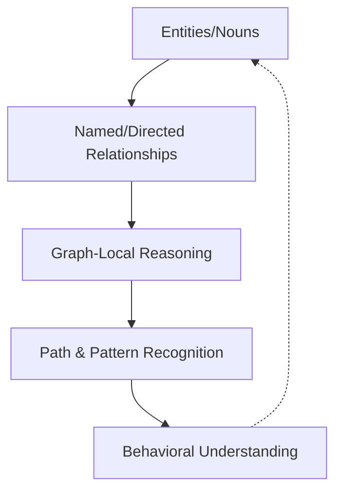

## Introduction

Most professionals become fluent in tables long before they realize it. Rows and columns quietly shape how we think about work, systems, and accountability. From asset inventories to risk registers, from dashboards to audit reports, tabular structures form the backbone of how organizations observe themselves. This fluency is rarely questioned because it works. And for a large class of problems, it works exceptionally well.

At the same time, many modern environments no longer behave like collections of independent items. Digital systems, identity infrastructures, operational platforms, and security landscapes behave more like interconnected networks. Incidents propagate, dependencies compound, and small changes ripple across unexpected paths. When these environments are forced into purely tabular representations, the data may remain correct, yet understanding quietly degrades.

This is not a tooling problem. It’s not really a skills gap either. What usually breaks is the representation itself. Tabular thinking and graph thinking are not competing approaches. They are complementary mental models and communication tools. Each excels at answering different questions, and each fails when applied outside its natural domain. Critical thinking today depends on recognizing which model a problem requires, and on moving deliberately between them. Improving this fluency matters not only for individual understanding, but for how teams align, explain, and decide together.

## Tabular Thinking as a Foundational Skill

Tabular thinking is one of the most stable abstractions we rely on in knowledge work, often without even realizing we are doing it. Long before databases, ledgers imposed order by forcing observations into consistent categories. This discipline survived because, in practice, it worked well enough for most of the problems organizations actually had. It reduced ambiguity, supported accountability, and allowed complex activities to be coordinated at scale. The relational database formalized what practitioners already understood intuitively: explicit structure enables control.

In operational and governance contexts, tabular thinking excels at precision. It defines scope, ownership, thresholds, and compliance boundaries. When a column is clearly defined, interpretation becomes unnecessary. This is why tables dominate finance, compliance, and reporting. These domains reward consistency and punish ambiguity, usually during audits or incidents, when ambiguity suddenly becomes expensive. A control either exists or it does not. A risk is either accepted or escalated. A service either meets its target or fails it.

Cognitively, tables reduce load by externalizing structure. They allow the reader to compare without inference and to aggregate without interpretation. This explains why executives and managers gravitate toward tables. A well-designed table communicates state quickly and predictably. It supports decision-making by removing surprise.

Operationally, tabular thinking is indispensable. Asset inventories, access reviews, service catalogs, KPIs, KRIs, and audit artifacts all rely on it. Without tables, accountability dissolves. Systems cannot be governed if their components cannot be listed, categorized, and measured. Maintaining good tables often surfaces gaps in ownership and scope long before incidents occur.

At the same time, tables embed a quiet assumption: that the most important questions can be answered by inspecting records or aggregating them along predefined dimensions. This assumption holds for many tasks. It breaks down when the question shifts from *what exists* to *how things interact*. Relationships become secondary, flattened into references. Context moves outside the representation.

This limitation is structural, not accidental. Tables are designed to constrain interpretation. As systems grow more interconnected, this constraint becomes a liability. Recursive queries exist, but they are neither intuitive nor communicative. Humans do not naturally think in joins.

Before leaving tabular thinking, it helps to be precise about *how* tables are structured. Tables are not a single content type. They follow distinct patterns, each optimized for a specific kind of meaning. In cybersecurity and GRC, these patterns appear repeatedly, often without being named. Michael Andrews listed [5 common table types](https://storyneedle.com/content-structure-in-tables/), and I provided some IT and cybersecurity related examples for a better understanding.

### Mutual Comparison Tables



In practice, a mutual comparison table answers a very simple question: “How do similar things compare along the same criteria?” Structurally, it follows a hierarchical logic where a single category **($S'$)** defines the common nature of everything being discussed. Each row typically represents a specific subject **($S$)** belonging to that category, while the column headings serve as properties **($P$)** that describe the subjects. The cells at the intersection of a row and column provide the specific values **($V$)** that characterize each subject's individual attributes. Implicitly, the table makes two claims: that each row belongs to the same category, and that each row can be compared meaningfully along the same set of properties.

### Example: Critical Vulnerability Assessment

In this IT Risk Management context, the shared category **($S'$)** is "Active System Vulnerabilities."

| Property ($P$): Threat Level | Property ($P$): CVE ID | Subject ($S$): Vulnerability Name | Property ($P$): Affected System | Property ($P$): Remediation Status |
| --- | --- | --- | --- | --- |
| Critical | CVE-2021-44228 | **Log4Shell** | Web Server Cluster | Patch Pending |
| High | CVE-2024-21413 | **MonikerLink** | Outlook Clients | Fully Mitigated |
| Critical | CVE-2023-38831 | **WinRAR Exploit** | Finance Workstations | In Progress |

* **The Category ($S'$):** Active System Vulnerabilities.
* **The Subjects ($S$):** Specific security flaws like Log4Shell or MonikerLink.
* **The Properties ($P$):** Common identifiers such as CVE IDs, the severity level, and the current status of the fix.
* **The Values ($V$):** The specific data points, such as Critical or Patch Pending, which define the risk for that particular flaw.

### Dimensional Tables



In a Dimensional Table, the structure is focused on a single subject **($S$)** rather than a list of many items, with the table exploring various facets or "dimensions" of that one topic. The organizational logic centers on a **Primary Property ($P'$)**, which is typically the leftmost column and serves as the foundation for all other data in a row. Because this primary property is essential for the other information to exist, it creates a chain of statements: first establishing an instance of the primary dimension (e.g., a specific year or category), and then providing **Secondary Properties ($P''$)** and **Values ($V$)** that describe that specific instance. As shown in the archetypal diagram, the values of the primary property act as the anchor that explains and supports all secondary properties and values within the same row.

### Example: Incident Response Playbook

In an IT Security context, a dimensional table can be used to detail the specific dimensions of a single subject, such as a Data Breach Response Plan.

| Primary Property ($P'$): Response Phase | Secondary Property ($P''$): Key Stakeholders | Secondary Property ($P''$): Required Tools | Value ($O''$): Primary Objective |
| --- | --- | --- | --- |
| **Identification** | SOC Analysts, IT Manager | SIEM, Log Analyzers | Confirm and document the security incident. |
| **Containment** | Network Security, DevOps | Firewalls, EDR | Limit the scope and magnitude of the threat. |
| **Eradication** | Security Engineers | Antivirus, Re-imaging Tools | Remove the root cause and artifacts of the threat. |
| **Recovery** | IT Ops, Business Owners | Backup Systems | Restore systems to normal service safely. |

* **The Subject ($S$):** Data Breach Response Plan.
* **Primary Property ($P'$):** Response Phase. This is the "key column" that defines the relationship of the content; if a phase (like "Containment") didn't exist, the stakeholders and tools associated with it would not be relevant.
* **Secondary Properties ($P''$):** Key Stakeholders and Required Tools. these dimensions are structurally dependent on which phase of the response is being discussed.
* **Values ($V$ or $O''$):** The specific objectives or teams (e.g., SOC Analysts or Limit the scope) that characterize each individual dimension of the plan.

### Alternative List Tables



In an Alternative List Table, the structure focuses on a single overarching subject **($S$)**, but unlike dimensional tables, the properties **($P$)** are independent alternatives rather than interconnected facets. The rows do not share a horizontal relationship; instead, each column acts as an independent list of values **($O$)** that categorize different examples or types of that subject. Because these tables often omit a left-hand "key" column to explain what individual values represent, the logical connection between values in the same row can become ambiguous or entirely non-existent. This lack of explicit labels often requires the reader to rely on surrounding text to determine if items across columns are meant to be direct opposites, related pairs, or merely random examples.

### Example: Access Control Models

In the context of Governance, Risk, and Compliance (GRC), this format is often used to contrast different philosophies of system access under the subject of "Identity and Access Management (IAM)."

| Property ($P$): Mandatory Access Control (MAC) | Property ($P$): Discretionary Access Control (DAC) |
| --- | --- |
| System-enforced security labels | User-defined permissions |
| High-security/Military environments | General business folders |
| Deterministic | Flexible |
| Non-transferable by users | Owner-controlled sharing |

* **The Subject ($S$):** Identity and Access Management (IAM).
* **The Properties ($P$):** MAC and DAC. These are presented as alternative approaches to the same subject.
* **Independence of Rows:** Each row provides a comparison point (e.g., Environment vs. Flexibility), but the table does not have a primary dimension like "Year" or "Phase" that forces these values to exist.
* **Implicit Relationships:** While "System-enforced" and "User-defined" are clear opposites, a reader might need external documentation to understand if "Deterministic" and "Flexible" are the specific technical terms used by the organization to define these alternatives.

### Spectrum Tables



A Spectrum Table is a sophisticated structural hybrid that combines the logical depth of a dimensional table with the categorization found in alternative lists. It is designed to demonstrate how specific properties of a subject **($S$)** vary according to an independent factor, often creating a progression or "spectrum". In this model, the rows represent the primary properties **($P'$)** of the subject, while the column headings represent different levels or alternatives along a spectrum **($P+$ and $P++$)**. This allows the table to show how values **($O$)** change dependently based on which level of the spectrum is being viewed. Unlike brittle marketing tables that hide information, a true spectrum table uses consistent data types across column headings to allow for direct, scalable comparison.

### Example: Service Level Agreements (SLA)

In the IT and Cybersecurity domain, the spectrum table is the standard format for comparing different tiers of a Managed Security Service Provider (MSSP) offering.

| Primary Property ($P'$): Security Feature | Tier 1: Basic ($P+$ ) | Tier 2: Professional ($P++$) | Tier 3: Enterprise ($P+++$) |
| --- | --- | --- | --- |
| **Log Retention** | 30 Days | 90 Days | 365 Days |
| **Response Time (SLA)** | Next Business Day | 4 Hours | 30 Minutes |
| **Monitoring Coverage** | Critical Assets Only | Full Network | Cloud + On-Prem + Mobile |
| **Incident Reporting** | Monthly | Weekly | Real-time Dashboard |

* **The Subject ($S$):** MSSP Service Packages.
* **Primary Properties ($P'$):** These are the constant features offered (Log Retention, Response Time, etc.) that serve as row headings.
* **The Spectrum ($P+, P++$):** The service tiers (Basic, Professional, Enterprise) act as the independent variables that define the columns.
* **The Values ($O$):** The specific deliverables (e.g., 30 Minutes or 90 Days) are dependent variables; they change as you move from left to right along the spectrum of price and service depth.

### Matrix Tables



A Matrix Table is characterized by its bidirectional structure, where row headings **($P_1$)** and column headings **($P_2$)** hold equal logical weight. Unlike tables that prioritize a single subject or primary dimension, a genuine matrix describes two distinct "facets" (Facet X and Facet Y) of a single overarching subject **($S$)**. Every specific value **($O$)** within the table is defined by the intersection of these two properties, meaning each value possesses two independent attributes simultaneously. This structure is often misused in "quasi-matrices" where data only sums or makes sense in one direction; however, a true matrix allows a reader to start with a value and answer two separate, equally important questions about its classification.

### Example: Risk Assessment Matrix

In the field of Governance, Risk, and Compliance (GRC), the most iconic application of this structure is the Risk Heat Map. This matrix is used to determine the "Risk Level" of a specific subject, such as "Cloud Data Migration."

| Facet Y ($P_1$): Probability | Facet X ($P_2$): Low Impact | Facet X ($P_2$): Medium Impact | Facet X ($P_2$): High Impact |
| --- | --- | --- | --- |
| **High Likelihood** | Moderate Risk | High Risk | Critical Risk |
| **Medium Likelihood** | Low Risk | Moderate Risk | High Risk |
| **Low Likelihood** | Informational | Low Risk | Moderate Risk |

* **The Subject ($S$):** Enterprise Risk Assessment.
* **The Facets ($P_1, P_2$):** Probability and Impact are the two facets of the subject. Neither is more important than the other; you cannot determine the final risk level without both.
* **The Intersection:** If we look at the value "Critical Risk," it is defined by two properties: it has a "High Likelihood" (Facet Y) and a "High Impact" (Facet X).
* **Bidirectional Utility:** You can use the table to answer "What happens if a high-impact event is highly likely?" or "What conditions lead to a Critical Risk rating?".

## When Systems Do Not Fit into Tables

Effective table design requires a shift away from ad-hoc, "hand-crafted" layouts toward standardized structures that support long-term business goals. In the realms of ITSM, GRC, and Cybersecurity, this standardization is vital for maintaining clarity. Whether it is a mutual comparison table for vulnerabilities, a matrix for risk, or a spectrum table for service tiers, content engineering ensures that high-stakes data can be reused across multiple reporting channels while maintaining editorial oversight. However, even with perfect standardization, a fundamental limit exists: tables are designed to summarize state, but they struggle to explain behavior.

The inadequacy of a table often surfaces when an environment’s complexity—defined as a function of its size, connectedness, and semi-structure—surpasses the limits of a row-and-column format. Many environments only appear list-like because we document them that way; identity systems and security architectures are often managed as inventories, yet they behave as ecosystems. When systems are highly connected and semi-structured, forcing them into a table suppresses their relational structure. Practitioners sense this gap intuitively when they find themselves manually correlating multiple reports or maintaining diagrams outside of official documentation. These "workarounds" are symptoms of a representational mismatch where the data is correct, but the context is lost.

Graph thinking addresses this mismatch by treating relationships as first-class citizens rather than secondary attributes. In a graph model, meaning is not trapped in a cell; it emerges from the connectivity between nodes and edges. This is not merely a technical storage decision, but a fundamental reasoning shift. By adopting the property graph model—where nodes represent entities like "Users" or "Assets," and named, directed edges represent the "Verbs" of the system—we move away from global scans of isolated records toward a "graph-local" perspective. This allows us to trace influence and follow paths, transforming our documentation from a static list of components into a dynamic map of system behavior.

## Graph Thinking as a First-Class Mental Model

Graph thinking becomes an unavoidable necessity when systems stop behaving like collections of independent items and begin behaving like ecosystems. In practice, this transition tends to happen when three things grow at the same time: size, connectedness, and exceptions. [Ian Robinson](https://iansrobinson.com/)describes this pattern well, but most practitioners recognize it long before they can name it. In the early stages of an IT environment, data is managed within the fixed, predictable schemas of a table. However, as dependencies accumulate and exceptions become the rule, the "connectedness" of the data begins to dominate system behavior. At this tipping point, tabular representations fail because they treat relationships as secondary metadata, such as foreign keys or join tables, rather than first-class citizens. This representational mismatch creates a very real gap in how defenders reason about their own environments. Defenders often end up staring at sorted lists of events, while attackers navigate the same environment by following trust relationships and shortcuts.

As a mental model, graph thinking utilizes the Property Graph Data Model to provide a shared language for this complexity. In this framework, we describe the world through nodes, which represent entities, and edges, which represent relationships. Unlike the generic, unnamed associations found in a spreadsheet, edges in a graph are named and directed, acting as the "verbs" that connect the system’s "nouns." For example, a User node does not simply exist in a list; it OWNS a file, HAS_ACCESS to a server, or AUTHENTICATED_FROM a specific IP address. These relationships can carry their own properties, such as timestamps or levels of trust, allowing for a "schema-free but structured" approach that can accommodate ad-hoc real-world exceptions without breaking the underlying data model.

### Analyzing Systems through Graph Logic

In the analytical phase, graph thinking shifts the focus from global scans and aggregations to "graph-local" reasoning. This is the technical implementation of the "Attacker's Mindset" famously described by [John Lambert](https://www.google.com/search?q=https://medium.com/%40johnlatwc/defenders-think-in-lists-attackers-think-in-graphs-127159549736), who observed that while defenders look at tables of isolated assets, attackers see the specific paths that connect them. This approach allows for the discovery of **Transitive Risk**, which is often mathematically invisible to row-based queries. Tabular thinking excels at "Direct Risk," such as identifying that a specific server has a vulnerability, but graph analysis exposes how an attacker might exploit that vulnerability to gain a credential, then move laterally across the network. By treating authentication, network connections, and shared resources as "edges of trust," graph logic reveals the hidden pathways to high-value targets.

A critical evolution in this analysis, as highlighted by [Marc Maiffret](https://www.darkreading.com/cyber-risk/think-in-graphs-act-on-risk), is the concept of **True Privilege**. In modern hybrid environments where identity is the new perimeter, an account is rarely just a row in an Active Directory list; it is a gateway to dozens of systems spanning on-prem, cloud, and SaaS nodes. Analyzing systems through graphs allows defenders to calculate the "sum" of all access across these environments. In practice, tools like [BloodHound](https://github.com/BloodHoundAD/BloodHound) use this logic to reveal "attack paths" that are invisible in lists, illustrating how a compromised low-level account can traverse multiple relationships to reach a Domain Admin. Similarly, [VirusTotal](https://www.virustotal.com/) allows analysts to "pivot" through a graph of IP addresses and file hashes to find clusters of related malware campaigns that would remain disconnected in a simple row-and-column report.

This "graph-local" reasoning also transforms IT operations, particularly within the Configuration Management Database (CMDB). A tabular CMDB might list a server and its OS, but a graph model maps that Asset to a Process, then to a Service, and finally to an SLA. When a server fails, the graph view allows for immediate Network Impact Analysis, tracing the failure through the web to identify which high-level services are breached. This allows IT teams to respond to millions of interconnected dependencies in milliseconds. Concepts like blast radius, choke points, and transitive risk are native to this perspective, allowing analysts to "spider" through data by following the trail of a process execution chain or a suspicious network flow.

### Presenting Systems as Graphs to Drive Action

The presentation of a graph is far more than a mere illustration; it is a sophisticated communication tool designed to surface hidden assumptions and drive meaningful security outcomes. However, visibility alone does not equal security. As Maiffret warns, even a small organization can generate a graph of millions of nodes and edges, leading to "analysis paralysis." Effective graph presentation must move beyond the chaotic "spaghetti chart" by applying risk-based prioritization. The goal of a graph-based presentation is to turn observations into decisions by highlighting the most dangerous "choose-your-own-adventure" pathways an attacker might take to reach high-value targets. By preserving the relationship context, graphs ensure that an event is only flagged when it deviates from the established neighborhood of a service account or user.



By using relationship-centric narratives, a graph can replace pages of dense technical text. Instead of a long report explaining an identity compromise, a directed graph shows the undeniable flow of an incident from a phishing email to lateral movement. This visual contextualization allows for Remediation Impact analysis, identifying a single mitigation—such as fixing a misconfiguration in the identity infrastructure—that eliminates multiple risk pathways simultaneously. In this sense, the defender eventually "wins" back the list: they generate a prioritized list of actions that were derived from the complex logic of the graph, effectively bridging the cognitive gap that [Alexander Goller](https://microsegment.io/post/2025-05-14-attackers-think-in-graphs/) identifies as the defender's "table prison."

Moreover, presenting systems as graphs allows organizations to externalize hidden structures where "tree assumptions" have silently broken. Many IT and security failures occur precisely where a hierarchy, such as an LDAP directory or an organizational chart, has been bypassed by unofficial "shadow" reporting lines. A graph presentation makes these deviations visible, highlighting the gap between what is documented and how the system actually behaves. When graph literacy becomes an organizational capability, it ensures that different teams—such as SOC, GRC, and DevOps—align their mental models around a shared, accurate representation of reality, allowing them to proactively harden the network before an attacker exploits the web.

### Criticism: Why Graphs Are Not a Silver Bullet

Despite the strategic advantages, it is a mistake to suggest that graph thinking is a "silver bullet" for defenders. While they are a multidimensional evolution of the table, they are functionally different tools, and over-reliance on one can lead to operational failure. First, tables remain the superior tool for managing state—the "nouns" of the network. To know who owns an asset, its patch level, or its department, a table is the most efficient and reliable representation. Suggesting that defenders should only think in graphs ignores the quieter prerequisite: the disciplined, row-based inventory that makes any graph meaningful in the first place. You cannot run an efficient audit against a complex graph; you need the snapshot of accountability that only a table provides.

Second, the cognitive and operational overhead of graphs can be prohibitive. As Maiffret suggests, the volume of graph data can be overwhelming. Without the simplified structure of a table, junior analysts may struggle to make quick, effective decisions. In many cases, the most effective security outcome is a "list generated from a graph"—using the complex multidimensional logic to produce a simple, prioritized list of actions. The final question for any IT or security professional is not which tool is better, but a constant self-interrogation: *"What am I trying to understand right now, and is my current representation helping me see the answer or hiding it?"*

## Conclusion

Critical thinking in modern environments is less about intelligence and more about representation. The same data can produce clarity or confusion depending on how it is structured. Tabular thinking provides discipline, accountability, and precision. Graph thinking provides context, explanation, and foresight.

Neither model is sufficient alone. Tables without graphs hide behavior. Graphs without tables lack control. Fluency in both allows individuals to understand systems as they are and teams to align around shared mental models. Organizations that cultivate this dual fluency tend to respond faster to incidents. More importantly, they understand *why* those incidents happen, which is usually what prevents the next one. The conversation worth having is simple and difficult at the same time: *what are we trying to understand, and is our representation helping us see it—or quietly hiding it?*
