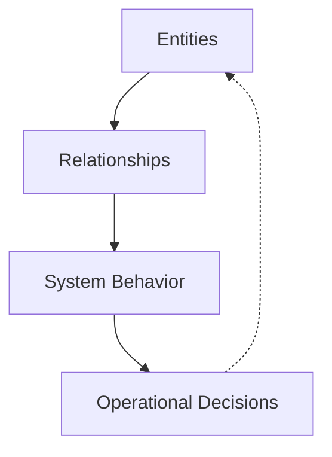

## Introduction

Most professionals become fluent in tables long before they realize it. Rows and columns quietly shape how we think about work, systems, and accountability. From asset inventories to risk registers, from dashboards to audit reports, tabular structures form the backbone of how organizations observe themselves. This fluency is rarely questioned because it works, and for a large class of problems, it works exceptionally well.

At the same time, many modern environments no longer behave like collections of independent items. Digital systems, identity infrastructures, operational platforms, and security landscapes behave more like interconnected networks. Incidents propagate, dependencies compound, and small changes ripple across unexpected paths. When these environments are forced into purely tabular representations, the data may remain correct, yet understanding quietly degrades.

This is not a tooling problem, nor a skills gap in the usual sense. It is a representational mismatch. Tabular thinking and graph thinking are not competing approaches. They are complementary mental models and communication tools. Each excels at answering different questions, and each fails when applied outside its natural domain. Critical thinking today depends on recognizing which model a problem requires, and on moving deliberately between them. Improving this fluency matters not only for individual understanding, but for how teams align, explain, and decide together.

## Tabular Thinking as a Foundational Skill

Tabular thinking is one of the most stable abstractions in knowledge work. Long before databases, ledgers imposed order by forcing observations into consistent categories. This discipline survived because it worked. It reduced ambiguity, supported accountability, and allowed complex activities to be coordinated at scale. The relational database formalized what practitioners already understood intuitively: explicit structure enables control.

In operational and governance contexts, tabular thinking excels at precision. It defines scope, ownership, thresholds, and compliance boundaries. When a column is clearly defined, interpretation becomes unnecessary. This is why tables dominate finance, compliance, and reporting. These domains reward consistency and punish ambiguity. A control either exists or it does not. A risk is either accepted or escalated. A service either meets its target or fails it.

Cognitively, tables reduce load by externalizing structure. They allow the reader to compare without inference and to aggregate without interpretation. This explains why executives and managers gravitate toward tables. A well-designed table communicates state quickly and predictably. It supports decision-making by removing surprise.

Operationally, tabular thinking is indispensable. Asset inventories, access reviews, service catalogs, KPIs, KRIs, and audit artifacts all rely on it. Without tables, accountability dissolves. Systems cannot be governed if their components cannot be listed, categorized, and measured. Maintaining good tables often surfaces gaps in ownership and scope long before incidents occur.

At the same time, tables embed a quiet assumption: that the most important questions can be answered by inspecting records or aggregating them along predefined dimensions. This assumption holds for many tasks. It breaks down when the question shifts from *what exists* to *how things interact*. Relationships become secondary, flattened into references. Context moves outside the representation.

This limitation is structural, not accidental. Tables are designed to constrain interpretation. As systems grow more interconnected, this constraint becomes a liability. Recursive queries exist, but they are neither intuitive nor communicative. Humans do not naturally think in joins.

Before leaving tabular thinking, it helps to be precise about *how* tables are structured. Tables are not a single content type. They follow distinct patterns, each optimized for a specific kind of meaning. In cybersecurity and GRC, these patterns appear repeatedly, often without being named. Michael Andrews listed [5 common table types](https://storyneedle.com/content-structure-in-tables/), and I provided some IT and cybersecurity related examples for a better understanding.

### Mutual Comparison Tables



In a mutual comparison table, the content structure follows a hierarchical logic where a single category **($S'$)** defines the common nature of everything being discussed. Each row typically represents a specific subject **($S$)** belonging to that category, while the column headings serve as properties **($P$)** that describe the subjects. The cells at the intersection of a row and column provide the specific values **($V$)** that characterize each subject's individual attributes. This creates two distinct statements: first, that the subject is a member of the overarching category, and second, that the subject possesses a specific value for a given property.

### Example: Critical Vulnerability Assessment

In this IT Risk Management context, the shared category **($S'$)** is "Active System Vulnerabilities."

| Property ($P$): Threat Level | Property ($P$): CVE ID | Subject ($S$): Vulnerability Name | Property ($P$): Affected System | Property ($P$): Remediation Status |
| --- | --- | --- | --- | --- |
| Critical | CVE-2021-44228 | **Log4Shell** | Web Server Cluster | Patch Pending |
| High | CVE-2024-21413 | **MonikerLink** | Outlook Clients | Fully Mitigated |
| Critical | CVE-2023-38831 | **WinRAR Exploit** | Finance Workstations | In Progress |

* **The Category ($S'$):** Active System Vulnerabilities.
* **The Subjects ($S$):** Specific security flaws like **Log4Shell** or **MonikerLink**.
* **The Properties ($P$):** Common identifiers such as CVE IDs, the severity level, and the current status of the fix.
* **The Values ($V$):** The specific data points, such as **Critical** or **Patch Pending**, which define the risk for that particular flaw.

### Dimensional Tables



In a **Dimensional Table**, the structure is focused on a single subject **($S$)** rather than a list of many items, with the table exploring various facets or "dimensions" of that one topic. The organizational logic centers on a **Primary Property ($P'$)**, which is typically the leftmost column and serves as the foundation for all other data in a row. Because this primary property is essential for the other information to exist, it creates a chain of statements: first establishing an instance of the primary dimension (e.g., a specific year or category), and then providing **Secondary Properties ($P''$)** and **Values ($V$)** that describe that specific instance. As shown in the archetypal diagram, the values of the primary property act as the anchor that explains and supports all secondary properties and values within the same row.

### Example: Incident Response Playbook

In an IT Security context, a dimensional table can be used to detail the specific dimensions of a single subject, such as a **Data Breach Response Plan**.

| Primary Property ($P'$): Response Phase | Secondary Property ($P''$): Key Stakeholders | Secondary Property ($P''$): Required Tools | Value ($O''$): Primary Objective |
| --- | --- | --- | --- |
| **Identification** | SOC Analysts, IT Manager | SIEM, Log Analyzers | Confirm and document the security incident. |
| **Containment** | Network Security, DevOps | Firewalls, EDR | Limit the scope and magnitude of the threat. |
| **Eradication** | Security Engineers | Antivirus, Re-imaging Tools | Remove the root cause and artifacts of the threat. |
| **Recovery** | IT Ops, Business Owners | Backup Systems | Restore systems to normal service safely. |

* **The Subject ($S$):** Data Breach Response Plan.
* **Primary Property ($P'$):** Response Phase. This is the "key column" that defines the relationship of the content; if a phase (like "Containment") didn't exist, the stakeholders and tools associated with it would not be relevant.
* **Secondary Properties ($P''$):** Key Stakeholders and Required Tools. these dimensions are structurally dependent on which phase of the response is being discussed.
* **Values ($V$ or $O''$):** The specific objectives or teams (e.g., **SOC Analysts** or **Limit the scope**) that characterize each individual dimension of the plan.

### Alternative List Tables



In an **Alternative List Table**, the structure focuses on a single overarching subject **($S$)**, but unlike dimensional tables, the properties **($P$)** are independent alternatives rather than interconnected facets. The rows do not share a horizontal relationship; instead, each column acts as an independent list of values **($O$)** that categorize different examples or types of that subject. Because these tables often omit a left-hand "key" column to explain what individual values represent, the logical connection between values in the same row can become ambiguous or entirely non-existent. This lack of explicit labels often requires the reader to rely on surrounding text to determine if items across columns are meant to be direct opposites, related pairs, or merely random examples.

### Example: Access Control Models

In the context of **Governance, Risk, and Compliance (GRC)**, this format is often used to contrast different philosophies of system access under the subject of "Identity and Access Management (IAM)."

| Property ($P$): Mandatory Access Control (MAC) | Property ($P$): Discretionary Access Control (DAC) |
| --- | --- |
| System-enforced security labels | User-defined permissions |
| High-security/Military environments | General business folders |
| Deterministic | Flexible |
| Non-transferable by users | Owner-controlled sharing |

* **The Subject ($S$):** Identity and Access Management (IAM).
* **The Properties ($P$):** MAC and DAC. These are presented as alternative approaches to the same subject.
* **Independence of Rows:** Each row provides a comparison point (e.g., Environment vs. Flexibility), but the table does not have a primary dimension like "Year" or "Phase" that forces these values to exist.
* **Implicit Relationships:** While "System-enforced" and "User-defined" are clear opposites, a reader might need external documentation to understand if "Deterministic" and "Flexible" are the specific technical terms used by the organization to define these alternatives.

### Spectrum Tables



A **Spectrum Table** is a sophisticated structural hybrid that combines the logical depth of a dimensional table with the categorization found in alternative lists. It is designed to demonstrate how specific properties of a subject **($S$)** vary according to an independent factor, often creating a progression or "spectrum". In this model, the rows represent the primary properties **($P'$)** of the subject, while the column headings represent different levels or alternatives along a spectrum **($P+$ and $P++$)**. This allows the table to show how values **($O$)** change dependently based on which level of the spectrum is being viewed. Unlike brittle marketing tables that hide information, a true spectrum table uses consistent data types across column headings to allow for direct, scalable comparison.

### Example: Service Level Agreements (SLA)

In the IT and Cybersecurity domain, the spectrum table is the standard format for comparing different tiers of a **Managed Security Service Provider (MSSP)** offering.

| Primary Property ($P'$): Security Feature | Tier 1: Basic ($P+$ ) | Tier 2: Professional ($P++$) | Tier 3: Enterprise ($P+++$) |
| --- | --- | --- | --- |
| **Log Retention** | 30 Days | 90 Days | 365 Days |
| **Response Time (SLA)** | Next Business Day | 4 Hours | 30 Minutes |
| **Monitoring Coverage** | Critical Assets Only | Full Network | Cloud + On-Prem + Mobile |
| **Incident Reporting** | Monthly | Weekly | Real-time Dashboard |

* **The Subject ($S$):** MSSP Service Packages.
* **Primary Properties ($P'$):** These are the constant features offered (Log Retention, Response Time, etc.) that serve as row headings.
* **The Spectrum ($P+, P++$):** The service tiers (Basic, Professional, Enterprise) act as the independent variables that define the columns.
* **The Values ($O$):** The specific deliverables (e.g., **30 Minutes** or **90 Days**) are dependent variables; they change as you move from left to right along the spectrum of price and service depth.

### Matrix Tables



A **Matrix Table** is characterized by its bidirectional structure, where row headings **()** and column headings **()** hold equal logical weight. Unlike tables that prioritize a single subject or primary dimension, a genuine matrix describes two distinct "facets" (Facet X and Facet Y) of a single overarching subject **()**. Every specific value **()** within the table is defined by the intersection of these two properties, meaning each value possesses two independent attributes simultaneously. This structure is often misused in "quasi-matrices" where data only sums or makes sense in one direction; however, a true matrix allows a reader to start with a value and answer two separate, equally important questions about its classification.

### Example: Risk Assessment Matrix

In the field of **Governance, Risk, and Compliance (GRC)**, the most iconic application of this structure is the **Risk Heat Map**. This matrix is used to determine the "Risk Level" of a specific subject, such as "Cloud Data Migration."

| Facet Y ($P_1$): Probability | Facet X ($P_2$): Low Impact | Facet X ($P_2$): Medium Impact | Facet X ($P_2$): High Impact |
| --- | --- | --- | --- |
| **High Likelihood** | Moderate Risk | High Risk | **Critical Risk** |
| **Medium Likelihood** | Low Risk | Moderate Risk | High Risk |
| **Low Likelihood** | Informational | Low Risk | Moderate Risk |

* **The Subject ($S$):** Enterprise Risk Assessment.
* **The Facets ($P_1, P_2$):** **Probability** and **Impact** are the two facets of the subject. Neither is more important than the other; you cannot determine the final risk level without both.
* **The Intersection:** If we look at the value **"Critical Risk,"** it is defined by two properties: it has a "High Likelihood" (Facet Y) and a "High Impact" (Facet X).
* **Bidirectional Utility:** You can use the table to answer "What happens if a high-impact event is highly likely?" or "What conditions lead to a Critical Risk rating?".

## When Systems Do Not Fit into Tables

Effective table design requires a shift away from ad-hoc, "hand-crafted" layouts that serve only immediate needs toward standardized structures that support long-term business goals and audience comprehension. Too often, tables in technical fields suffer from looking like raw, unedited database exports or idiosyncratic "PowerPoint-style" slides that prioritize visual flair over structural integrity. When tables drop essential explanatory headings or include extraneous, unrelated data, they become untrustworthy and difficult for the audience to use for critical decision-making. By deconstructing existing tables to find recurring patterns and implementing standardized templates, organizations can ensure their data is flexible, easy to update, and consistently interpreted across different contexts.

In the realms of ITSM, GRC, and Cybersecurity, this standardization is vital for maintaining clarity amidst complex technical data. Within Cybersecurity, moving from raw vulnerability logs to standardized mutual comparison tables allows security teams to verify that they are not missing key variables during threat analysis. For GRC professionals, utilizing rigid matrix templates for risk assessments ensures that auditors can trust the bidirectional relationship between probability and impact without the confusion caused by "glib" or poorly labeled marketing-style comparisons. In ITSM, applying spectrum table structures to service catalogs provides a scalable way to present tier variations, ensuring that internal customers understand exactly how service properties change according to the chosen package. Ultimately, content engineering based on these standard structures allows high-stakes IT data to be revised and reused across multiple reporting channels while maintaining full editorial oversight and technical accuracy.

Many environments only appear list-like because we document them that way. Identity systems, operational platforms, and security architectures are often described as inventories, yet they behave as networks. Failures occur not because individual components are unknown, but because their relationships are misunderstood.

Practitioners sense this gap intuitively. Analysts export multiple reports and correlate them manually. Engineers maintain diagrams outside official documentation. Incident responders reconstruct timelines from logs never meant to tell stories. These practices persist because tabular representations suppress relational structure.

Graph thinking addresses this mismatch by treating relationships as first-class. Entities become nodes. Relationships become edges. Meaning emerges from connectivity. This is not a storage decision first; it is a reasoning shift.

## Graph Thinking as a First-Class Mental Model and a Shared Language

Graph thinking becomes unavoidable when systems stop behaving like collections of items and start behaving like ecosystems. This shift rarely happens suddenly. It emerges as environments grow, integrate, and accumulate exceptions. At first, everything still fits into inventories and reports. Over time, relationships dominate behavior.

As a mental model, graph thinking reframes how systems are understood. Instead of asking what exists, it asks how things interact. Instead of listing components, it traces influence. Instead of summarizing state, it explains behavior. Nodes are important, but edges carry meaning.

This is especially visible in security and operations. Incidents are sequences, not points. Attackers move. Failures propagate. Tables can list alerts, but they struggle to express progression. Graphs make progression explicit.

BloodHound illustrates this in identity environments. Active Directory appears manageable in tables. Users, groups, and permissions can all be listed. Breaches occur because attackers exploit *paths*. BloodHound succeeds because it models trust relationships as a graph and exposes attack paths that tables cannot reveal.

VirusTotal applies the same principle to threat intelligence. Indicators gain meaning through relationships. Files, domains, IPs, and campaigns form networks. Analysts pivot, traverse, and cluster. The workflow is inherently graph-based.

Maltego makes this explicit by turning analysis into interactive graph exploration. Entities are added, relationships expanded, hypotheses tested visually. This supports sense-making before conclusions.

A useful clarification anchors this thinking: trees are graphs with constraints. LDAP hierarchies, DNS zones, process trees, and organizational charts are all graphs. Thinking of them as such makes deviations visible. Many failures occur precisely where tree assumptions silently break.

Graph thinking also changes how scale is perceived. In tables, complexity grows with volume. In graphs, it grows with connectivity. A few highly connected nodes often dominate system behavior. Concepts like blast radius, choke points, and transitive risk are native to graphs.

Equally important is graph thinking as a communication tool. Teams often believe they agree because they share data. Graphs surface disagreement early. Missing edges, questionable relationships, and hidden assumptions become visible. A shared graph becomes a shared mental model.

Visual graph representations matter because they externalize structure. They allow teams to reason together. They reduce translation overhead. A graph can replace pages of narrative by making causality visible.

Graph literacy, then, becomes an organizational capability. It does not mean everyone must query graphs. It means knowing when a table will hide behavior and when a graph will reveal it.

A simple meta-example explains graphs by being one:

Graph thinking does not replace tabular discipline. It complements it. Tables verify. Graphs explain. Together, they align representation with reality.

## Conclusion

Critical thinking in modern environments is less about intelligence and more about representation. The same data can produce clarity or confusion depending on how it is structured. Tabular thinking provides discipline, accountability, and precision. Graph thinking provides context, explanation, and foresight.

Neither model is sufficient alone. Tables without graphs hide behavior. Graphs without tables lack control. Fluency in both allows individuals to understand systems as they are and teams to align around shared mental models.

The question is not whether to choose one over the other. It is whether we recognize when each is needed. As systems grow more interconnected, this recognition becomes a core professional skill. The organizations that cultivate it will not just respond faster to incidents. They will understand them better, and often prevent them entirely.

The conversation worth having is simple and difficult at the same time: *What are we trying to understand, and is our representation helping or hiding the answer?*
