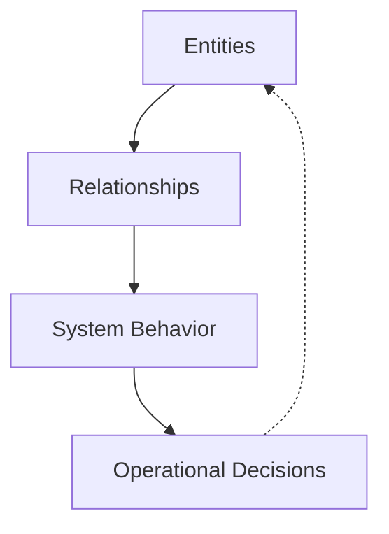

## Introduction

Most professionals become fluent in tables long before they realize it. Rows and columns quietly shape how we think about work, systems, and accountability. From asset inventories to risk registers, from dashboards to audit reports, tabular structures form the backbone of how organizations observe themselves. This fluency is rarely questioned because it works, and for a large class of problems, it works exceptionally well.

At the same time, many modern environments no longer behave like collections of independent items. Digital systems, identity infrastructures, operational platforms, and security landscapes behave more like interconnected networks. Incidents propagate, dependencies compound, and small changes ripple across unexpected paths. When these environments are forced into purely tabular representations, the data may remain correct, yet understanding quietly degrades.

This is not a tooling problem, nor a skills gap in the usual sense. It is a representational mismatch. Tabular thinking and graph thinking are not competing approaches. They are complementary mental models and communication tools. Each excels at answering different questions, and each fails when applied outside its natural domain. Critical thinking today depends on recognizing which model a problem requires, and on moving deliberately between them. Improving this fluency matters not only for individual understanding, but for how teams align, explain, and decide together.

## Tabular Thinking as a Foundational Skill

Tabular thinking is one of the most stable abstractions in knowledge work. Long before databases, ledgers imposed order by forcing observations into consistent categories. This discipline survived because it worked. It reduced ambiguity, supported accountability, and allowed complex activities to be coordinated at scale. The relational database formalized what practitioners already understood intuitively: explicit structure enables control.

In operational and governance contexts, tabular thinking excels at precision. It defines scope, ownership, thresholds, and compliance boundaries. When a column is clearly defined, interpretation becomes unnecessary. This is why tables dominate finance, compliance, and reporting. These domains reward consistency and punish ambiguity. A control either exists or it does not. A risk is either accepted or escalated. A service either meets its target or fails it.

Cognitively, tables reduce load by externalizing structure. They allow the reader to compare without inference and to aggregate without interpretation. This explains why executives and managers gravitate toward tables. A well-designed table communicates state quickly and predictably. It supports decision-making by removing surprise.

Operationally, tabular thinking is indispensable. Asset inventories, access reviews, service catalogs, KPIs, KRIs, and audit artifacts all rely on it. Without tables, accountability dissolves. Systems cannot be governed if their components cannot be listed, categorized, and measured. Maintaining good tables often surfaces gaps in ownership and scope long before incidents occur.

At the same time, tables embed a quiet assumption: that the most important questions can be answered by inspecting records or aggregating them along predefined dimensions. This assumption holds for many tasks. It breaks down when the question shifts from *what exists* to *how things interact*. Relationships become secondary, flattened into references. Context moves outside the representation.

This limitation is structural, not accidental. Tables are designed to constrain interpretation. As systems grow more interconnected, this constraint becomes a liability. Recursive queries exist, but they are neither intuitive nor communicative. Humans do not naturally think in joins.

Before leaving tabular thinking, it helps to be precise about *how* tables are structured. Tables are not a single content type. They follow distinct patterns, each optimized for a specific kind of meaning. In cybersecurity and GRC, these patterns appear repeatedly, often without being named. Michael Andrews listed [5 common table types](https://storyneedle.com/content-structure-in-tables/), and I provided some IT and cybersecurity related examples for a better understanding.

### Mutual Comparison Tables

Mutual comparison tables list multiple subjects that belong to the same category and describe them using shared properties. Each row represents a subject. Each column represents a property. The table asserts both membership in a category and the values of properties for each member. These tables are common in vendor comparisons and control benchmarking.

| Top EDR Tools (Detection Efficacy) | Detection Rate | False Positive Rate | Cost per Endpoint | Analyst Efficiency |
| ---------------------------------- | -------------- | ------------------- | ----------------- | ------------------ |
| CrowdStrike Falcon                 | 99.2%          | 0.4%                | $59.99            | High               |
| SentinelOne                        | 98.5%          | 0.8%                | $54.99            | High               |
| Microsoft Defender                 | 97.8%          | 1.2%                | $42.50            | Medium             |
| VMware Carbon Black                | 96.9%          | 1.5%                | $52.00            | Medium             |

These tables support selection and justification, but they say little about how tools interact once deployed.

### Dimensional Tables

Dimensional tables describe a single subject across a primary varying dimension, often time or maturity. Other properties depend on that primary dimension. These tables are common in framework adoption and program maturity assessments.

| NIST CSF Govern Phase | Policy Maturity | Risk Register Depth | Executive Reporting |
| --------------------- | --------------- | ------------------- | ------------------- |
| Initial               | Ad-hoc          | High-level          | Quarterly           |
| Repeatable            | Standardized    | Asset-linked        | Monthly             |
| Defined               | Integrated      | Quantitative        | Weekly              |
| Managed               | Adaptive        | Predictive          | Real-time           |

They communicate progression clearly, but they assume linearity.

### Alternative List Tables

Alternative list tables present independent options under different headings. The rows are not related. These tables are common in strategy discussions and trade-off analyses.

| GRC Property  | Conservative Approach | Aggressive Approach   |
| ------------- | --------------------- | --------------------- |
| Risk Appetite | Minimal tolerance     | Higher tolerance      |
| Vendor Risk   | Annual audits         | Continuous monitoring |
| Compliance    | Checklist-based       | Outcome-based         |

Without careful labeling, these tables easily imply relationships that do not exist.

### Spectrum Tables

Spectrum tables show how properties vary across an ordered scale. Columns represent levels of maturity or capability. Rows represent features or controls.

| Access Control Maturity | Basic     | Intermediate | Advanced     | Optimized  |
| ----------------------- | --------- | ------------ | ------------ | ---------- |
| Authentication          | Passwords | MFA          | RBAC         | Zero Trust |
| Privilege Mgmt          | Static    | Reviewed     | Just-in-time | Dynamic    |

These tables are useful for roadmaps, but they hide dependencies.

### Matrix Tables

Matrix tables classify subjects across **two equally important dimensions**, where meaning exists only at their intersection. Neither axis dominates the interpretation. In cybersecurity, the most familiar example is the **risk assessment matrix**, which maps likelihood against impact. Risk cannot be evaluated by probability alone or severity alone; it only becomes meaningful when both are considered together. This structure makes the matrix a powerful coordination tool. Executives, security leaders, and auditors can discuss prioritization using a shared language without requiring deep technical context, which explains why this model appears consistently across frameworks, standards, and regulatory guidance.

| Likelihood \ Impact | Low Impact | Medium Impact | High Impact | Critical Impact |
| ------------------- | ---------- | ------------- | ----------- | --------------- |
| Rare                | Low        | Low           | Medium      | Medium          |
| Possible            | Low        | Medium        | High        | High            |
| Likely              | Medium     | High          | High        | Critical        |
| Almost Certain      | High       | Critical      | Critical    | Critical        |

At the same time, the risk matrix reveals the natural boundary of classification-based thinking. It assumes risks are independent, static, and comparable in isolation. Two risks placed in the same cell may behave very differently once shared assets, identity relationships, or cascading failures are considered. The matrix helps organizations agree on *what matters most*, but it does not explain *how risk moves through the system*. That gap is not a flaw in the model; it is a signal that classification has done its job and a relational model—graph thinking—is required next.

Tabular thinking, across all these forms, is essential. It enforces discipline. The risk lies in expecting it to explain systems whose behavior emerges from interaction rather than accumulation.

## When Systems Stop Being Lists

Many environments only appear list-like because we document them that way. Identity systems, operational platforms, and security architectures are often described as inventories, yet they behave as networks. Failures occur not because individual components are unknown, but because their relationships are misunderstood.

Practitioners sense this gap intuitively. Analysts export multiple reports and correlate them manually. Engineers maintain diagrams outside official documentation. Incident responders reconstruct timelines from logs never meant to tell stories. These practices persist because tabular representations suppress relational structure.

Graph thinking addresses this mismatch by treating relationships as first-class. Entities become nodes. Relationships become edges. Meaning emerges from connectivity. This is not a storage decision first; it is a reasoning shift.

## Graph Thinking as a First-Class Mental Model and a Shared Language

Graph thinking becomes unavoidable when systems stop behaving like collections of items and start behaving like ecosystems. This shift rarely happens suddenly. It emerges as environments grow, integrate, and accumulate exceptions. At first, everything still fits into inventories and reports. Over time, relationships dominate behavior.

As a mental model, graph thinking reframes how systems are understood. Instead of asking what exists, it asks how things interact. Instead of listing components, it traces influence. Instead of summarizing state, it explains behavior. Nodes are important, but edges carry meaning.

This is especially visible in security and operations. Incidents are sequences, not points. Attackers move. Failures propagate. Tables can list alerts, but they struggle to express progression. Graphs make progression explicit.

BloodHound illustrates this in identity environments. Active Directory appears manageable in tables. Users, groups, and permissions can all be listed. Breaches occur because attackers exploit *paths*. BloodHound succeeds because it models trust relationships as a graph and exposes attack paths that tables cannot reveal.

VirusTotal applies the same principle to threat intelligence. Indicators gain meaning through relationships. Files, domains, IPs, and campaigns form networks. Analysts pivot, traverse, and cluster. The workflow is inherently graph-based.

Maltego makes this explicit by turning analysis into interactive graph exploration. Entities are added, relationships expanded, hypotheses tested visually. This supports sense-making before conclusions.

A useful clarification anchors this thinking: trees are graphs with constraints. LDAP hierarchies, DNS zones, process trees, and organizational charts are all graphs. Thinking of them as such makes deviations visible. Many failures occur precisely where tree assumptions silently break.

Graph thinking also changes how scale is perceived. In tables, complexity grows with volume. In graphs, it grows with connectivity. A few highly connected nodes often dominate system behavior. Concepts like blast radius, choke points, and transitive risk are native to graphs.

Equally important is graph thinking as a communication tool. Teams often believe they agree because they share data. Graphs surface disagreement early. Missing edges, questionable relationships, and hidden assumptions become visible. A shared graph becomes a shared mental model.

Visual graph representations matter because they externalize structure. They allow teams to reason together. They reduce translation overhead. A graph can replace pages of narrative by making causality visible.

Graph literacy, then, becomes an organizational capability. It does not mean everyone must query graphs. It means knowing when a table will hide behavior and when a graph will reveal it.

A simple meta-example explains graphs by being one:

Graph thinking does not replace tabular discipline. It complements it. Tables verify. Graphs explain. Together, they align representation with reality.

## Conclusion

Critical thinking in modern environments is less about intelligence and more about representation. The same data can produce clarity or confusion depending on how it is structured. Tabular thinking provides discipline, accountability, and precision. Graph thinking provides context, explanation, and foresight.

Neither model is sufficient alone. Tables without graphs hide behavior. Graphs without tables lack control. Fluency in both allows individuals to understand systems as they are and teams to align around shared mental models.

The question is not whether to choose one over the other. It is whether we recognize when each is needed. As systems grow more interconnected, this recognition becomes a core professional skill. The organizations that cultivate it will not just respond faster to incidents. They will understand them better, and often prevent them entirely.

The conversation worth having is simple and difficult at the same time: *What are we trying to understand, and is our representation helping or hiding the answer?*
