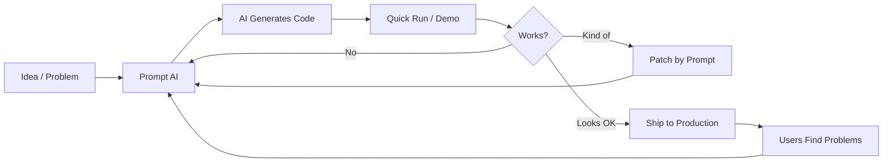

Walk through a casino and you will see rows of slot machines. Someone sits down, pulls the lever, watches the reels spin, and waits for the result. Most of the time nothing happens. Occasionally a small win appears. Rarely, the machine pays out. If the outcome is disappointing, the response is simple: pull the lever again.

Working with AI development tools can sometimes resemble this pattern more than many engineers are comfortable admitting. A prompt produces code, a design suggestion, or a configuration. The output might be close to what was intended, or it might miss the mark entirely. When that happens, the natural reaction is to adjust the prompt and try again. After several attempts, something that appears workable often emerges.

While the slot-machine analogy is useful, in practice AI-assisted development behaves less like pure randomness and more like a **guided stochastic search under constraints**. The model operates within defined parameters and optimization boundaries. Even so, the external behavior can resemble repeated attempts until something acceptable appears.
{: .notice--info}

At a superficial level, this resembles productivity. Iteration accelerates, output increases, and systems appear faster to build. Yet software engineering has never been evaluated by whether a system can eventually be generated. The discipline emerged because engineers learned that systems which merely appear to work often fail once they encounter real operating conditions. The central question has always been whether a system behaves predictably under constraints and whether other teams can depend on it once it becomes part of a larger environment. Understanding that distinction matters when discussing AI-assisted development.

Below is a diagram for what I have observed with some vibe coders:

## Some History

Much of the current excitement around AI-assisted development centers on speed. Code generation is faster, design alternatives can be explored quickly, and prototypes can appear with far less manual effort than before. These capabilities are real, and in many cases they are genuinely useful.

Where the discussion becomes more complicated is when speed begins to be interpreted as evidence that earlier engineering practices are becoming unnecessary. It is increasingly common to hear claims that the traditional development lifecycle is collapsing, that stages such as design and testing can be compressed into a single loop of generation and validation, or that structured development processes belong to a slower era of software development.

This interpretation overlooks why those practices appeared. The Software Development Lifecycle did not emerge because engineers preferred process to creativity. It emerged because software projects repeatedly failed when development relied primarily on iteration and intuition.

Early software systems were comparatively small and operated in tightly controlled environments. Programs were often written by the same people who ran them, and informal practices were usually sufficient because the consequences of failure were limited. That situation changed during the 1960s as organizations began commissioning systems whose complexity exceeded the methods used to build them. Systems grew larger, dependencies multiplied, and failures became more costly. Projects ran over budget, schedules slipped, and deployed systems sometimes failed in ways that were difficult to correct. These patterns became widely known as the software crisis.

The response was not simply to write code more quickly. Engineers began introducing structure into how systems were specified, designed, verified, and deployed. Over time those practices evolved into what we now describe as the Software Development Lifecycle. Seen from this perspective, the SDLC is less a rigid sequence of stages and more an accumulation of lessons about how complex systems fail.

## Why the SDLC Exists

The SDLC did not emerge fully formed as a predefined framework. It developed gradually as engineers discovered which practices prevented particular classes of failure. Requirements practices appeared because teams were building systems that did not match the needs they were supposed to solve. Architecture reviews emerged because structural design mistakes were expensive to correct once implementation had begun. Testing became formalized because defects discovered in production were disruptive and costly. Change and release controls appeared because uncontrolled updates could destabilize operational systems. Monitoring eventually became essential because even well-tested systems behave differently once they encounter real environments.

Viewed this way, the SDLC is not simply a workflow but a **formal risk management model**. It is a collection of controls that exist because particular risks occur often enough to justify preventing them. These controls implicitly map to risk classes such as requirements risk, structural risk, and operational risk.

Modern governance frameworks follow a similar logic. NIST’s Risk Management Framework integrates risk considerations directly into the system lifecycle, and COBIT approaches enterprise IT governance as the coordination of objectives, resources, and risk. The principle behind both is straightforward: technology risk does not disappear simply because systems become easier to build.

On the other hand, AI-assisted development clearly changes how software can be produced. It reduces the effort required to generate code, helps developers explore alternative approaches quickly, and allows teams to move from idea to prototype much faster than before. What it does not change are the underlying risks.

Systems can still be built against incorrect requirements. Architectures can still fail under real workloads. Implementations can still contain vulnerabilities. Deployments can still disrupt production environments. Systems can still become difficult to maintain. Those risks existed before AI and they remain today. If the risks remain, the need for controls remains as well.

This leads to a simple observation. Controls exist because certain failures occur often enough to justify preventing them. Removing a control while the underlying risk remains does not eliminate the risk. It simply makes the system harder to govern.

Looking at the lifecycle through the lens of risk control clarifies the situation.

| SDLC Control Area         | Risk Mitigated                               | Status in AI Development | Concern                                                |
| ------------------------- | -------------------------------------------- | ------------------------ | ------------------------------------------------------ |
| Requirements governance   | Building the wrong system                    | Still exists             | AI can implement unclear requirements quickly          |
| Requirements traceability | Weak linkage between need and implementation | Still exists             | Generated artifacts may lack traceability              |
| Architecture review       | Structural design flaws                      | Still exists             | Pattern-based designs may ignore real constraints      |
| Secure design review      | Insecure trust boundaries                    | Still exists             | Generated designs may repeat insecure patterns         |
| Secure implementation     | Coding vulnerabilities                       | Still exists             | AI-generated code may include known flaws              |
| Static analysis           | Undetected defects                           | Still exists             | Code volume may exceed review capacity                 |
| Dependency governance     | Supply-chain risk                            | Still exists             | Generated solutions may introduce unknown dependencies |
| Testing and verification  | Functional defects                           | Still exists             | Generated tests may mirror code assumptions            |
| Independent verification  | Correlated validation failure                | Often weaker             | Code and tests may originate from the same model       |
| Code review               | Unsafe changes                               | Still exists             | Developers may not fully understand generated code     |
| Release management        | Operational instability                      | Still exists             | Faster generation increases deployment pressure        |
| Monitoring                | Undetected failures                          | Still exists             | Higher change velocity increases reliance on detection |

AI reduces the marginal cost of code generation, but not system entropy or operational complexity.

Another issue involves assurance. Traditional lifecycle practices produce evidence: traceability between requirements and tests, review records, design decisions, and defect metrics. These artifacts allow organizations to reason about whether a system has been properly validated.

Many AI-assisted workflows do not yet produce equivalent evidence consistently. In practice, this often introduces the risk of **correlated validation failure**, where both the generated code and its corresponding tests originate from the same model and may overlook the same flaws.

The issue is not that AI-generated systems cannot work. The issue is that quality becomes harder to measure when development accelerates while assurance evidence becomes thinner.

## Concrete Failure Scenario: Misconfigured Cloud Infrastructure

Consider a simple but realistic scenario. A developer uses an AI tool to generate a cloud infrastructure configuration for a new microservice. The prompt is vague, and the generated configuration includes a security group rule that opens port 22 (SSH) to the internet (0.0.0.0/0).

The system functions correctly. It deploys, responds to requests, and passes basic validation. However, it violates a fundamental security assumption. Without architecture review or secure design validation, the issue remains undetected until it is exploited or discovered during audit.

This is not a failure of generation speed. It is a failure of missing controls.

## Does a practical middle ground exist?

A more practical middle ground, at least in my experience, is to integrate AI into the lifecycle without removing control points.

Human review should follow initial AI-generated artifacts to assess correctness, constraints, and security implications. Automated analysis and testing should be embedded in CI/CD pipelines. Independent verification, distinct from AI-generated tests, becomes more important, not less.

At each stage, evidence should be produced and retained. Review decisions, validation results, and test coverage still matter because they are the basis for trust.

This approach does not eliminate error. It reduces the likelihood that errors propagate unchecked.

The example above is an obvious failure caused by missing controls. More concerning are the less visible ones.

When AI tools generate logic and data flows, reviewers may lack sufficient context to fully understand the implications of changes. This can degrade the shared mental model within a team.

Over time, systems may remain functional but become harder to reason about, harder to review, and harder to safely modify. In practice, this loss of clarity appears to be a natural consequence of how these systems are produced rather than an isolated mistake.

## Another risk in the shadows

AI development tools lower the barrier for creating systems outside formal governance structures. Organizations have always struggled with [shadow IT](https://en.wikipedia.org/wiki/Shadow_IT) because teams will build solutions when official processes move too slowly. AI makes that easier.

Applications and integrations can now be assembled quickly with minimal effort. Some will solve legitimate problems. Others will accumulate risk. From an operational perspective, these systems often lack ownership, documentation, and architectural consistency. They introduce technical debt and integration complexity. From a security perspective, they expand the attack surface, introduce inconsistent controls, and create audit and compliance challenges.

The speed of generation amplifies both outcomes.

## Conclusion

Part of the current enthusiasm around AI development is driven by novelty. It is still remarkable to see systems generate code, workflows, and architectures that previously required much more manual effort. But software engineering has never been judged by whether something can be produced once.

The real question is whether the result can be trusted over time.

- Can the system be maintained?
- Can it be secured?
- Can it be understood by the teams responsible for operating it?
- Can its quality be measured in a credible way?

Those questions matter more than the novelty of generation. AI will almost certainly become part of everyday engineering practice. What does not change is the underlying reality: the risks are still there, and if the risks remain, the controls must remain as well.
