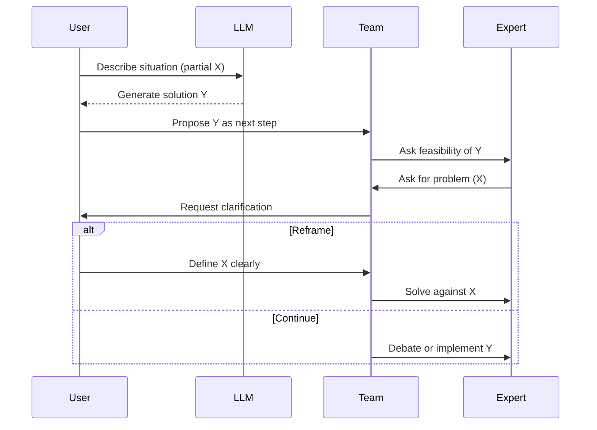

The XY problem is not new. It has been part of engineering discussions for years, and it is usually described in a simple way: someone has a problem X, assumes a solution Y, and asks how to implement Y instead of explaining X. The definition at [xyproblem.info](https://xyproblem.info/) puts it directly: "user wants to do X, thinks solution Y will work, and asks about Y instead of X." The pattern itself has not changed. What has changed is how often it now appears, and how far it travels before it is questioned.

Large language models generate text. They produce structured responses across many domains, and that makes them accessible to people without a background in IT, system administration, or software development. A question is asked, and an answer appears that looks complete. It often includes steps, options, and trade-offs. The output reads like something that has already been thought through. That is usually enough to move a discussion forward, even when the underlying problem is not clearly defined.

The change is not in the structure of the XY problem, but in its scale. Producing a plausible Y is now trivial. More importantly, that Y carries a certain weight because of how it is presented. It is formatted, confident, and immediately actionable. It can be copied into a ticket, dropped into a chat, or presented in a meeting without much friction. An assumption that would previously stay local now propagates. By the time it is questioned, it may already be in progress.

In practice, the sequence is predictable. A problem occurs, but it is not articulated. Instead, a query is sent to a model. The model produces candidate solutions. One of them is selected, usually because it looks concrete. That solution is then brought into the organisation and handed over for implementation. At that point, the discussion is already anchored on Y, while X remains implicit, fragmented, or missing entirely.

This shows up in routine communication more often than it should. A message appears in a team chat asking whether a specific feature should be enabled because "it improves detection." There is no description of what is currently not being detected, no indication of gaps, and no context around the environment. The discussion starts with the feature.

A ticket suggests migrating a service to a different platform because it "scales better." There is no evidence of load, no constraints identified, and no operational issue described. The implementation discussion begins anyway.

In a meeting, a recommendation is made to introduce caching for performance. When asked where the latency is, or what the baseline is, the answers are unclear. The solution is specific, but the problem is not.

These are not edge cases. They are small, daily examples of the same pattern. The presence of a structured answer shifts the centre of gravity. Instead of asking what is happening, the discussion moves toward whether the proposed solution should be accepted, modified, or rejected.

At some point, someone asks a simple question: what problem are we solving? By then, the conversation is already shaped around Y. The model output becomes a reference point, and it often needs to be challenged before the original problem can be reconstructed. That is the inversion. Instead of validating a solution against a problem, the problem has to be rediscovered from the solution.

This is not about models being right or wrong. It is about missing context. LLMs do not see the system they are being applied to. They do not see constraints, dependencies, or previous decisions. Those exist outside the prompt. The output fills the gaps with something plausible, and plausibility is often enough to move work forward.

The correction is straightforward, but it requires discipline. Ask for the problem. Paraphrase it. Separate assumptions from requirements. Make constraints explicit. Validate the problem before discussing solutions. The guidance from xyproblem.info still applies because the underlying issue has not changed.

What has changed is the rate at which Y appears, and the distance it travels before someone asks about X.

The corrective action remains the same. Identify X first. Then decide whether Y is relevant.
