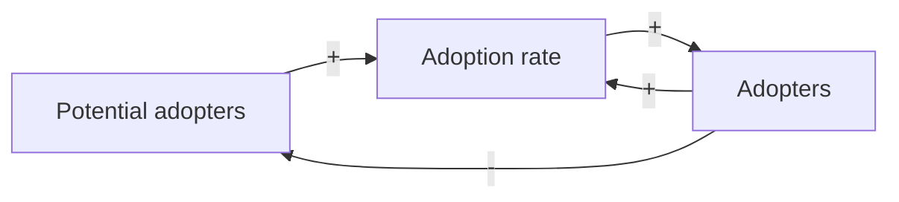
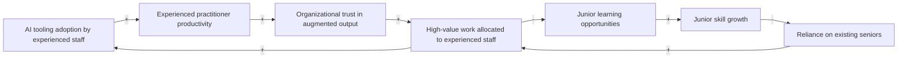
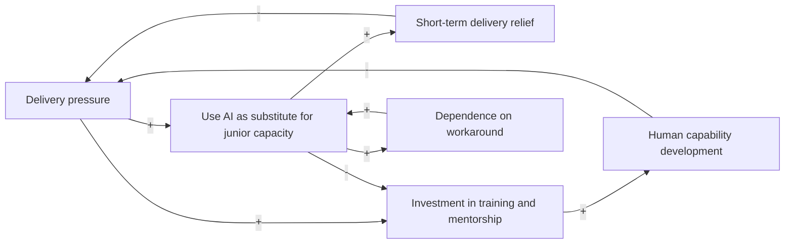
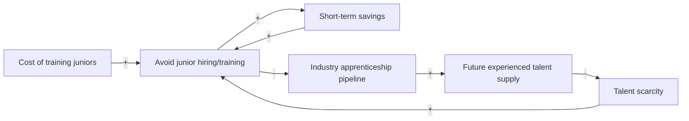
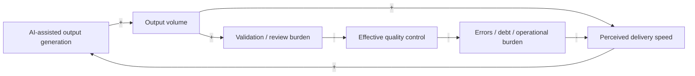

If you have spent enough time in software engineering, cybersecurity, IT, or adjacent technical fields, you have likely encountered the familiar joke that companies want a junior with ten years of experience. The joke persists because it reflects something uncomfortably real. Many organizations have long wanted entry-level hires who arrive partially trained, operationally useful from day one, and somehow still available at junior salaries. The economics behind that expectation are obvious enough: training people is expensive, mentoring consumes senior time, and building apprenticeship capacity often slows teams down before it speeds them up. If someone else can absorb those costs first, the individual firm benefits.

None of this is new. The underinvestment in junior talent predates the current AI wave by many years, and most practitioners already understand the problem intuitively. They may not describe it formally, but they recognize the symptoms: unrealistic expectations for junior roles, shrinking entry-level opportunities, inflated "entry-level" requirements, and organizations quietly hoping the labor market will continue producing experienced practitioners they did not have to develop themselves. What AI changes is not the existence of this dynamic, but the economics and intensity of it. If these incentives persist, the trajectory is not encouraging: organizations may preserve short-term output while weakening the apprenticeship pipeline that produces future experienced practitioners.

This is not an attempt to argue that AI has created a new workforce problem, nor is it an attempt to present some novel revelation about technical hiring. The issue is widely recognized. The value in discussing it through system dynamics is narrower and more practical: to describe the structural feedback mechanisms through which AI may accelerate an already familiar problem. Once the feedback structure of a system is understood, its long-term behavior becomes easier to reason about, and the consequences of local optimization become easier to identify before they fully materialize.

## A systemic perspective for the problem: archetypes

System dynamics studies how systems behave over time based on their internal feedback structures. Rather than analyzing isolated decisions, it examines how decisions interact, reinforce one another, or produce delayed effects elsewhere in the system. One of its core tools is the causal loop diagram, or CLD. A CLD maps variables and the causal relationships between them. A positive relationship means two variables tend to move in the same direction, while a negative relationship means they move in opposite directions. From those relationships emerge feedback loops. Some reinforce change and amplify movement, while others constrain it and stabilize the system. Over time, practitioners of system dynamics observed that certain feedback structures recur across very different domains. These recurring structural patterns are commonly referred to as archetypes. The argument of this article is straightforward: the current AI-driven pressure to reduce junior hiring appears to fit several known archetypes associated with delayed systemic degradation.

Software engineering provides the clearest illustration, but the same logic extends well beyond development. Cybersecurity has analogous apprenticeship paths through SOC analysis, junior detection engineering, operational security roles, and similar early-career positions. The broader issue is therefore not about junior developers specifically, but about the erosion of apprenticeship pipelines in knowledge work more generally.

Before discussing the archetypes, it is useful to establish how a causal loop diagram is read. Consider a simple adoption model. As more people adopt a product or idea, adoption may accelerate through word of mouth or network effects. At the same time, the more adoption occurs, the fewer potential adopters remain. One dynamic reinforces growth while the other constrains it.

The purpose of a CLD is not numerical prediction but structural understanding. It helps explain why systems behave as they do by visualizing the feedback mechanisms embedded within them. With that foundation established, we can examine the apprenticeship problem through several common archetypes.

### Success to the Successful

The **Success to the Successful** archetype describes systems where advantage compounds because resources flow toward those already performing well. In the context of AI-assisted knowledge work, this dynamic is particularly relevant because AI tends to benefit experienced practitioners more than inexperienced ones. A senior engineer, analyst, or operator can often use AI effectively because they possess the surrounding judgment required to validate output, identify errors, refine prompts, and integrate results into broader context. A junior lacks much of that judgment and therefore cannot leverage the tool in the same way.

This creates an asymmetry. The more AI improves the productivity of experienced personnel, the more trust organizations place in their output, and the more high-value work they allocate to them. As that work concentrates around already-capable staff, juniors receive fewer opportunities to learn by doing. With fewer meaningful opportunities, junior skill growth slows, which in turn increases organizational reliance on existing senior staff. The visible gain is productivity. The hidden cost is reduced capability formation.

### Shifting the Burden

The **Shifting the Burden** archetype appears when organizations rely on symptomatic fixes instead of addressing structural causes. Many firms struggle with junior productivity not because juniors are inherently ineffective, but because their internal systems for developing them are poor. Weak onboarding, inconsistent mentorship, inadequate documentation, poor engineering discipline, and chaotic delivery processes all make junior development harder than it needs to be.

AI offers a convenient workaround. Rather than improving the environment so less experienced personnel can become productive more quickly, firms can use AI to reduce perceived dependence on juniors altogether. This alleviates immediate delivery pressure while leaving the underlying developmental weakness untouched. Over time, the organization may become more dependent on the workaround while its underlying ability to build human capability declines.

### Tragedy of the Commons

The **Tragedy of the Commons** describes systems where individually rational actions degrade a shared resource. In this case, the shared resource is the industry-wide apprenticeship pipeline. Every organization benefits from experienced practitioners existing in the labor market, but producing experienced practitioners requires someone to hire and train inexperienced ones.

Training juniors is expensive, and avoiding that expense is individually rational. If experienced practitioners become more productive through AI augmentation, the economic case for avoiding junior hiring strengthens further. Each individual firm can conclude that it is more efficient to hire experienced talent later than to develop it internally. No single company intends to degrade the labor market. Yet if enough firms follow the same logic, the market’s future supply of experienced talent declines anyway.

### Limits to Growth

The **Limits to Growth** archetype describes systems where reinforcing gains eventually encounter delayed balancing constraints. AI can increase output, sometimes substantially, but raw output has rarely been the only constraint in technical work. Software delivery, security operations, and similar disciplines remain bounded by review, validation, architecture, governance, testing, maintenance, and operational ownership.

If AI increases production faster than organizations can review and govern that production, the bottleneck simply moves elsewhere. Organizations may therefore mistake local throughput gains for sustainable systemic productivity improvements. The system appears to accelerate until balancing constraints assert themselves in the form of quality degradation, technical debt, or governance overload.

### Reflection

None of this is a novel complaint. Most practitioners already understand some version of the problem. They know organizations often want underpaid experience, avoid mentorship overhead, and rely on someone else to produce trained talent. The value of system dynamics is not that it reveals this reality for the first time, but that it explains why the pattern persists despite being widely recognized.

Each individual decision appears rational in isolation. Hiring fewer juniors improves short-term margins. Using AI to augment experienced staff increases immediate output. Expecting candidates to arrive partially trained reduces onboarding costs. The problem emerges when everyone behaves this way inside the same labor ecosystem.

AI does not need to fully replace junior roles for this to matter. It only needs to shift the economics enough to further weaken already-fragile apprenticeship incentives. If that happens, the long-term consequence may not be that AI replaced junior workers outright. It may instead be that the industry consumed more of its future talent-production capacity in exchange for present efficiency.

## Conclusion

The junior talent crisis in technical fields is not new, and AI did not create it. What AI does is strengthen many of the incentives that produced it. This is not a certain forecast, but it is a reasonable projection from the feedback structures: if organizations continue optimizing for present throughput while externalizing the cost of talent development, the apprenticeship pipeline weakens.

That matters because technical capability is not produced instantly. It is accumulated over years through supervised exposure, repetition, failure, correction, and gradual transfer of judgment from experienced practitioners to new ones. Once that pipeline degrades, rebuilding it is neither quick nor cheap. By the time the shortage becomes visible enough for everyone to acknowledge, the corrective actions may take years to bear fruit.

The most dangerous systemic failures are often not caused by dramatic disruption, but by slow erosion of the processes that quietly sustain the system. If AI is used primarily to remove the need to train the next generation, then the industry may discover too late that it optimized away part of the mechanism that produces future expertise.
