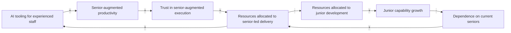
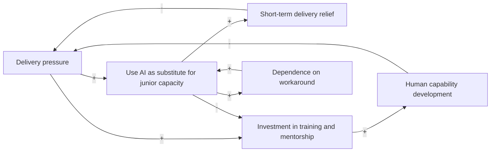
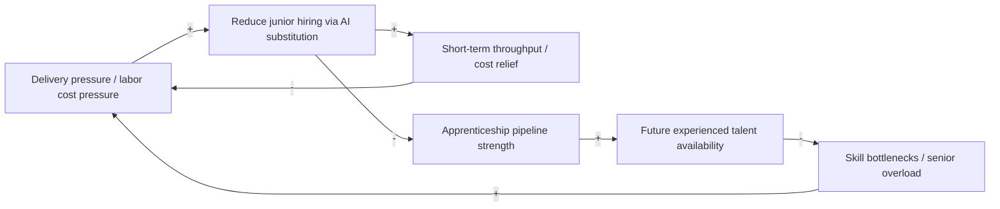
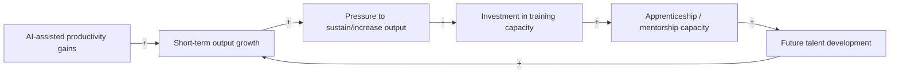

If you have spent enough time in software engineering, cybersecurity, IT, or adjacent technical fields, you have likely heard the familiar joke that companies want a junior with ten years of experience. The joke survives because it reflects something real. Many organizations have long wanted entry-level hires who arrive partially trained, useful from day one, and still cheap enough to classify as junior. The economics are obvious enough: training people costs money, mentoring consumes senior time, and building apprenticeship capacity usually slows teams down before it speeds them up. If someone else can absorb those costs first, the individual firm benefits.

None of this is new. The underinvestment in junior talent predates the current AI wave by many years, and most practitioners already understand the pattern intuitively. They may not describe it formally, but they recognize the symptoms: unrealistic requirements for junior roles, shrinking entry-level opportunities, inflated “entry-level” expectations, and organizations quietly hoping the labor market will keep producing experienced practitioners they did not have to develop themselves.

What AI changes is not the existence of this dynamic, but the economics and intensity of it.

That point needs a qualification. The recent weakness in technology hiring should not be lazily attributed to AI alone. A significant portion of the post-2022 contraction is more plausibly explained by pandemic-era overhiring, macroeconomic tightening, and general normalization after an unusually expansionary labor market. Broad IT employment data does not support the claim that AI has already caused a general collapse in technical employment. But aggregate employment can remain stable while the underlying structure deteriorates. A system may look healthy in headline numbers while the composition of hiring shifts in ways that weaken its future.

That is the concern here. This is not an argument that AI has already broken the workforce. It is an argument that current trends may be reinforcing incentives that degrade the apprenticeship pipeline over time.

Some labor-market signals point in that direction. [Indeed Hiring Lab](https://www.hiringlab.org/2025/07/30/experience-requirements-have-tightened-amid-the-tech-hiring-freeze/) found that senior and manager-level tech postings were down 19% from pre-pandemic levels in early 2025, while standard and junior titles were down 34%, and the share of tech postings requiring at least five years of experience rose from 37% to 42% between Q2 2022 and Q2 2025. [SignalFire’s 2025 State of Tech Talent Report](https://www.signalfire.com/blog/signalfire-state-of-talent-report-2025) reports that new-graduate hiring at Big Tech has fallen by more than 50% from 2019 levels, with new graduates now accounting for only 7% of hires. [Lightcast’s Q2 2024 Cybersecurity Talent Report](https://lightcast.io/resources/research/quarterly-cybersecurity-talent-report-june-24) shows a similar “hollow middle” pattern in cybersecurity: surplus at the entry level, shortages in the mid-career band. None of this proves an inevitable future shortage. It does suggest that the pipeline is becoming more fragile.

This is not an attempt to present some novel revelation about technical hiring. The problem is widely recognized. The value in discussing it through system dynamics is narrower and more practical: it provides a way to describe the feedback mechanisms through which AI may accelerate an already familiar pattern. Once the feedback structure of a system is understood, its long-term behaviour becomes easier to reason about, and the consequences of local optimisation become easier to see before they fully materialise.

## A Systemic Perspective on the Problem

System dynamics studies how systems behave over time based on their internal feedback structures. Rather than looking at isolated decisions, it examines how decisions interact, reinforce one another, or create delayed effects elsewhere in the system. One of its core tools is the causal loop diagram, or CLD. A CLD maps variables and the causal relationships between them. A positive relationship means two variables tend to move in the same direction. A negative relationship means they tend to move in opposite directions. From those relationships emerge feedback loops. Some reinforce change and amplify movement. Others constrain it and stabilise the system.

Over time, system dynamics practitioners observed that certain feedback structures recur across very different domains. These recurring patterns are commonly called archetypes. The argument of this article is straightforward: if current incentives persist, the AI-driven reallocation of work and hiring preferences appears consistent with several archetypes associated with delayed systemic degradation.

Software engineering provides the clearest illustration, but the same logic extends well beyond development. Cybersecurity has analogous apprenticeship paths through SOC analysis, junior detection engineering, operational security roles, and similar early-career positions. The broader issue is therefore not about junior developers specifically. It is about the erosion of apprenticeship pipelines in knowledge work more generally.

System dynamics is also concerned with behaviour over time, not merely static structure. A system may appear healthy in the short term while accumulating weaknesses that only become visible later. That temporal dimension matters here because the argument is not that AI causes immediate workforce collapse, but that it may strengthen feedback loops whose effects emerge only after years of compounding.

Before discussing the archetypes, it is useful to establish how a causal loop diagram is read. Consider a simple adoption model. As more people adopt a product or idea, adoption may accelerate through word of mouth or network effects. At the same time, the more adoption occurs, the fewer potential adopters remain. One dynamic reinforces growth while the other constrains it.

```mermaid
flowchart LR
    PA["Potential adopters"] -->|+| AR["Adoption rate"]
    AR -->|+| A["Adopters"]
    A -->|+| AR
    A -->|-| PA
````

The purpose of a CLD is not numerical prediction but structural understanding. It helps explain why systems behave as they do by visualising the feedback mechanisms embedded within them.

These archetypes should not be read as competing explanations from which only one can be correct. They describe the same system from different angles and at different levels of abstraction. Some operate primarily within firms. Others describe market-wide dynamics. Others describe delayed constraints that emerge over time.

With that foundation established, we can examine the apprenticeship problem through several common archetypes.

### Tragedy of the Commons

The **Tragedy of the Commons** describes systems where individually rational actions degrade a shared resource. In this case, the shared resource is the industry-wide apprenticeship pipeline. Every organization benefits from experienced practitioners existing in the labor market, but producing experienced practitioners requires someone to hire and train inexperienced ones.

Training juniors is expensive, and avoiding that expense is individually rational. If AI increases the leverage of already-experienced personnel, the economic case for avoiding junior hiring strengthens further. Each firm can conclude that it is more efficient to buy talent later than to develop it internally. No single company intends to degrade the labor market. Yet if enough firms behave that way, the future supply of experienced talent declines anyway.

```mermaid
flowchart LR
    COST["Cost of training juniors"] -->|+| AVOID["Avoid junior hiring/training"]
    AVOID -->|+| SAVINGS["Short-term savings"]
    SAVINGS -->|+| AVOID

    AVOID -->|-| PIPE["Industry apprenticeship pipeline"]
    PIPE -->|+| SUPPLY["Future experienced talent supply"]
    SUPPLY -->|-| SCARCITY["Talent scarcity"]
    SCARCITY -->|+| AVOID
```

At the macro level, this may be the central structural problem. The remaining archetypes can be understood as lower-level mechanisms through which this broader market dynamic manifests inside organizations.

### Success to the Successful

The **Success to the Successful** archetype describes systems where competing activities receive unequal resources, causing advantage to compound over time. Here, the relevant competition is between investment in senior-augmented execution and investment in junior capability development.

Some AI productivity studies suggest less-experienced workers can benefit substantially from AI assistance when given access and support. [Brynjolfsson, Li, and Raymond](https://www.nber.org/papers/w31161), for example, found novice workers benefited more from AI assistance than experienced ones in customer support. But organizations do not allocate resources based solely on theoretical productivity upside. They allocate based on trust, perceived execution certainty, and risk tolerance.

As AI increases the leverage of already-trusted senior staff, organizations may direct more work, tooling, and budget toward senior-augmented execution. The more resources flow in that direction, the fewer remain for structured junior development.



### Shifting the Burden

The **Shifting the Burden** archetype appears when organizations rely on symptomatic fixes instead of addressing structural causes.

Many firms struggle with junior productivity not because juniors are inherently ineffective, but because their internal systems for developing them are poor. Weak onboarding, inconsistent mentorship, inadequate documentation, poor engineering discipline, and chaotic delivery processes all make junior development harder than it needs to be.

AI itself is not the problem in this model. The issue arises when organizations use AI primarily as a substitute for building the human systems required to develop capability.



### Fixes That Fail

The **Fixes That Fail** archetype describes interventions that solve an immediate problem while creating delayed side effects that worsen the original condition.

Replacing junior capacity with AI-assisted experienced staff may improve short-term throughput and reduce labor costs, but the downstream effects can gradually undermine those gains. As apprenticeship opportunities shrink, fewer practitioners develop into experienced contributors. The resulting shortages increase review bottlenecks, reduce institutional depth, and concentrate operational burden on a shrinking pool of senior staff.



Over time, the intervention intended to improve delivery may weaken the very human capability required to sustain it.

### Growth and Underinvestment

The **Growth and Underinvestment** archetype describes systems where performance improvements are pursued without proportional investment in the capacity required to sustain them.

Training capacity is not merely headcount. It depends on mentorship bandwidth, documentation quality, onboarding processes, engineering discipline, and the willingness to allocate experienced staff toward development rather than pure execution.

If organizations use AI to expand output without reinvesting part of those gains into apprenticeship infrastructure, they may enjoy short-term performance while gradually eroding the capacity needed to sustain future growth.



### Reflection

None of this is a novel complaint. Most practitioners already understand some version of the problem. They know organizations often want underpaid experience, avoid mentorship overhead, and rely on someone else to produce trained talent. The value of system dynamics is not that it reveals this reality for the first time, but that it explains why the pattern persists despite being widely recognized.

Each individual decision appears rational in isolation. Hiring fewer juniors improves short-term margins. Using AI to augment experienced staff increases immediate output. Expecting candidates to arrive partially trained reduces onboarding costs. The problem emerges when everyone behaves this way inside the same labor ecosystem.

AI does not need to fully replace junior roles for this to matter. It only needs to shift the economics enough to further weaken already-fragile apprenticeship incentives. If that happens, the long-term consequence may not be that AI replaced junior workers outright. It may be that the industry consumed more of its future talent-production capacity in exchange for present efficiency.

The quieter risk is that this erosion may remain mostly invisible while it is happening. Organizations may continue meeting delivery targets for years, especially while drawing from talent developed under earlier market conditions. Structural degradation often becomes obvious only after the pipeline has already weakened.

## Conclusion

The junior talent crisis in technical fields is not new, and AI did not create it. What AI may do is strengthen many of the incentives that produced it.

This is not a prediction of inevitable collapse. It is a structural warning. If organizations continue optimizing for present throughput while externalizing the cost of talent development, the apprenticeship pipeline weakens.

Technical capability is not produced instantly. It accumulates over years through supervised exposure, repetition, failure, correction, and gradual transfer of judgment from experienced practitioners to new ones. Once that pipeline degrades, rebuilding it is neither quick nor cheap.

The most dangerous systemic failures are often not dramatic. They emerge through slow erosion of the processes that quietly sustain the system. If AI is used primarily to reduce the need to train the next generation, the industry may discover too late that it optimized away part of the mechanism by which future expertise was created.
