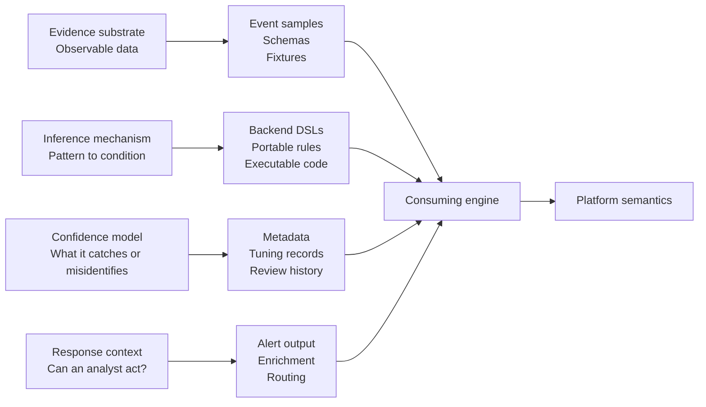

---

title: "The Concept Beneath Detection-as-Code"
tags:

* Detection-as-code
* Detection engineering
* SIEM
* Sigma
* KQL

---

## A migration reveals the missing concept

Consider a representative migration pattern. A detection team at a financial services firm had built its program over four years, accumulating several hundred Splunk SPL rules organized by ATT&CK technique, each with an owner assignment and a last-reviewed date. When the organization’s platform decision moved to Microsoft Sentinel, the migration project began with a rule conversion exercise and immediately exposed something the SPL had kept invisible: nobody could answer what the program actually covered. The rules described what SPL made convenient to express. They did not describe the threat model, the telemetry assumptions, or the conditions under which each rule would fail. The coverage logic had never been made explicit. The platform had been providing the illusion that it existed.

That is not a migration problem. Migrations reveal it; they do not cause it. The program had been built from tools inward — query syntax first, rule structure second, detection concept never — which meant the content was permanently coupled to the platform that originated it. When the platform changed, there was nothing to migrate except syntax. The program’s organizational logic, to the extent it had one, had lived in SPL’s affordances. SPL leaving meant the logic left with it.

Detection-as-code cannot be understood only as a workflow or repository practice. It rests on a prior concept: what a detection is before it is expressed as SPL, KQL, Sigma, Python, YAML, or anything else. If that concept is missing, the repository can look mature while the program remains tool-shaped.

The artifact problem beneath detection-as-code is usually framed as a question of format: what kind of thing is a YAML Sigma rule, exactly? Is KQL a programming language or a query language? Is Python too expressive for detection use? Those questions are real, but they are downstream of a prior confusion. The format debates assume that getting the artifact taxonomy right will make a detection program governable. It will not. Artifact taxonomy is a result. It is not the foundation. The foundation is understanding what detection is, independently of the tools that implement it.

## Detection is a claim about evidence

The concept beneath detection-as-code is not Git, CI, schemas, YAML, or rule conversion. Those are implementation surfaces. The concept is detection itself: a structured claim that observable evidence indicates a condition worth investigating. Once that concept is explicit, the surrounding artifacts become easier to classify.

Detection is a claim about evidence. It asserts that a pattern in observable data is diagnostic of a condition worth investigating. That claim is not defined by the language it is expressed in. It is defined by what it requires: a substrate of observable evidence, an inference mechanism connecting pattern to condition, a confidence model accounting for what the rule catches and what it misidentifies, and response context sufficient for a human analyst to evaluate the alert the rule produces. Those requirements are not optional based on the platform. They apply to every detection, in every language, on every engine.

The point of stating them explicitly is not to produce a definition. It is to produce an evaluation criterion. A detection without testable fixture coverage is not a reliable control. It is an assumption stored in a repository, waiting to fail silently. A detection without documented false-positive conditions is not a deployed control; it is an unaccounted source of alert fatigue. A detection that produces an alert an analyst cannot act on has served the inference mechanism and failed the response context. Each failure is specific. Each maps to one of four requirements the concept places on the practice. None of that reasoning requires knowing what platform the detection runs on.

This is what the system looks like in practice. Each requirement maps to artifact types; each artifact type finds meaning in the engine that consumes it:



The diagram is not a taxonomy. It is the system that emerges once the requirements are explicit. Every artifact in a detection repository occupies a position in this model; every obligation is accounted for.

## Artifacts follow requirements

A detection repository is not made of one kind of thing because detection is not made of one kind of requirement. Event samples carry the evidence substrate, and their quality is measured by representativeness: whether they cover the telemetry conditions, including negative cases and edge cases, that determine whether the inference holds. Schemas carry the validation role. They describe the expected shape of other artifacts so that malformed input is caught before it reaches the engine. Rule logic, whether expressed as a backend query, a portable declaration, or executable code, carries the inference mechanism. Metadata can carry parts of the confidence and operating model: false-positive notes, tuning history, review records, and response assumptions. Test fixtures and assertions carry the evidence that the rule behaves as specified. Alert output fields carry the response context.

Format does not decide which requirement an artifact serves. Role does. A JSON document can be an event sample, an IAM policy, an application configuration object, or a JSON Schema. The same syntax; four different obligations. The consuming system decides what the artifact means, what it is allowed to change, and what failure looks like when it is wrong. The separation of role from format is where the conventional detection-as-code discussion breaks down, because the format debates are conducted as if the right answer produces better detections. They produce, at best, better-formatted detections. The conceptual obligation the detection is meant to serve remains unaddressed until someone asks which of the four requirements a given artifact serves, and whether it serves it faithfully.

The artifact variety in a detection repository is not produced by tooling fragmentation or platform accumulation. It is demanded by the concept. A repository that appears to be a heterogeneous pile of formats is, correctly understood, a set of artifacts each serving a distinct obligation. The artifact problem does not disappear when a single format is imposed. It migrates: a repository forced into one language is a repository where some obligations are being served poorly, invisibly, or not at all.

## Portability is not equivalence

Sigma rules are designed to express detection intent that can be converted into backends such as Splunk SPL, Microsoft KQL, Elastic EQL, QRadar AQL, and Google Chronicle YARA-L. The portability Sigma provides is real and useful. It is also bounded: field mappings, null handling, string matching semantics, and backend operator behavior do not align uniformly across those targets. A Sigma rule translated into KQL is not automatically the same inference running on a different engine. It is a translated inference, with assumptions carried forward and assumptions left behind.

Consider a simplified detection for suspicious process creation. In Sigma:

```yaml
title: Suspicious Process Creation
logsource:
  category: process_creation
detection:
  selection:
    Image: '*\cmd.exe'
    CommandLine|contains: 'powershell -nop'
  condition: selection
```

Converted to Microsoft KQL, the portable intent becomes:

```kql
DeviceProcessEvents
| where FileName =~ "cmd.exe" or FolderPath endswith @"\cmd.exe"
| where ProcessCommandLine contains "powershell -nop"
```

The logic appears equivalent, but equivalence now depends on the target data model. In Sigma `process_creation`, `Image` normally refers to the created process image, while in `DeviceProcessEvents` the created process is represented by fields such as `FileName` and `FolderPath`. `InitiatingProcessFileName` refers to the parent or initiating process. Mapping `Image` to `InitiatingProcessFileName` would therefore change the inference: the rule would no longer ask whether the created process is `cmd.exe`; it would ask whether the parent process is `cmd.exe`. The conversion may still produce valid KQL, but it has not preserved the detection claim.

Sigma addresses the inference mechanism requirement across platforms. It does not automatically address the confidence model, because the false-positive behavior of the same rule can differ meaningfully between backends depending on how the underlying data is normalized.

That is not a criticism of Sigma. It is a description of what portability can and cannot transfer. A practitioner who understands what detection requires knows exactly which obligations a portable rule format handles and which it leaves open. A practitioner reasoning from the tool knows Sigma’s conversion behavior. That is useful knowledge, but narrower and more fragile than knowing which detection obligations the conversion can preserve.

Panther-style Python detections sit at the other end of the design space. Python gives the inference mechanism general-purpose expressiveness within the platform’s execution constraints: nested structure traversal, helper libraries, contextual alert output, branching logic that no declarative format can represent cleanly. That expressiveness comes with a different obligation set: linting, dependency management, runtime constraints, sandboxing, and unit testing with representative event fixtures. The governance cost is higher because the failure modes are closer to software failure. A syntactically valid Python detection can import a broken dependency, exhaust memory on malformed input, or return an incorrect decision on a case the unit tests did not cover. The format is not the risk. The authority the consuming engine grants it is.

Backend query languages — SPL, KQL, EQL — place the inference mechanism close to the query engine. That proximity is powerful and constraining in equal measure. A KQL detection with a valid parse can be operationally wrong if it scans a field that is not consistently populated, assumes a normalization the data pipeline does not enforce, or carries a time-window assumption that the indexer resolves differently than the author expected. A syntactically valid query is not a validated detection. It is a validated string. The engine’s interpretation of that string against real telemetry is where the inference lives or fails.

## Validation follows the artifact

Once the four requirements are established, the validation model for each artifact type follows without memorizing category rules. A schema error in a fixture is a substrate failure: the test evidence no longer reflects the telemetry conditions the inference needs to handle. A field mapping mismatch in a converted Sigma rule is an inference failure: the portable intent has been translated into something that does not preserve the detection logic at the target backend. Missing false-positive conditions or expected false-positive behavior in rule metadata is a confidence model failure: the rule is deployed without the organization knowing what it will misidentify and under what telemetry conditions.

In practice, this failure looks like the difference between a documented detection and an assumption stored in a repository. Here is what confidence model completeness can look like:

```yaml
# INCOMPLETE: No confidence context
title: Suspicious Process Creation
description: Detects suspicious process creation
severity: high

# BETTER: Confidence assumptions visible
title: Suspicious Process Creation
description: Detects cmd.exe command lines invoking PowerShell with suspicious flags
severity: high
known_false_positive_conditions:
  - Legitimate administration using cmd.exe and PowerShell in the same session
  - Build automation invoking PowerShell through cmd.exe
telemetry_assumptions:
  - ProcessCommandLine is populated and not truncated
  - Parent and child process fields are normalized consistently
tuning_notes:
  - Exclude approved automation accounts only after fixture validation
test_coverage:
  positive_fixtures: 8
  negative_fixtures: 5
last_reviewed: 2024-11-15
```

The difference is not formatting. It is whether the organization understands what the rule may misidentify, under what telemetry conditions, and what evidence supports that assumption. An alert context field that surfaces raw event data rather than analyst-relevant enrichment is a response context failure: the detection produces an alert the receiving analyst cannot act on without independent investigation.

None of those failures surface as “the rule is wrong.” They surface as operational noise, unexplained triage errors, alert fatigue, and incidents detected but not responded to in time. The concept makes them diagnosable as what they are: a specific requirement, incompletely served, at a specific artifact type.

This is where my earlier Detection-as-Code work fits into the larger argument. The [practical implementation model] dealt with repository structure and repeatable validation. The [log replay work] made the evidence substrate executable against a real rule engine. The [rule-behavior analysis] showed why platform semantics matter: a rule file may look like static configuration, but its behavior depends on parser output, inheritance, grouping, frequency logic, evaluation order, and the runtime that consumes it. Those details came from one detection stack, but the obligation is general. A detection is not validated because the artifact exists. It is validated only when the evidence, inference, confidence assumptions, and platform behavior have been tested together.

## Tool-independence is not platform agnosticism

That diagnostic capability is what tool-independence means in practice. Not the ability to write rules in any language. The ability to evaluate any detection — in any language, in any format, on any platform — against what detection requires. A practitioner holding the concept walks into an unfamiliar repository and recognizes which obligations are being served, which are underserved, and which are structurally absent. They do not need to know the platform’s query syntax to identify that the repository has no fixture coverage, that the metadata does not record a confidence model, or that the alert output does not support response. The evaluation criterion is the concept, not familiarity with the tool.

The reverse is also true: knowing the platform syntax is not enough. Rule behavior is shaped by the consuming engine, the data model, the parser, the execution order, and the runtime context. That platform-specific behavior does not invalidate the general concept. It shows why the consuming engine must be part of the validation model.

Tool-independence is not platform agnosticism. It is the ability to evaluate a tool against what detection requires, rather than learning what detection requires from the tool.

## The taxonomy is derivable

The taxonomy follows from that position without needing to be separately established. Event samples are data, measured by representativeness. Schemas are data with a validation role, their authority derived from the engine that applies them. Metadata becomes configuration when it changes triage behavior, escalation timing, routing, or response priority; not all metadata has that role. Backend query languages are DSLs that express analytical intent constrained by the query engine and the data model it operates over. Sigma expresses portable declarative detection intent, translatable across backends with known assumptions and known losses. YARA addresses content-oriented detection; YARA-L addresses event and log detection, with their own execution models and their own obligation sets. Executable detection code in Python or equivalent imports the full governance model of software.

The taxonomy is derivable. It is what you get when you ask, for each artifact, which of the four requirements it serves and which consuming engine gives it meaning.

The practitioner who builds from the concept re-learns nothing when the tool changes. Format debates become engineering decisions with a criterion: which option serves the relevant obligation faithfully, at scale, and with testability? A new platform is evaluated against what detection requires, not adopted because it resolves the previous platform’s limits with limits of a different kind. A repository organized around the concept is legible to anyone who understands detection, regardless of which tools built it. The migration reveals what was always true.

The practitioner reasoning from tools re-learns everything. Each migration is a reset. Each new platform reopens questions that should have been settled once, at the level of the concept. The repository built around platform affordances is not a detection program. It is a record of what the previous tool made convenient to express.

A program built that way is not wrong because it used SPL. It is wrong because SPL was the reason its detections existed. That is the distinction the concept makes visible.
