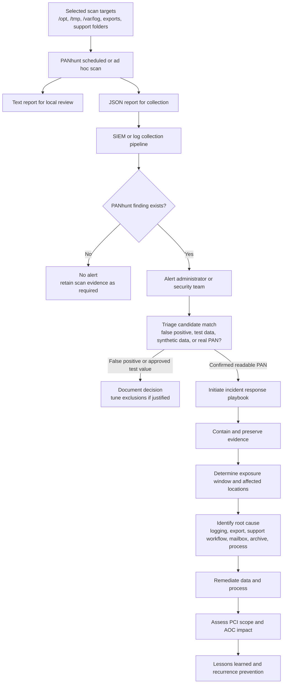

---

title: "PANhunt is now on PyPI"
tags:

- PANhunt
- PCI DSS
- Incident Response
- Data Discovery
- Open Source

---

## Why PANhunt exists

When I started working in a payment processor, [Dionach PANhunt project](https://github.com/dionach/PANhunt) was already in use on many servers. It was not a tool I discovered later because I wanted to write something around PCI DSS, and it was not a side project looking for a use case. It was already part of a practical routine: search systems for possible primary account numbers and help validate whether [primary account numbers (PANs)](https://www.pcisecuritystandards.org/glossary/#glossary-p:~:text=to%2DPoint%20Encryption.%E2%80%9D-,PAN,-Acronym%20for%20%E2%80%9Cprimary) existed outside the places where we expected it to exist.

That changes how a tool looks. The interesting question is not whether PAN discovery is useful in theory. It is whether the tool helps administrators and security teams test assumptions that otherwise remain hidden behind diagrams, procedures, and inherited operational habits.

PANhunt is a primitive but dedicated DLP utility. It does not try to become a full DLP platform, a PCI compliance platform, or an incident-response platform. It searches reachable files and containers for PAN-like values, validates likely candidates, and reports masked findings so the operator can decide what needs review.

That narrowness is the point. A security team does not always need a platform to answer a specific operational question. Sometimes it needs a small tool that can be run against selected paths, report possible clear-text PAN, and give the team enough evidence to start the right process.

## Why this matters for PCI DSS

PCI DSS Requirement 3 is about the confidentiality of stored account data. In practice, that means protecting cardholder data and sensitive authentication data, with PAN as the central data element for cardholder-data handling. For PANhunt, the closest storage-control anchor is [PCI DSS 4.0.1](https://docs-prv.pcisecuritystandards.org/PCI%20DSS/Standard/PCI-DSS-v4_0_1.pdf) Requirement 3.5.1, because the practical concern is PAN that remains readable wherever it is stored.

If readable PAN is confirmed in a stored location where it should not exist, this is not a minor hygiene issue. It is a failure of the relevant protection requirement for that data location, and it can become a blocker for a compliant Attestation of Compliance until it is understood, remediated, and assessed. The organization may still need to determine scope, ownership, volume, root cause, and whether the data is production, test, synthetic, or stale, but confirmed readable stored PAN is not routine cleanup.

PANhunt does not implement Requirement 3.5.1. It does not make PAN unreadable, and it does not decide whether a storage location is approved. Its role is to help build a detection capability around the requirement. It helps find candidate clear-text PAN in logs, exports, mail containers, support bundles, archive files, and working folders so the organization can validate the finding and respond.

That validation step matters because false positives are still possible. A Luhn-valid value is not automatically a real payment card, and a matched value may be test data, synthetic data, stale data, or a format collision with another numeric identifier. A candidate match is not automatically a PCI DSS failure, but confirmed readable stored PAN is a serious compliance issue.

## Why this belongs in incident response

PCI DSS v4.0.1 Requirement 12.10.7 gives this a second operational anchor. If unencrypted PAN is found where it is not supposed to be, the organization needs to initiate its incident-response plan. That changes the handling model. The finding is not just a file to delete. It is a signal that a process may have allowed readable account data to remain somewhere outside the expected control boundary.

The incident-response plan needs to answer practical questions. How long has the readable PAN been there? How much data is involved? Which system, application, export, log path, user action, or support process created it? Was the location inside or outside the expected cardholder data environment? Was the data production, test, synthetic, or a false positive? What remediation is needed? Which process needs to change so the same residue is not created again?

PANhunt does not answer all of those questions. It gives the first signal. That signal still needs triage, evidence handling, root-cause analysis, remediation, and lessons learned. Without some discovery capability, the organization may only find the problem by accident, during an assessment, or after data has already been retained longer than anyone intended.

## Where PAN actually remains

PAN does not only appear in the systems designed to process it. It can remain in exported reports, temporary working folders, compressed logs, mailbox attachments, support bundles, old documents, spreadsheets, and folders created during troubleshooting. None of this requires a dramatic failure. Someone exports data for investigation. An application accidentally logs PAN to syslog. A support workflow includes a field that should have been masked. A mailbox attachment survives longer than the case that created it. A compressed archive preserves data nobody expected to keep.

Those are ordinary failure modes, not edge cases.

A clean architecture diagram may show where PAN is supposed to flow, but file systems, logs, mailboxes, and archives often contain the residue of operational work. PANhunt is useful because it can test some of that residue directly. A finding does not automatically answer every scoping question, but it does make the assumption unsafe until reviewed.

For administrators, this means the tool can help check the places where operational data accumulates. For security teams, it can provide evidence for triage. For compliance teams, it can support the discussion about whether the environment matches the documented data-flow and storage model.

## Where the tool helps

PANhunt helps before relying too heavily on assumptions. It can support PCI scope validation by checking whether a server, directory, export location, or operational folder contains PAN-like data when it is believed to be outside the cardholder data environment. A confirmed finding does not automatically decide scope, but it means the current scope assumption needs review.

It can also support cleanup work. Old folders, archived exports, support bundles, and mailbox data are often treated as storage hygiene problems. Sometimes they are. Sometimes they are evidence of a process that kept producing sensitive artifacts. If a support export contains PAN, the export workflow deserves review. If a compressed log contains PAN, the logging path deserves review. If mailbox attachments contain PAN, the communication process deserves review. Removing the file may be necessary, but it is rarely the whole answer.

Periodic checks can be useful because environments accumulate data slowly. Temporary folders become permanent. Exports are copied. Logs are compressed. Old archives are retained because nobody is sure whether they can be deleted. PANhunt can support selected checks of locations where PAN should not normally appear, especially before audits, migrations, control reviews, or major cleanup activities.

The same applies during operational change. Migrations, application changes, logging changes, troubleshooting work, and incident-response activities often create temporary data outside the normal application path. Those folders are easy to forget once the urgent work is finished. A lightweight PAN discovery check can help confirm that temporary work did not leave readable card data behind.

## A practical detection-and-response flow

In practice, I would not treat PANhunt output as something an administrator checks manually once and forgets. A better model is to produce reports, collect the JSON output, alert only when there is a finding, and then make the response path explicit. The tool is only one step in that chain, but the chain matters because PCI DSS Requirement 12.10.7 expects a response when unencrypted PAN is found where it should not be.



The important part is the decision point. A candidate match should not immediately become a declared incident without triage, because false positives and test values exist. But confirmed readable PAN where it should not exist should not be handled as a normal cleanup task either. It should enter the incident-response process, because the organization needs to understand exposure duration, root cause, remediation, scope, and recurrence prevention.

## Installing it

PANhunt is [now available on Pypi](https://pypi.org/project/panhunt/), so it can be installed as a normal Python command-line tool:

```bash
pipx install panhunt
panhunt --help
```

PANhunt requires Python 3.9 or later. On Linux and macOS, there is one practical dependency to remember. PANhunt uses "python-magic" for file-type detection, and that usually requires the operating system "libmagic" package. On Debian or Ubuntu, this means installing "libmagic1"; on Fedora, "file-libs"; and on macOS with Homebrew, "libmagic".

This is not an interesting detail, but it is exactly the kind of detail that wastes time when a tool is being prepared for an assessment or scheduled scan.

## Quick command-line usage

The simplest use is to scan a target path and write the default report:

```bash
panhunt /path/to/check
```

On Windows, the same idea applies to a drive, directory, or specific folder:

```bash
panhunt D:\Exports
```

Reports are written as timestamped text reports in the configured report directory. JSON reports can also be generated when the result needs to be collected, reviewed, or ingested by another workflow:

```bash
panhunt /data -o /var/reports/panhunt -j /var/reports/panhunt
```

The "-x" parameter excludes paths from the scan, including files or directories, and should use absolute paths. The "-o" parameter sets the text report directory. The "-j" parameter enables JSON output and sets its directory. The "-X" parameter excludes known PAN values, such as approved test values, and "-w" controls worker count. Quiet mode with "-q" disables terminal output and is useful for scheduled runs.

A controlled quick scan may look like this:

```bash
panhunt /data \
  -x /data/tmp,/data/known-large-dumps,/data/panhunt-output \
  -o /data/panhunt-output \
  -j /data/panhunt-output \
  -w 2 \
  -q
```

The exclusion feature should be used deliberately. Excluding irrelevant paths can reduce scan time and noise, but excluding too broadly can hide the evidence the scan was supposed to find. The same applies to "-X". Excluding known test PANs can reduce repeated noise, but the exclusion list should be reviewed because it changes what the tool will report.

Running PANhunt without a target path or configuration file no longer starts a root-directory scan. It prints a short reminder and exits without scanning. That behaviour is intentional. A recursive scanner should not do the broadest possible operation because the operator missed an argument.

Using configuration files

For repeated or advanced runs, the configuration file is the better interface. Command-line parameters are useful for one-off checks, but a configuration file makes the scan easier to review, repeat, and adjust. That matters when the scan supports PCI evidence, incident response, or recurring hygiene checks.

A basic configuration can look like this:

```ini
[DEFAULT]
# Target can be supplied as target, search, or file.
search = /data
exclude = /data/tmp,/data/known-large-dumps,/data/panhunt-output
outfile = /data/panhunt-output
json = /data/panhunt-output

# Exclude known test PANs only when intentional and reviewed.
excludepans = 4111111111111111

workers = 2
quiet = false
```

The scan can then be started with:

```bash
panhunt -C config.ini
```

This is the better pattern for scheduled scans or repeatable reviews. It avoids long command lines, keeps the target and exclusions visible, and makes the scan easier to discuss during review. If someone asks what was scanned and what was excluded, the answer should not depend on shell history.

## A practical Linux example

A common Linux use case is checking selected operational locations such as "/opt", "/tmp", and "/var/log". These paths can contain application artifacts, temporary data, logs, support residue, and compressed files. They are also noisy, so the scan design matters.

PANhunt takes one target path per run. For multiple targets, use separate configuration files, separate command invocations, or a small wrapper script. That is preferable to hiding several different operational questions inside one unclear scan.

For "/opt", the configuration can be simple:

```ini
[DEFAULT]
search = /opt
exclude = /opt/panhunt-output
outfile = /var/log/panhunt
json = /var/log/panhunt
quiet = true
workers = 2

sizeLimit = 21474836480
maxTotalExpandedBytes = 21474836480
maxArchiveMembers = 10000
maxArchiveCompressionRatio = 100
parserTimeoutSeconds = 30
parserMemoryLimitBytes = 536870912
```

For "/tmp", I would be more careful. It can contain useful residue, but it can also contain sockets, transient runtime files, unrelated user data, and rapidly changing content. A scheduled scan should exclude PANhunt output and any local paths known to be noisy or unsafe:

```ini
[DEFAULT]
search = /tmp
exclude = /tmp/panhunt-output,/tmp/systemd-private
outfile = /var/log/panhunt
json = /var/log/panhunt
quiet = true
workers = 2

sizeLimit = 21474836480
maxTotalExpandedBytes = 21474836480
maxArchiveMembers = 10000
maxArchiveCompressionRatio = 100
parserTimeoutSeconds = 30
parserMemoryLimitBytes = 536870912
```

For "/var/log", the exclusion list matters more. "/var/log" contains normal text logs and rotated compressed logs, but it can also contain binary accounting files, journal storage, sudo I/O session trees, and the PANhunt reports themselves if they are written there. The scan should not recursively inspect its own output.

```ini
[DEFAULT]
search = /var/log

# Exclude binary/system log stores, accounting logs, sudo I/O session trees,
# PANhunt's own report directory, and PANhunt's own runtime log if written under /var/log.
exclude = /var/log/journal,/run/log/journal,/var/log/lastlog,/var/log/btmp,/var/log/wtmp,/var/log/faillog,/var/log/tallylog,/var/log/sudo-io,/var/log/panhunt,/var/log/PANhunt.log

outfile = /var/log/panhunt
json = /var/log/panhunt

quiet = true
workers = 2

sizeLimit = 21474836480
maxTotalExpandedBytes = 21474836480
maxArchiveMembers = 10000
maxArchiveCompressionRatio = 100
maxArchivePathLength = 4096
archiveSpoolThreshold = 8388608
parserTimeoutSeconds = 30
parserMemoryLimitBytes = 536870912
maxPdfPages = 100
maxPdfTextBytes = 10485760
```

I would normally exclude journal storage and known binary accounting logs from a direct "/var/log" scan. That does not mean journal content is irrelevant. It means binary journal files should be handled through "journalctl", exported to text or JSON, and then scanned as an explicit artifact.

For example:

```bash
mkdir -p /var/tmp/panhunt-journal-export

journalctl --since "30 days ago" --no-pager -o short-iso \
  > /var/tmp/panhunt-journal-export/journal-last-30-days.log

panhunt /var/tmp/panhunt-journal-export \
  -o /var/log/panhunt \
  -j /var/log/panhunt
```

The same principle applies more generally. PANhunt is useful when the data is reachable as text, document content, mail content, archive content, or compressed content it can inspect. Native binary log stores are better exported through their own tools before scanning.

## Avoid scanning your own evidence

PANhunt output should be separated from the scan target whenever possible. If reports or JSON results are written under a scanned path, they can become input for the next run and create avoidable noise. The same applies to PANhunt’s runtime log if it is written inside a scanned directory.

The cleaner pattern is to use a dedicated output directory, exclude that directory explicitly, and keep the scan target and scan evidence separated. When writing reports under "/var/log/panhunt", exclude "/var/log/panhunt" from "/var/log" scans. If the runtime log is written to a known path under the scan target, exclude that path as well.

## Scheduled scanning and system limits

The repository includes example systemd files for scheduled scanning. That is a useful pattern for administrators because it makes the target, configuration, output, and resource controls explicit. A scheduled scan should define what is being checked, what is excluded, where reports are written, and what limits apply.

For an ad hoc large scan on a systemd-based Linux host, CPU usage can be capped directly:

```bash
systemd-run --scope -p CPUQuota=60% panhunt -C config.ini
```

System-level limits do not replace scan-level limits, but they provide another boundary. That matters when scanning compressed logs or old archives, especially on systems that are doing other work.

## What changed in 2.0

PANhunt 2.0 is almost a total rewrite, but the rewrite is not the subject. The subject is the use case that made the rewrite necessary. A small DLP utility can be good enough for a clean test folder and still be too fragile for production data. In this case, production-like data meant compressed logs, nested archives, mail containers, support bundles, old exports, and files left behind by normal work.

The technical details belong in the README. The practical change is that PANhunt is now easier to install, easier to run consistently, and better suited for the kinds of data operators actually need to check. It supports text-like files, Office documents, PDFs, mail formats, archives, compressed files, and nested content. Access databases are listed but not yet searched.

PANhunt is not originally my project. It comes from the Dionach PANhunt project, and the original BSD-3-Clause license and copyright notice remain preserved. Dionach made a small, useful PAN discovery utility available to the PCI and security community. My contribution was to take a tool that was already useful and improve the parts that mattered under real use.

## Reading the results

The output still needs review. A candidate match is not automatically a PCI DSS failure, but confirmed readable stored PAN is a serious compliance issue. Context matters: source, location, ownership, retention purpose, masking, encryption, business process, and whether the value is production, test, synthetic, or stale data.

If readable PAN is confirmed where it should not exist, the next step is not just deletion. The incident-response plan should guide the review: how long the data was present, how it got there, what process failed, how it was remediated, what evidence was preserved, and what should change to prevent recurrence.

The masking behaviour matters for the same reason. PANhunt reports masked values rather than full card numbers. A discovery tool should not create a new exposure while trying to find an old one.

PANhunt 2.0 is still a small open-source utility. That is how I want to present it. It helps check places where clear-text PAN can remain: logs, exports, attachments, compressed archives, support data, temporary folders, and old operational residue. In payment environments, those places are often where the interesting findings are.
