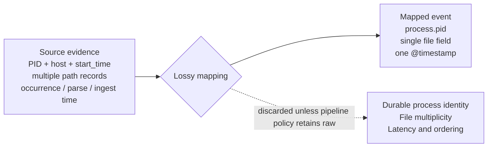
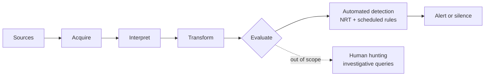
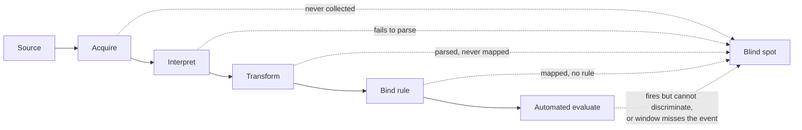

---

title: "The silence that reads as safety"
tags:

- Detection-as-code
- Detection engineering
- SIEM
- Security Data Pipeline
- Security Data Lake
- Logging

---

Consider a detection team that builds a rule watching for suspicious LSASS access — the kind that precedes credential theft. On modern Windows estates that signal comes from Sysmon Event ID 10 or equivalent EDR process-access telemetry, not the raw security log, so the rule is bound to that source, tuned once against a red-team exercise, and deployed. For a while it fires as often as expected. Then it goes quiet. Not disabled, not erroring, not flagged anywhere as broken — the console shows it enabled, the source shows events still arriving, and the rule simply stops producing anything for anyone to look at.

Months of silence read, by default, as good news. No alerts means no credential theft, and no credential theft means the control is working. That is the reading every console is built to encourage, because a quiet rule looks identical to a working one.

The silence is also unreadable. It is consistent with several conditions that share nothing but their output. The technique may not be occurring, in which case the rule is doing exactly what it was built to do. The rule may be wrong — miscalibrated against a threshold nobody has revisited, or written against an implementation attackers have moved past. Or the evidence the rule depends on may have stopped arriving in usable form: a mapping change upstream, a parser failing on a subset of events, a field the rule reads that stopped being populated after a fleet update. Different conditions, one identical signal. The console cannot separate them, and neither can the analyst reading it.

That silence is what the pipeline produces when its stages are allowed to discard. The path from a log to an incident candidate gets described the way any refinement pipeline is — data becomes information, information becomes knowledge, each stage adding structure to the one below. What the description omits is that each stage is also free to throw away, and that a signal arriving at the end carries no record of what was discarded to produce it. Silence is the limit case: an output refined down to a single bit, and a single bit cannot say which condition produced it.

## Detection surface, and the part of it that has no name

The vocabulary built to describe detection stops one level above where that silence is produced. Forrester introduced or popularized the strategic sense of *detection surface* in 2023, defining it as the asset type upon which attacker activity is detected and pairing it against attack surface. Rapid7 now frames the surface through signals, logs, telemetry, breadth, and depth. Jon Schipp states the governing fact plainly: the detection surface is always smaller than the attack surface, because any uncovered asset is automatically undetectable.

Every established use of the term operates near the same altitude — coverage. Whether an endpoint runs an agent, whether a cloud service logs, whether a technique maps to any rule. Forrester's own account gestures lower, insisting that logging is visibility rather than detection and that the point is the utility of detection, not the presence of data. But the worked examples rarely descend past asset and platform granularity. The LSASS rule lives below that floor. The endpoint was covered, the telemetry was flowing, the asset was on the detection surface by every established measure — and the rule went blind anyway.

That blindness inside a covered asset is not a coverage gap. It is coverage that exists and no longer carries what a rule needs to discriminate. Coverage — detection surface *size*, the sense the term already has — answers whether the asset is on the surface. It does not answer whether the telemetry arriving from that asset still preserves the distinctions a rule was written to make. The second question needs its own name, because no acknowledged term asks it directly in this runtime, rule-relative sense: **detection surface integrity**, the degree to which telemetry inside an established surface both retains the distinctions a rule depends on and reaches the rule while the rule is looking. Size is necessary. Integrity is what makes size worth having.

The phrase is new; the terrain is not. It has been studied piecemeal, under other names. MITRE's Center for Threat-Informed Defense has spent years asking what ATT&CK coverage actually requires, building Atomic Data Sources and sensor mappings, and its work on ambiguous techniques identifies the required fields, dependencies, fidelity, timeliness, and context a technique needs before it can be detected with confidence. Academic work has begun measuring attack observability in cloud telemetry and detection efficacy across logging standards by asking what survives normalization. Increasingly, this body of work specifies what evidence a detection requires. What remains unresolved is whether those requirements stay satisfied after deployment, as sources, parsers, mappings, routes, and evaluation windows change. The unit that question turns on is neither the feed nor the rule alone. It is the live dependency between them.

## What a mapping keeps, and what it decides not to

That lapsing dependency has a most common origin, and it is the third possibility in the LSASS silence: a field going quiet underneath a rule while the source stays healthy. This is not a parsing accident. It is what happens when the mapping from source to schema does exactly its job, and that job turns out narrower than what the rule needed.

Three things routinely conflated here belong apart. A *schema* defines what can be represented — ECS can carry occurrence, first-observed, and ingestion timestamps; UDM can carry repeated fields and process ancestry. A *mapping* is the function that selects source fields and transforms them into that schema. A *pipeline policy* decides whether the raw, unmapped event survives alongside the mapped one. The schema sets the ceiling on what can be expressed; the mapping decides what actually is; the pipeline policy decides whether anything discarded can be recovered. When people say a schema "lost" a field, the schema is rarely the agent. The mapping is.

The intuitive reading of mapping is translation — `pid` becomes `process.pid`, a vendor field becomes an ECS field, nothing changes but the labels. That reading is incomplete. A mapping is a claim about which distinctions in the source remain answerable afterward, made once, by whoever wrote it, long before any rule tries to use the result. A capable schema does not force loss: ECS permits custom fields for what falls outside the common set, and UDM preserves structures a flatter target would discard. Loss is a property of a particular mapping, not of canonicalization — but lossy mappings are common, default, and rarely labeled as lossy. What one does is decide, silently, which future questions its output can no longer answer:

Each entry in that discarded column is a specific rule made impossible. A PID uniquely identifies a process only while that process is alive; after it exits, the number is free for reuse. A mapping that keeps the PID alone, without host and process start time or a source-provided entity identifier, cannot support durable correlation across time — the later process that inherits the number is indistinguishable from the one a rule was tracking. Several path records from a single audit event, each naming a file a process touched, collapse into one field, and file multiplicity stops being answerable. Occurrence, parse, and ingest time collapse into a single stamp, and questions of latency and ordering lose the fields that would answer them.

The audit case has a precise boundary, because it is easy to overstate. A Linux audit event is several records sharing one identifier, and standard tooling groups them into a single action. Storing the records separately does not destroy the relationship as long as the shared identifier and the record multiplicity are preserved. It becomes destructive only when the collector discards the identifier, overwrites repeated records, or presents an individual record as a complete action. The loss is not inherent in the multi-record format; it is a choice made at reconstruction.

None of these are bugs. Each mapping is doing a job — reduce a messy source to a consistent shape — and each reduction is also a decision about which future question the mapped event cannot answer. A rule that depends on durable process identity, file multiplicity, or ingest latency is not written incorrectly. It is written against evidence the mapping did not carry and the pipeline policy did not retain, and nothing downstream registers a fault, because there is none. The recent literature measures exactly this, comparing raw logs against standardized output and flagging the fields and granularity that do not survive. A mapping is a boundary on future detection: it carries some distinctions and leaves the rest behind, recoverable only if the pipeline policy kept the raw evidence and someone thinks to return to it.

## The same boundary, drawn everywhere

That boundary is most visible at the mapping, but the mapping is not its only site. The reduction happens wherever information is compressed for the next consumer, and it appears both before the mapping runs and after.

It appears before, at reconstruction — the audit case above, where a fragmented event is either reassembled or quietly broken depending on whether the collector preserves the binding identifier. It appears after, inside the metrics built to watch the pipeline. A single composite health score folds queue depth, parser failures, coverage gaps, and noise into one number; each input is honest arithmetic, but the sum cannot say which input moved it. A stakeholder told the score fell can do nothing; a stakeholder told it fell because a mandatory source went dark can act. This is why the more capable platforms separate coverage, data quality, pipeline continuity, and rule-execution health into distinct signals — the decomposition is what keeps the number diagnostic.

And it appears in vocabulary. The field has converged on *detection gap* for a blind spot, and the convergence is real. But the term is flat: it records that a gap exists without recording where in the pipeline it opened, which means it cannot tell an operator whether to page the platform team, the parsing engineer, or the detection engineer. That flatness is a consequence of the pipeline underneath being more uniform than it looks. Published reference architectures make the uniformity visible: set an Elastic Beats-to-Elasticsearch design beside a Cribl-fronted pipeline beside a multi-tool SOC stack, and the vendors, ordering, and logos disagree on nearly everything except the spine. Every one of them acquires, interprets, transforms, and evaluates, in that logical order or a permuted one.

A SIEM is a data-engineering pipeline wearing security vocabulary, and the two dominant architectures differ mainly in where they bind source evidence to an analytical representation. Early binding — schema-on-write, as in Elasticsearch or Graylog — parses and maps at ingest, and can make representation failures persistent when raw evidence is not retained. Late binding — schema-on-read, as in Splunk or Sentinel — stores raw and imposes structure at query time, which can make a deployed analytic blind while leaving the original event available for another query. Late binding relocates the selection; it does not necessarily make loss permanent. The operations are invariant; only their timing and order move. A blind spot can open at any of them regardless of architecture, which is why vendors independently draw the same machine and the same machine has the same failure points. Convergence here evidences shared structure, not how often the failure occurs.

The evaluate step carries a distinction the diagram marks and the argument must hold. Automated detection is the standing layer that runs with no human present: near-real-time rules over streaming engines or materialized views, and scheduled rules that sweep on an interval. Human hunting runs against the same store but is triggered by a person and sits outside this piece's scope. When a rule "fires" or "goes silent" here, it means the automated layer — and the two automated modes fail differently, one of them invisibly.

## Extent and integrity

A blind spot has a location, and that location is the first thing the flat vocabulary discards. Placed on the invariant spine, every blind spot in this argument sits at one operation:

Located this way, the blind spots sort into two families, and the sort is the finding. A blind spot is an *extent* failure when the asset, source, or analytic was never brought into scope. It is an *integrity* failure when the thing is in scope and the telemetry still fails to deliver what a rule needs — either because a distinction was dropped, or because intact telemetry never reached a rule that was looking. Which family a failure belongs to decides whether any established tool can currently see it:

| Blindness | Where it opens | Family | Rule-relative tooling today |
|---|---|---|---|
| Collection | Source never onboarded | Extent | Yes — inventory, deployment coverage |
| Detection | Mapped and available, no rule binds it | Extent | Coverage matrices record the claim |
| Parser | In scope, events fail to parse | **Integrity** | Fragmented, not rule-relative |
| Mapping | Parses, never mapped into a rule's fields | **Integrity** | Fragmented, not rule-relative |
| Discrimination | Rule fires, required context absent | **Integrity** | Fragmented, not rule-relative |
| Temporal | Intact event never evaluated — aged past a window, or streamed past an NRT rule before its partner | **Integrity** | Effectively none |

The two extent failures have tooling because both ask whether something is in scope — a question inventories answer directly. Detection blindness is the hinge case: by mechanism it looks like the integrity failures, in-scope and healthy and silent, but by remedy it belongs with extent, because the fix is to write a rule, not to repair telemetry. An ATT&CK matrix records that a rule *claims* a technique; it does not establish that the rule is deployed, enabled, fed by healthy telemetry, or recently validated. It organizes detection claims. It does not prove runtime coverage.

The integrity failures share a property no coverage instrument captures: each passed the extent test and failed afterward. Parser and mapping blindness clear onboarding and then fail on what the surface delivers. Discrimination blindness is narrower than it sounds and must stay inside integrity only in one sense — that the contextual evidence a rule declares it needs is absent, delayed, or semantically changed. Whether the rule, given every declared dependency, can actually infer intent is a separate question that belongs to efficacy, not integrity, because answering it requires testing the rule against known-malicious and known-benign activity the pipeline cannot generate about itself. Temporal blindness is the mode the automated-evaluate distinction exposes: a scheduled rule has a lookback window, and an event that arrives and ages past it before the next sweep is never evaluated though the data was present; an NRT rule sees each event once and cannot reconsider it when a late partner arrives unless its windowing waits. The telemetry was intact. The query's reach did not cover it. Silence again, from a healthy surface.

The honest claim about tooling is not that integrity is unmeasured. Google SecOps exposes source health, parser health, parse and validation failures, drop reasons, latency, and schema-change indicators. Elastic's Data Quality dashboard checks ECS mapping compatibility and keeps historical results. Sentinel monitors the health of analytics rules and data connectors. Each measures part of collection, parser, or mapping integrity. What publicly documented practice rarely does is join these component signals into a portable, rule-relative model that answers whether every live dependency of a given deployed rule remains satisfied after a source, parser, or schema change. The gap is not measurement. It is integration.

This two-family split is deliberately coarse. A finer decomposition serves governance reporting — surface extent, then path integrity, then analytic efficacy — and it maps onto CTID's telemetry-completeness and confidence work. That third domain marks this piece's scope boundary: whether an analytic actually distinguishes the target behavior can be established only through synthetic validation, adversary emulation, or incident outcomes, which are external ground truth. Integrity stays inside the pipeline; efficacy requires stepping outside it. One further boundary belongs here too. This argument describes accidental invalidation — parser drift, schema change, delayed delivery. Adversarial invalidation of the same path — audit-policy manipulation, sensor termination, log clearing, selective dropping, clock manipulation — is the same structural failure with an attacker in the loop, and it is out of scope here, though it is where a security reader should expect the concept to extend next.

Where a blindness sits names the stage; it does not name what to do. That requires its cause. The same detection blindness resolves to different actions depending on why the rule is missing: a source documented as out of scope was a risk-accepted judgment, and the remedy is to re-audit it; a source everyone agrees matters but nobody has written a rule for is backlog, and the remedy is to write the rule. Stage names where the pipeline went dark; cause names who repairs it; neither triggers an action alone. And the risk-accepted cause carries a specific danger, because it is the one place where "this distinction does not matter" is recorded explicitly rather than made silently inside a mapping nobody reads. Recorded and re-audited, it is the honest case. Recorded and never revisited, it is indistinguishable on the console from a real gap — the mapping's silent decision, now made by a person and filed as a judgment.

The two families also differ on cost, though not as a clean ranking. Detection blindness represents telemetry cost already incurred without corresponding analytic use — every processing cost paid, no rule reading the result, and the data already in the shape a rule would need. Collection blindness avoids some immediate processing cost by accepting a detection risk that stays invisible until an incident requires the missing evidence. Neither is simply cheap or simply dear: collection still incurs infrastructure and administrative cost, and a reliable rule still costs research, testing, and maintenance. The asymmetry worth noting is one of visibility, not price — one blindness shows up on the cost report and the other shows up only in the incident nobody caught.

## Measuring without committing the same reduction

A metric that watches this pipeline must avoid becoming an instance of what it watches. The temptation is the composite — one health score, one coverage percentage — and every composite draws the boundary again, keeping an aggregate and discarding the decomposition that would make it diagnosable. Goodhart's law frames the failure: a measure that becomes a target stops being a good measure. A program scored on a coverage percentage produces a coverage percentage, and a coverage percentage does not buy detection.

The defense is decomposition, and specifically decomposition that is rule-relative. A hundred-percent ATT&CK coverage claim, read alone, answers the LSASS silence with false confidence: it says a rule exists for each technique and says nothing about whether the telemetry each rule depends on is collected, parses, maps into the fields the rule reads, or carries the context the rule needs. CTID's own position is that coverage must include the required log sources and context to classify confidently; the bare percentage does not. Read beside a per-rule dependency measure — is this rule's declared evidence actually arriving, in the right form, within the window it evaluates — the coverage number becomes diagnostic instead of reassuring. No metric here is meant to be read alone when a paired metric exists.

The one construct worth stating precisely, because it is where the essay's problem becomes a number, is accumulated invalid time: the total duration during which a rule's declared hard dependencies went unsatisfied, weighted if needed by the rule's criticality. It is derivable from ordinary pipeline state, it is rule-relative by construction, and it turns "the rule went silent" into "the rule was structurally unable to fire for this long." What it must not collapse into is a single green-or-red flag per rule, because a rule is rarely healthy or broken across a whole estate — it can be valid on one platform and blind on another, on new hosts and not legacy ones, through one source path and not its fallback. The measure that avoids the essay's own criticism is not "is this rule valid" but "across what proportion of its intended scope does a valid path remain," and it needs an explicit unknown state, because treating an unevaluated dependency as healthy would rebuild silence-as-safety inside the instrument meant to detect it.

## What this piece does not measure, and why

Naming what a model excludes is the same discipline it demands of a mapping: the silent exclusion is the dangerous one. People and process are out of scope — analyst throughput, dismissal behavior, mean time to detect and respond, staffing. The test is whether a metric would still make sense asked of an unstaffed but perfectly running pipeline, firing every rule as designed with nobody watching; if the question needs a person to exist, it belongs elsewhere, which is why discrimination blindness is defined here as a dependency deficit rather than a precision rate. Retention is excluded only from live dependency integrity, not from detection capability at large, because retention directly governs long-window correlation, baseline construction, and retrospective detection even though it is orthogonal to whether a rule's dependencies are satisfied while the data is live. External ground truth is out by construction: efficacy, dismissal rates, and true detection probability require an intervention originating outside the pipeline, because the pipeline's own data cannot contain them.

## The model is a snapshot too

Every exclusion above rests on the premise that drives the whole argument: a claim frozen at a moment calcifies into false confidence unless it is rechecked. That premise binds this model as much as any mapping it describes, so the closing move is not to ask that it be adopted but that it be tested — and it is testable. Whether a rule-relative integrity signal predicts broken detections better than feed-volume baselines or coverage-only scores is a falsifiable claim, checkable against a corpus of real source outages, parser changes, and schema changes, measured by whether the integrity signal flags the break before the silence does.

The failure this piece describes is not confined to silence. A detection can keep firing while its output no longer means what its operators believe — wrong entity, changed severity, stale enrichment, an alert generated but never dispatched. Silence is the clearest symptom because it is the emptiest, but the same broken path can produce confident, well-formed, wrong output, and that case is harder to catch precisely because something still arrives. What unifies both is that the detection remained enabled and executable while the evidence path beneath it stopped meaning what it claimed to.

A pipeline that cannot tell you when an event happened, whether it was delivered, how its fields should be read, and whether its payload still distinguishes what a rule needs has already crossed the boundary. It is not measuring integrity. It is reporting extent, and reading the silence as safety.

---

A quiet rule lives in superposition: it is simultaneously working, broken, or starved of evidence — and the system cannot distinguish which. Coverage tells you the rule was deployed. It does not tell you whether it can still fire.

Source health, parser status, mapping changes, ingestion latency, and rule execution state are all measurable. They are usually observed separately. Join them around the rule, and you collapse the superposition: either a valid dependency path still exists, or it does not. Without that measurement, silence is ambiguous. It does not tell you whether the attacker was not present or whether the detection was already blind.

Build the controls to measure it: dependency tracking per rule, path validity across scope, pipeline state bound to rule capability. The measurement resolves the ambiguity. Without it, every quiet rule is a Schrödinger's detector — functional and broken at once until you look. The alternative to looking in advance is looking in the incident log.
