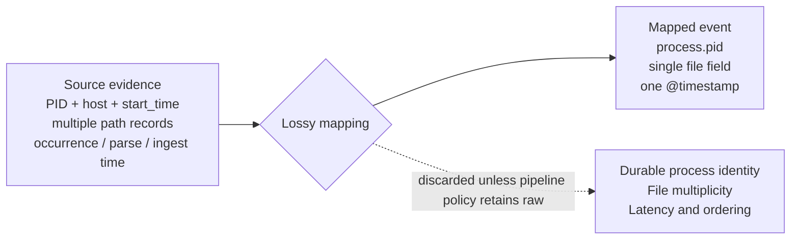
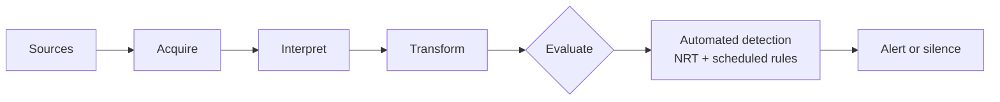
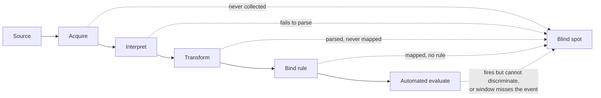

---

title: "The silence that reads as safety"
tags:

- Detection-as-code
- Detection engineering
- SIEM
- Security Data Pipeline
- Security Data Lake
- Logging

---

Consider a detection team that builds a rule watching for suspicious LSASS access — the kind that precedes credential theft. On modern Windows estates that signal comes from Sysmon Event ID 10 or equivalent EDR process-access telemetry, not the raw security log, so the rule is bound to that source, tuned once against a red-team exercise, and deployed. For a while it fires as often as expected. Then it goes quiet. Not disabled, not erroring, not flagged anywhere as broken — the console shows it enabled, the source shows events still arriving, and the rule simply stops producing anything for anyone to look at.

Months of silence read, by default, as good news. No alerts means no credential theft, and no credential theft means the control is working. That is the reading every console is built to encourage, because a quiet rule looks identical to a working one.

The silence is also unreadable. It is consistent with several conditions that share nothing but their output. The technique may not be occurring, in which case the rule is doing exactly what it was built to do. The rule may be wrong — miscalibrated against a threshold nobody has revisited, or written against an implementation attackers have moved past. Or the evidence the rule depends on may have stopped arriving in usable form: a mapping change upstream, a parser failing on a subset of events, a field the rule reads that stopped being populated after a fleet update. Different conditions, one identical signal. The console cannot separate them, and neither can the analyst reading it.

That silence is what the pipeline produces when its stages are allowed to discard. The path from a log to an incident candidate gets described the way any refinement pipeline is — data becomes information, information becomes knowledge, each stage adding structure to the one below. What the description omits is that each stage is also free to throw away, and that a signal arriving at the end carries no record of what was discarded to produce it. Silence is the limit case: an output refined down to a single bit, and a single bit cannot say which condition produced it.

## Detection surface, and the part of it that has no name

The vocabulary built to describe detection stops at coverage — whether an endpoint runs an agent, whether a cloud service logs, whether a technique maps to any rule. Coverage answers one question: is the asset on the detection surface? It does not answer whether telemetry arriving from that asset still preserves the distinctions a rule was written to make.

The LSASS rule was deployed on a covered endpoint with telemetry flowing. The asset was on every established detection surface. The rule still went blind. That blindness is coverage that exists and no longer carries what a rule needs to discriminate.

The second question needs its own term. **Detection surface integrity** is the degree to which telemetry inside an established surface retains the distinctions a rule depends on and reaches the rule while the rule is looking. Size is necessary. Integrity is what makes size worth having.

The terrain has been studied piecemeal under other names. MITRE's Center for Threat-Informed Defense builds Atomic Data Sources and sensor mappings to ask what ATT&CK coverage actually requires, specifying the required fields, dependencies, fidelity, timeliness, and context a technique needs before it can be detected with confidence. Academic work has begun measuring attack observability in cloud telemetry by asking what evidence survives normalization. What remains unresolved is whether those requirements stay satisfied after deployment, as sources, parsers, mappings, routes, and evaluation windows change. The unit that question turns on is neither the feed nor the rule alone. It is the live dependency between them.

## What a mapping keeps, and what it decides not to

That lapsing dependency has a most common origin, and it is the third possibility in the LSASS silence: a field going quiet underneath a rule while the source stays healthy. This is not a parsing accident. It is what happens when the mapping from source to schema does exactly its job, and that job turns out narrower than what the rule needed.

Three things routinely conflated here belong apart. A *schema* defines what can be represented — ECS can carry occurrence, first-observed, and ingestion timestamps; UDM can carry repeated fields and process ancestry. A *mapping* is the function that selects source fields and transforms them into that schema. A *pipeline policy* decides whether the raw, unmapped event survives alongside the mapped one. The schema sets the ceiling on what can be expressed; the mapping decides what actually is; the pipeline policy decides whether anything discarded can be recovered. When people say a schema "lost" a field, the mapping is usually the agent. Lossy mappings are common, default, and rarely labeled as lossy.

A mapping is a claim about which distinctions in the source remain answerable afterward, made once and long before any rule tries to use the result. Loss is a property of a particular mapping, not of canonicalization. What one does is decide, silently, which future questions its output can no longer answer:

Each entry in that discarded column is a specific rule made impossible. A PID uniquely identifies a process only while that process is alive; after it exits, the number is free for reuse. A mapping that keeps the PID alone, without host and process start time or a source-provided entity identifier, cannot support durable correlation across time — the later process that inherits the number is indistinguishable from the one a rule was tracking. Several path records from a single audit event, each naming a file a process touched, collapse into one field, and file multiplicity stops being answerable. Occurrence, parse, and ingest time collapse into a single stamp, and questions of latency and ordering lose the fields that would answer them.

The Linux audit case has a precise boundary. An audit event is several records sharing one identifier, and standard tooling groups them into a single action. Storing the records separately preserves the relationship as long as the shared identifier and the record multiplicity are retained. Destruction comes only when the collector discards the identifier, overwrites repeated records, or presents an individual record as a complete action. Loss is a choice made at reconstruction, not inherent in the format.

None of these are bugs. Each mapping does a job — reduce a messy source to a consistent shape — and each reduction is also a decision about which future question the mapped event cannot answer. A rule that depends on durable process identity, file multiplicity, or ingest latency is not written incorrectly. It is written against evidence the mapping did not carry and the pipeline policy did not retain. Nothing downstream registers a fault.

## The same boundary, drawn everywhere

That boundary is most visible at the mapping, but reduction happens wherever information is compressed for the next consumer. It appears before the mapping runs, at reconstruction — the audit case, where a fragmented event is either reassembled or quietly broken depending on whether the collector preserves the binding identifier. It appears after, inside health metrics. A single composite health score folds queue depth, parser failures, coverage gaps, and noise into one number. The sum is honest arithmetic, but the number cannot say which input moved it. A stakeholder told a score fell can do nothing; a stakeholder told it fell because a mandatory source went dark can act.

It appears in vocabulary too. The field has converged on *detection gap* for a blind spot, and the term is flat: it records that a gap exists without recording where in the pipeline it opened. That flatness tracks a uniformity in the pipelines themselves. Every published architecture — Beats-to-Elasticsearch, Cribl-fronted, multi-tool SOC stack — differs on vendors, ordering, and logos but shares the same spine: acquire, interpret, transform, evaluate.

A SIEM is a data-engineering pipeline, and every architecture can fail at any stage. The operations are invariant across vendors; only timing and binding move. Early binding — schema-on-write, as in Elasticsearch — parses and maps at ingest and can make failures persistent when raw evidence is not retained. Late binding — schema-on-read, as in Splunk — stores raw and imposes structure at query time, which relocates the selection but does not necessarily make loss permanent. Regardless of architecture, a blind spot can open wherever information is discarded.

## Extent and integrity

A blind spot has a location. Every blind spot in this argument sits at one operation:

Placed this way, blind spots sort into two families. A blind spot is an *extent* failure when the asset, source, or analytic was never brought into scope. It is an *integrity* failure when the thing is in scope and the telemetry still fails to deliver what a rule needs — either because a distinction was dropped, or because intact telemetry never reached a rule that was looking.

| Blindness | Where it opens | Family | Rule-relative tooling today |
|---|---|---|---|
| Collection | Source never onboarded | Extent | Yes — inventory, deployment coverage |
| Detection | Mapped and available, no rule binds it | Extent | Coverage matrices record the claim |
| Parser | In scope, events fail to parse | **Integrity** | Fragmented, not rule-relative |
| Mapping | Parses, never mapped into a rule's fields | **Integrity** | Fragmented, not rule-relative |
| Discrimination | Rule fires, required context absent | **Integrity** | Fragmented, not rule-relative |
| Temporal | Intact event never evaluated — aged past a window, or streamed past an NRT rule before its partner | **Integrity** | Effectively none |

The extent failures have tooling because both ask whether something is in scope. Detection blindness is the hinge case: by mechanism it looks like the integrity failures — in-scope and healthy and silent — but by remedy it belongs with extent, because the fix is to write a rule, not to repair telemetry. An ATT&CK matrix records that a rule claims a technique; it does not establish that the rule is deployed, enabled, fed by healthy telemetry, or recently validated.

The integrity failures share a property no coverage instrument captures: each passed the extent test and failed afterward. Parser and mapping blindness clear onboarding and then fail on what the surface delivers. Discrimination blindness is narrower than it sounds — the contextual evidence a rule declares it needs is absent, delayed, or semantically changed. Whether the rule can actually infer intent given every declared dependency is a separate question that belongs to efficacy, not integrity, because answering it requires testing against known-malicious and known-benign activity the pipeline cannot generate. Temporal blindness is the mode the automated layer exposes: a scheduled rule has a lookback window, and an event that arrives and ages past it before the next sweep is never evaluated though the data was present.

Google SecOps exposes source health, parser health, parse and validation failures, drop reasons, latency, and schema-change indicators. Elastic's Data Quality dashboard checks ECS mapping compatibility. Sentinel monitors the health of analytics rules and data connectors. Each measures part of collection, parser, or mapping integrity. What public practice rarely does is join these component signals into a rule-relative model that answers whether every live dependency of a deployed rule remains satisfied after a source, parser, or schema change. The gap is not measurement. It is integration.

## Measuring without committing the same reduction

A metric that watches this pipeline must avoid becoming an instance of what it watches. The temptation is the composite — one health score, one coverage percentage — and every composite draws the boundary again. A hundred-percent ATT&CK coverage claim, read alone, answers the LSASS silence with false confidence. Read beside a per-rule dependency measure — is this rule's declared evidence actually arriving in the right form within the window it evaluates — the coverage number becomes diagnostic instead of reassuring.

The construct worth stating precisely is accumulated invalid time: the total duration during which a rule's declared hard dependencies went unsatisfied, weighted if needed by criticality. It is derivable from ordinary pipeline state, rule-relative by construction, and it turns "the rule went silent" into "the rule was structurally unable to fire for this long." But it must not collapse into a single green-or-red flag per rule, because a rule is rarely uniformly healthy or broken across an estate. The measure that avoids the essay's own criticism is not "is this rule valid" but "across what proportion of its intended scope does a valid path remain," and it needs an explicit unknown state, because treating an unevaluated dependency as healthy would rebuild silence-as-safety inside the instrument meant to detect it.

## Scope

This model describes accidental invalidation — parser drift, schema change, delayed delivery. Adversarial invalidation of the same path — audit-policy manipulation, sensor termination, log clearing, selective dropping — is the same structural failure with an attacker in the loop, and it is out of scope here. People and process are excluded — analyst throughput, dismissal behavior, mean time to detect and respond, staffing. Retention is excluded only from live dependency integrity, not from detection capability at large, because retention governs long-window correlation and retrospective detection. External ground truth is out by construction: efficacy and true detection probability require an intervention originating outside the pipeline.

## The model is a snapshot too

Every exclusion above rests on a single premise: a claim frozen at a moment calcifies into false confidence unless rechecked. That premise binds this model as much as any mapping it describes. Whether a rule-relative integrity signal predicts broken detections better than feed-volume baselines or coverage-only scores is falsifiable — checkable against a corpus of real source outages, parser changes, and schema changes, measured by whether the integrity signal flags the break before the silence does.

The failure this piece describes is not confined to silence. A detection can keep firing while its output no longer means what its operators believe — wrong entity, changed severity, stale enrichment, an alert generated but never dispatched. Silence is the clearest symptom, but the same broken path can produce confident, well-formed, wrong output. What unifies both is that the detection remained enabled and executable while the evidence path beneath it stopped meaning what it claimed to.

A pipeline that cannot tell you when an event happened, whether it was delivered, how its fields should be read, and whether its payload still distinguishes what a rule needs has already crossed the boundary. It is not measuring integrity. It is reporting extent, and reading the silence as safety.
