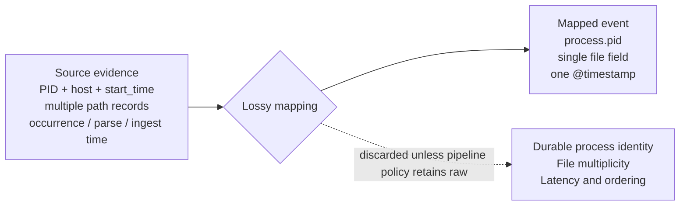

Consider a representative detection team building a rule for suspicious LSASS access. On a modern Windows estate that signal comes from Sysmon Event ID 10 or an equivalent EDR process-access event, not the raw Security log. The rule is bound to that source, tuned against a red-team exercise, and deployed. For a while it fires as often as expected. Then it goes quiet. It is not disabled, erroring, or flagged as broken. The console shows it enabled, the source shows events still arriving, and the rule simply stops producing anything for anyone to investigate.

The console cannot tell the analyst why. The technique may not be occurring, in which case the rule is doing exactly what it was built to do. The rule may be miscalibrated against a threshold nobody has revisited. Or the evidence may have stopped arriving in a usable form because of an upstream mapping change, a parser failure on a subset of events, or a field that stopped being populated after a fleet update. All three conditions look identical in the console: enabled, receiving data, silent. That is the operational problem this piece addresses. A rule can remain enabled, deployed, and connected to a live source while the specific evidence it depends on has quietly become invalid, and the platforms built to monitor detection do not check for that condition directly.

## A rule's evidence, not its enablement status

The vocabulary used to describe detection usually stops at coverage: whether an endpoint runs an agent, whether a cloud service logs, whether a technique maps to any rule at all. MITRE's [Sensor Mappings to ATT&CK](https://ctid.mitre.org/projects/sensor-mappings-to-attack/) formalises this well, connecting ATT&CK data sources to the concrete sensors and events that can provide them. Coverage answers one question: is the asset on the detection surface? It does not answer whether the telemetry crossing that surface still carries what a specific rule needs to discriminate.

The LSASS rule was deployed on a covered endpoint with telemetry flowing. It passed every coverage check available. The endpoint stayed covered while the field the rule actually read stopped carrying what the rule needed. Coverage is a property of the asset. What the rule needs is a property of the rule, and the two diverge exactly in cases like this one.

Most platforms collapse that divergence into a single operational status — enabled or disabled, connected or not — because the underlying health signals are usually binary too. That binary is the wrong shape for the failure. A source can go quiet because a service is legitimately down, because a sensor failed accidentally, or because an attacker suppressed it, and these look identical from the console. Sparse or absent events, on their own, cannot prove that a dependency is broken; they can only fail to prove that it is healthy. A rule-relative model needs a third state. Each declared dependency of a rule should carry `VALID`, `INVALID`, or `UNKNOWN`, where `UNKNOWN` is the honest answer whenever event volume alone cannot settle the question, and where `VALID` and `INVALID` are earned from signals that do not depend on volume at all.

Those signals split into two families that current tooling tends to blur together. Capability signals describe whether the evidence path can produce what the rule needs at all: sensor configuration, loaded audit rules, parser compatibility, field-mapping coverage, transport health, timing guarantees. Activity signals describe what is actually arriving: event counts, field-population rates, distribution shifts. Microsoft Sentinel's [connector health monitoring](https://learn.microsoft.com/en-us/azure/sentinel/monitor-data-connector-health), Elastic's [ingest-pipeline error handling](https://www.elastic.co/docs/manage-data/ingest/transform-enrich/error-handling), and Google SecOps's [ingestion health hub](https://docs.cloud.google.com/chronicle/docs/ingestion/ingestion-overview) all expose fragments of both families — parser failures, mapping compatibility, connector status, latency. What none of them do by default is join those fragments into a per-rule answer. A capability signal can be healthy while an activity signal is silent, and a rule-relative model needs both before it moves a dependency out of `UNKNOWN`.

## What a mapping commits a rule to

Part of why capability signals matter independently of volume is that loss is usually designed in, not accidental. A schema sets what can be represented at all — ECS can carry occurrence, first-observed, and ingestion timestamps; UDM can carry repeated fields and process ancestry. A mapping selects which source fields populate that schema. A pipeline policy decides whether the raw, unmapped event survives alongside the mapped one. The schema sets the ceiling. The mapping decides which source distinctions cross it. The policy decides whether anything discarded is still recoverable. When a rule loses a field, the loss usually happened in the mapping or the retention policy, not in the schema's capacity.


```mermaid
graph LR
    A["Source evidence<br/>PID + host + start_time<br/>multiple path records<br/>occurrence / parse / ingest time"] --> B{"Lossy mapping"}
    B --> C["Mapped event<br/>process.pid<br/>single file field<br/>one @timestamp"]
    B -.->|discarded unless pipeline policy retains raw| D["Durable process identity<br/>File multiplicity<br/>Latency and ordering"]
```

A process ID uniquely identifies a process only while it is alive; a mapping that keeps the PID without host and start time cannot support correlation once the number is reused. Linux `auditd` shows the same boundary precisely: several records share one identifier, and standard tooling groups them into a single action. Destruction happens when a collector discards that identifier or treats one record as the whole action — a decision made in reconstruction, not one inherent to the source format. None of this is necessarily a bug. A mapping narrower than a rule's later requirements is often the correct engineering trade-off. It still means the rule now depends on evidence the mapping never carried, and nothing downstream will register a fault when that dependency goes unmet.

## Declaring what a rule needs

The mapping discussion above matters only because it explains why a dependency can be `INVALID` even while the source it comes from looks perfectly healthy. Making that checkable requires the rule to say, explicitly, what it needs: the required source, the event type, the mandatory fields, any semantic constraint on those fields, the acceptable latency, and the evaluation window. A minimal declaration for the LSASS rule looks like this:

```yaml
rule: lsass-access-suspicious
dependencies:
  - source: sysmon
    event_type: ProcessAccess
    required_fields: [SourceImage, TargetImage, GrantedAccess]
    semantic_constraint: "GrantedAccess includes PROCESS_VM_READ"
    max_latency: 5m
    evaluation_window: 15m
```

Each line is checkable against a specific signal, not a general health score. `source: sysmon` and `event_type: ProcessAccess` are capability checks against sensor configuration and parser compatibility. `required_fields` and `semantic_constraint` are mapping checks against the schema the mapping actually populates. `max_latency` and `evaluation_window` are checks against transport timing and the scheduler that runs the rule. A dependency moves to `INVALID` only when a specific line fails a specific check; it moves to `UNKNOWN` when no check has run recently enough to say either way, and it never moves to `INVALID` on the strength of a quiet event count alone.

## Accumulated invalid time

Declaring dependencies this way makes a single measure possible: the total duration during which a rule's declared hard dependencies were unsatisfied. Each dependency carries a timestamped state; a transition to `INVALID` opens an interval, recovery closes it, and the intervals sum per rule. Rule criticality stays a separate dimension rather than folding into the duration, so a low-priority rule that has been silently broken for a month is still visible as a month, not diluted by its priority weighting.

This is the most falsifiable proposal in this piece, because it converts "the rule went silent" into "the rule was structurally unable to fire for this period," and that duration is a number a team can track, alert on, and reduce. It needs retained state transitions rather than a point-in-time snapshot — a health dashboard that only shows the current status cannot compute it — but that retention requirement is small compared with what it replaces: a console that reads absence of alerts as absence of risk.

## Suppression looks the same as drift

Everything above was framed around accidental invalidation — parser drift, a schema change, a delayed feed. Deliberate suppression produces the identical structural failure. An attacker who disables Sysmon, clears an audit policy, or selectively drops a log source leaves the same signature: capability or activity signals moving to `INVALID`, with no alert generated because the rule that would have caught the technique is the one that just went dark. A model that only asks whether a dependency is satisfied does not need to know why it stopped being satisfied to flag it, so accidental drift and adversarial suppression belong in the same three-state model rather than in two separate ones.

That equivalence has a limit worth stating plainly. The capability signals this model relies on — sensor state, loaded rule set, configuration hash — are themselves telemetry, collected and reported by the same infrastructure an attacker with sufficient access could tamper with. A model built on the assumption that those signals are honest will correctly catch configuration drift and most accidental failures, and it will catch unsophisticated suppression that leaves the reporting path intact. It has no answer for an adversary capable of falsifying the capability signal along with suppressing the evidence it describes. Closing that gap needs tamper-evident collection — signed heartbeats, attestation from outside the host being monitored — which this model does not supply on its own and which should be treated as a distinct, harder problem rather than assumed away.

## Scope

Attacker attribution stays out of scope: the model determines that a dependency is invalid, not who or what made it so. Analyst throughput, dismissal behaviour, and staffing belong to people and process rather than the evidence path. Retention sits outside live dependency validity too, though it remains part of overall detection capability because it governs long-window correlation. Whether a rule correctly infers malicious intent when every declared dependency is satisfied is a question of efficacy, not validity, and answering it needs known-malicious and known-benign activity the pipeline cannot supply by itself.

## The criterion this replaces

A detection rule should declare the evidence conditions required for it to remain valid, and the platform should evaluate those conditions continuously, independently of whether the rule has produced an alert. That is a stricter requirement than a coverage matrix or a feed-volume dashboard, and it is only worth adopting if it catches broken detection capability earlier than either does — a claim that is testable against a corpus of real source outages, parser changes, and schema changes, not just plausible on paper. It also asks more of a rule author than deploying against a red-team exercise once and moving on: every hard dependency has to be named at write time, not discovered later when the console goes quiet and nobody can say why.
