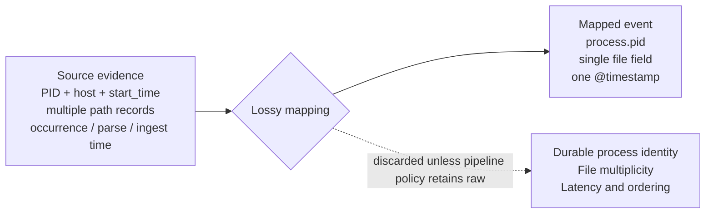
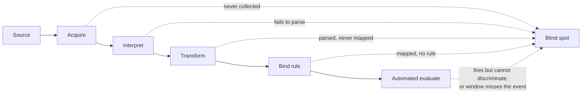

A detection team builds a rule for suspicious LSASS access. On modern Windows estates, that signal comes from Sysmon Event ID 10 or equivalent EDR process-access telemetry rather than the raw Security log. The rule is bound to that source, tuned against a red-team exercise, and deployed. For a while, it fires as often as expected. Then it goes quiet. It is not disabled, erroring, or flagged as broken. The console shows it enabled, the source shows events still arriving, and the rule simply stops producing anything for anyone to investigate.

After a few months, the silence starts to look like good news. No alerts is interpreted as no credential theft, which in turn suggests that the control is working. Most consoles encourage that reading because a quiet rule looks much like a healthy one.

The problem is that the silence says very little. The technique may not be occurring, in which case the rule is doing exactly what it was built to do. The rule may be wrong — miscalibrated against a threshold nobody has revisited, or written against an implementation attackers have moved past. The evidence may also have stopped arriving in a usable form because of an upstream mapping change, a parser failure affecting a subset of events, or a field that stopped being populated after a fleet update. All of these conditions produce the same result in the console. Neither the platform nor the analyst can distinguish between them from the absence of alerts alone.

Each stage of a detection pipeline can remove information that the next stage cannot recover. We usually describe the path from a log to an incident candidate as refinement: data becomes information, then something an analyst can act on. That description says little about what was removed along the way. By the time the pipeline produces no alert, the absence carries no record of whether the technique did not occur or the evidence was lost before evaluation.

## Detection surface, and what coverage misses

The vocabulary used to describe detection usually stops at coverage — whether an endpoint runs an agent, whether a cloud service logs, or whether a technique maps to any rule. Coverage answers one question: is the asset on the detection surface? It does not answer whether telemetry from that asset still preserves the distinctions a rule was written to make.

The LSASS rule was deployed on a covered endpoint with telemetry flowing. The asset appeared on every established detection surface, yet the rule still went blind. The endpoint remained covered, but the telemetry no longer carried what the rule needed to discriminate.

That second property is **detection surface integrity**: the degree to which telemetry inside an established surface retains the distinctions a rule depends on and reaches the rule while the rule is looking. Coverage still matters, but its value depends on the integrity of what flows through it.

Existing work covers parts of this problem. MITRE's Center for Threat-Informed Defense uses Atomic Data Sources and sensor mappings to describe what ATT&CK coverage requires, including fields, dependencies, fidelity, timeliness, and context. Academic work has also started measuring attack observability in cloud telemetry by examining what evidence survives normalization. The operational problem is checking whether those requirements remain satisfied after deployment as sources, parsers, mappings, routes, and evaluation windows change. That check concerns the live dependency between a rule and its evidence, not the feed or the rule in isolation.

## What a mapping keeps, and what it leaves behind

One common cause is the third LSASS scenario: a field goes quiet underneath a rule while the source still appears healthy. This is not always a parsing accident. It can happen because the mapping from source to schema does exactly what it was designed to do, but the design is narrower than the rule's later requirements.

Three separate decisions are often collapsed into one. A *schema* defines what can be represented — ECS can carry occurrence, first-observed, and ingestion timestamps; UDM can carry repeated fields and process ancestry. A *mapping* selects source fields and transforms them into that schema. A *pipeline policy* determines whether the raw or unmapped event survives alongside the mapped one. The schema sets the ceiling on what can be expressed. The mapping determines which source distinctions are carried into it. The pipeline policy determines whether discarded evidence remains recoverable. When people say that a schema "lost" a field, the loss usually occurred in the mapping or retention policy.

A mapping therefore commits the pipeline to a particular set of future questions. Loss is a property of a specific mapping, not of canonicalization itself. In practice, the mapping determines which distinctions remain answerable after transformation:

```mermaid
graph LR
    A["Source evidence<br/>PID + host + start_time<br/>multiple path records<br/>occurrence / parse / ingest time"] --> B{"Lossy mapping"}
    B --> C["Mapped event<br/>process.pid<br/>single file field<br/>one @timestamp"]
    B -.->|discarded unless pipeline policy retains raw| D["Durable process identity<br/>File multiplicity<br/>Latency and ordering"]
```

Each discarded item removes a specific class of rules or correlations. A PID uniquely identifies a process only while that process is alive; after it exits, the number is available for reuse. A mapping that keeps the PID alone, without the host and process start time or a source-provided entity identifier, cannot support durable correlation across time. A later process that inherits the number becomes indistinguishable from the one the rule was tracking. Several path records from one audit event can collapse into a single field, making file multiplicity impossible to reconstruct. Occurrence, parse, and ingest time can collapse into one timestamp, removing the evidence needed to reason about latency and ordering.

The Linux audit case has a precise boundary. An audit event consists of several records sharing one identifier, and standard tooling groups them into a single action. Storing the records separately preserves the relationship as long as the shared identifier and record multiplicity remain intact. Destruction occurs when the collector discards the identifier, overwrites repeated records, or presents an individual record as a complete action. The loss happens during reconstruction; it is not inherent in the format.

Some of these reductions are deliberate and reasonable, but they still remove downstream options. A rule that depends on durable process identity, file multiplicity, or ingest latency may be valid, but it now depends on evidence the mapping did not carry and the pipeline policy did not retain. Nothing downstream necessarily registers a fault.

## Reduction happens elsewhere too

The mapping is the most visible boundary, but information is reduced at several points in the pipeline. It can happen before mapping, during reconstruction, as in the audit example. It can also happen later, inside health metrics. A composite health score may combine queue depth, parser failures, coverage gaps, and noise into one number. The arithmetic may be correct, but the score cannot explain which input moved it. A stakeholder told that a score fell has little to act on. A stakeholder told that a mandatory source went dark can respond.

The same flattening appears in vocabulary. The field has largely converged on *detection gap* for a blind spot, but the term does not identify where in the pipeline the gap opened. Most published architectures I have seen differ in vendors, ordering, and logos while retaining a similar operational spine.

Whatever the product calls its stages, the SIEM still acquires, interprets, transforms, and evaluates data. The timing and binding differ. Early binding — schema-on-write, as in Elasticsearch — parses and maps at ingest and can make failures persistent when raw evidence is not retained. Late binding — schema-on-read, as in Splunk — stores raw data and imposes structure at query time. That relocates the selection and can make recovery easier, but it does not remove the possibility of loss. A blind spot can still open wherever information is discarded or interpreted incorrectly.

## Extent and integrity

The failure becomes easier to diagnose when it is tied to the operation where it opens:

```mermaid
flowchart LR
    A[Source] --> B[Acquire]
    B --> C[Interpret]
    C --> D[Transform]
    D --> E[Bind rule]
    E --> F[Automated evaluate]

    B -. never collected .-> X[Blind spot]
    C -. fails to parse .-> X
    D -. parsed, never mapped .-> X
    E -. mapped, no rule .-> X
    F -. fires but cannot discriminate,<br/>or window misses the event .-> X
```

The failures in the diagram differ in one important respect. Some never enter the detection surface; others enter it and fail later. I call the first group *extent* failures: the asset, source, or analytic was never brought into scope. The second group contains *integrity* failures: the thing is in scope, but the telemetry still fails to deliver what a rule needs because a distinction was dropped or intact evidence did not reach the rule while it was evaluating.

| Blindness | Where it opens | Family | Typical visibility today |
|---|---|---|---|
| Collection | Source never onboarded | Extent | Inventory and deployment coverage |
| Detection | Mapped and available, no rule binds it | Extent | Coverage matrices; deployment state varies |
| Parser | In scope, events fail to parse | **Integrity** | Usually source- or parser-level, not rule-relative |
| Mapping | Parses, never mapped into a rule's fields | **Integrity** | Usually schema- or source-level, not rule-relative |
| Discrimination | Rule fires, required context absent | **Integrity** | Usually discovered during testing or investigation |
| Temporal | Intact event never evaluated — aged past a window, or streamed past an NRT rule before its partner | **Integrity** | Rarely evaluated per rule |

Extent failures already have useful tooling because they ask whether something is in scope. Detection blindness does not fit this division cleanly. Operationally, it can resemble an integrity failure because the source is present, healthy, and silent. The remedy still belongs to extent because the missing component is the analytic itself, not the evidence path. An ATT&CK matrix can record that a rule claims a technique, but it does not establish that the rule is deployed, enabled, receiving healthy telemetry, or recently validated.

The integrity failures share a property that ordinary coverage measures miss: each passed the extent test and failed afterward. Parser and mapping blindness clear onboarding and then fail on what the surface delivers. Discrimination blindness is narrower than the name may suggest. It means that contextual evidence declared by the rule is absent, delayed, or semantically changed. Whether the rule can correctly infer malicious intent when every declared dependency is present is a question of efficacy rather than integrity. Answering it requires known-malicious and known-benign activity that the pipeline cannot provide by itself. Temporal blindness is exposed by the automated evaluation layer. A scheduled rule has a lookback window, and an event that arrives too late or ages past that window before the next sweep may never be evaluated even though the data exists.

Google SecOps, Elastic, and Sentinel expose useful component signals such as source health, parser failures, mapping compatibility, connector health, latency, and rule status. These measurements cover parts of collection, parser, and mapping integrity. What I rarely see in public guidance is those signals joined into a rule-relative model that can answer whether every live dependency of a deployed rule remains satisfied after a source, parser, or schema change. The measurements exist, but they are usually not connected at the level where the rule depends on them.

## Measuring this without flattening it again

A metric for this pipeline should not repeat the same reduction it is meant to expose. The obvious temptation is a single health score or coverage percentage. Those measures can still be useful, but only when the components remain visible. A claim of complete ATT&CK coverage says little about the LSASS silence on its own. Read alongside a per-rule dependency measure — whether the rule's declared evidence is arriving in the required form and within its evaluation window — the coverage number becomes diagnostic rather than reassuring.

One useful measure is **accumulated invalid time**: the total duration during which a rule's declared hard dependencies were unsatisfied. Each hard dependency would maintain a timestamped valid or invalid state. A transition to invalid opens an interval; recovery closes it; the intervals are then summed per rule. Rule criticality can remain a separate dimension rather than being folded into the duration. This requires retained state transitions or a time series rather than a point-in-time snapshot, but it turns "the rule went silent" into "the rule was structurally unable to fire for this period."

## Scope

This article is limited to accidental invalidation such as parser drift, schema change, and delayed delivery. Audit-policy manipulation, sensor termination, log clearing, and selective dropping produce the same structural failure with an attacker in the loop, but adversarial invalidation is outside the scope here.

Analyst throughput, dismissal behaviour, mean time to detect and respond, and staffing belong to people and process rather than the evidence path described in this model. Retention also sits outside live dependency integrity, although it remains part of detection capability because it governs long-window correlation and retrospective detection. External ground truth is excluded because efficacy and true detection probability require evidence or intervention originating outside the pipeline.

## The model also needs validation

This model is useful only if it identifies broken detections earlier or more reliably than existing feed-volume checks and coverage scores. That is testable. A corpus of real source outages, parser changes, and schema changes could be used to compare whether a rule-relative integrity signal flags the failure before alert silence becomes the only visible symptom.

The failure described here is not limited to silence. A detection can continue firing while its output no longer means what operators think it means: the entity may be wrong, severity may have changed, enrichment may be stale, or an alert may have been generated but never dispatched. In each case, the detection remains enabled and executable while the evidence path underneath it no longer supports the claim being made.

A pipeline should be able to establish when an event occurred, whether it was delivered, how its fields were interpreted, and whether its payload still preserves the distinctions a rule depends on. Without that evidence, the platform may still report coverage, but it cannot support a credible claim of detection integrity.
