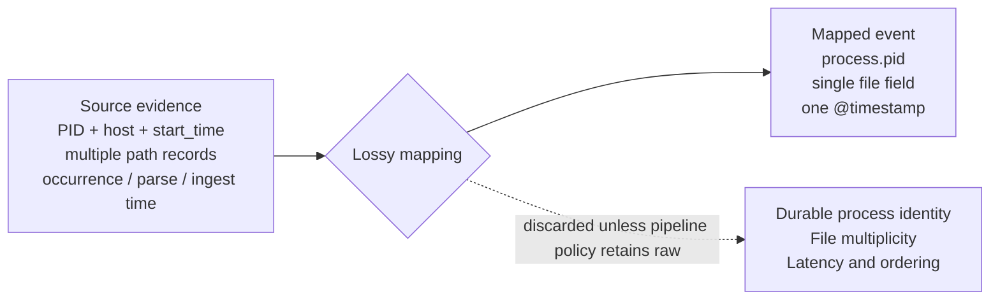

Imagine a detection team creating a rule to identify suspicious LSASS access. In a modern Windows environment, this signal typically originates from Sysmon Event ID 10 or a similar EDR process-access event rather than the standard Security log. The team links the rule to that specific data source, tunes it based on a red-team exercise, and deploys it. The rule initially generates alerts at the expected frequency. Eventually, the rule stops producing alerts. It has not been disabled, it is not generating errors, and it is not marked as broken. The management console indicates the rule is active and the data source continues to provide events, but the rule no longer generates results for investigators.

The console does not provide the reason for a lack of alerts. A rule might be silent because the specific technique is not occurring, which means the rule is functioning correctly. Alternatively, the rule might be miscalibrated against an outdated threshold. It is also possible that the evidence is no longer arriving in a usable format due to upstream mapping changes, parser failures on specific events, or fields that are no longer populated after a fleet update. These three scenarios appear identical in the console because the rule remains enabled and continues to receive data. This creates an operational problem where a rule stays deployed and connected to a live source while the specific evidence it requires is no longer valid. Standard detection monitoring platforms do not check for this specific condition.

## A rule's evidence, not its enablement status

The vocabulary used to describe detection usually stops at coverage: whether an endpoint runs an agent, whether a cloud service logs, whether a technique maps to any rule at all. MITRE's [Sensor Mappings to ATT&CK](https://ctid.mitre.org/projects/sensor-mappings-to-attack/) formalises this well, connecting ATT&CK data sources to the concrete sensors and events that can provide them. Coverage answers one question: is the asset on the detection surface? It does not answer whether the telemetry crossing that surface still carries what a specific rule needs to discriminate.

The LSASS rule was deployed on a covered endpoint with telemetry flowing. It passed every coverage check available. The endpoint stayed covered while the field the rule actually read stopped carrying what the rule needed. Coverage is a property of the asset. What the rule needs is a property of the rule, and the two diverge exactly in cases like this one.

Most platforms combine these different states into a single status, such as enabled or disabled or connected or disconnected. This happens because the underlying health signals are usually binary. This binary approach does not accurately represent how systems fail. A source might stop sending data because a service is down, a sensor failed, or an attacker suppressed the signal. These three scenarios appear identical on a console. Low event volume or the absence of events does not prove that a dependency is broken. These signals only indicate a lack of proof that the system is healthy. A rule-relative model requires a third state. Every declared dependency should be marked as `VALID`, `INVALID`, or `UNKNOWN`. The `UNKNOWN` status is the accurate response when event volume cannot provide a definitive answer. The `VALID` and `INVALID` statuses should be derived from signals that do not rely on volume.

Those signals split into two families that current tooling tends to blur together. Capability signals describe whether the evidence path can produce what the rule needs at all: sensor configuration, loaded audit rules, parser compatibility, field-mapping coverage, transport health, timing guarantees. Activity signals describe what is actually arriving: event counts, field-population rates, distribution shifts. Microsoft Sentinel's [connector health monitoring](https://learn.microsoft.com/en-us/azure/sentinel/monitor-data-connector-health), Elastic's [ingest-pipeline error handling](https://www.elastic.co/docs/manage-data/ingest/transform-enrich/error-handling), and Google SecOps's [ingestion health hub](https://docs.cloud.google.com/chronicle/docs/ingestion/ingestion-overview) all expose fragments of both families - parser failures, mapping compatibility, connector status, latency. What none of them do by default is join those fragments into a per-rule answer. A capability signal can be healthy while an activity signal is silent, and a rule-relative model needs both before it moves a dependency out of `UNKNOWN`.

## What a mapping commits a rule to

Capability signals are important regardless of data volume because data loss is typically a result of design choices rather than accidents. The schema determines the total range of representable information. For example, ECS supports occurrence, first-observed, and ingestion timestamps, while UDM supports repeated fields and process ancestry. A mapping determines which specific source fields are used to fill that schema. A pipeline policy then dictates if the original, unmapped event is kept with the mapped version. The schema defines the maximum possible data detail. The mapping determines which specific details from the source are actually included. The policy determines if any excluded data can be recovered later. If a rule lacks a specific field, that data was likely removed during the mapping process or by a retention policy rather than by a limitation of the schema.


```mermaid
graph LR
    A["Source evidence<br/>PID + host + start_time<br/>multiple path records<br/>occurrence / parse / ingest time"] --> B{"Lossy mapping"}
    B --> C["Mapped event<br/>process.pid<br/>single file field<br/>one @timestamp"]
    B -.->|discarded unless pipeline policy retains raw| D["Durable process identity<br/>File multiplicity<br/>Latency and ordering"]
```

A process ID identifies a process only during its lifetime. A mapping that stores the PID without the host and start time cannot correlate data after the operating system reuses the number. Linux `auditd` demonstrates this boundary. Multiple records share one identifier, and standard tools group these records into a single action. Data loss occurs when a collector discards the identifier or treats a single record as the complete action. This is a decision made during reconstruction rather than a limitation of the source format. This behavior is not always a bug. Creating a mapping narrower than what a rule eventually requires is often a valid engineering trade-off. However, it means the rule depends on evidence that the mapping does not contain. Downstream systems will not report an error when this dependency is missing.

## Declaring what a rule needs

The mapping discussion above matters only because it explains why a dependency can be `INVALID` even while the source it comes from looks perfectly healthy. Making that checkable requires the rule to say, explicitly, what it needs: the required source, the event type, the mandatory fields, any semantic constraint on those fields, the acceptable latency, and the evaluation window. A minimal declaration for the LSASS rule looks like this:

```yaml
rule: lsass-access-suspicious
dependencies:
  - source: sysmon
    event_type: ProcessAccess
    required_fields: [SourceImage, TargetImage, GrantedAccess]
    semantic_constraint: "GrantedAccess includes PROCESS_VM_READ"
    max_latency: 5m
    evaluation_window: 15m
```

Each line is verified against a specific signal rather than a general health score. The `source: sysmon` and `event_type: ProcessAccess` lines check sensor configuration and parser compatibility. The `required_fields` and `semantic_constraint` lines check the schema that the mapping populates. The `max_latency` and `evaluation_window` lines check transport timing and the rule scheduler. A dependency becomes `INVALID` only if a specific line fails a specific check. It becomes `UNKNOWN` if no check has run recently enough to provide a status. A dependency does not become `INVALID` based only on a low event count.

## Accumulated invalid time

You can measure one specific value by declaring dependencies in this manner. This value is the total time that a rule's declared hard dependencies were not met. Every dependency has a state with a timestamp. An interval begins when a state changes to `INVALID` and ends when the state recovers. These intervals are added together for each rule. Rule criticality is kept as a separate metric instead of being combined with the duration. This ensures that a low-priority rule that is broken for a month shows a duration of one month. The priority level does not reduce or change the recorded time.

This is the most falsifiable proposal in this piece. It converts "the rule went silent" into "the rule was structurally unable to fire for this period," which is a duration a team can track, alert on, and reduce. This method requires retained state transitions instead of a point-in-time snapshot. A health dashboard that only shows the current status cannot compute this figure. However, this retention requirement is small compared to the alternative of using a console that reads the absence of alerts as the absence of risk.

## Suppression looks the same as drift

The previous sections focused on accidental invalidation caused by parser drift, schema changes, or delayed feeds. Deliberate suppression causes the same structural failure. If an attacker disables Sysmon, clears an audit policy, or drops a log source, the result is the same. Capability or activity signals move to an invalid state. No alert is generated because the rule meant to catch the technique is the one that has been disabled. A model that checks if a dependency is satisfied does not need to know the reason it stopped working to flag it. Therefore, accidental drift and adversarial suppression should be part of the same three-state model instead of being treated as separate issues.

This equivalence has a specific limit. The capability signals this model uses include sensor states, loaded rule sets, and configuration hashes. These signals are telemetry data collected by the same infrastructure that an attacker could modify if they have enough access. A model that assumes these signals are accurate will identify configuration changes and most accidental failures. It will also detect simple attempts to suppress data that do not disrupt the reporting path. However, it cannot detect an adversary who can falsify the capability signal while also suppressing the evidence. Addressing this gap requires tamper-evident collection methods, such as signed heartbeats or attestation from an external host. This model does not provide those features. They should be treated as a separate and more difficult problem instead of being ignored.

## Scope

Attacker attribution stays out of scope: the model determines that a dependency is invalid, not who or what made it so. Analyst throughput, dismissal behaviour, and staffing belong to people and process rather than the evidence path. Retention sits outside live dependency validity too, though it remains part of overall detection capability because it governs long-window correlation. Whether a rule correctly infers malicious intent when every declared dependency is satisfied is a question of efficacy, not validity, and answering it needs known-malicious and known-benign activity the pipeline cannot supply by itself.

## The criterion this replaces

A detection rule must specify the evidence conditions it needs to function. The platform should test these conditions on a continuous basis, regardless of whether the rule has triggered an alert. This requirement is more demanding than using a coverage matrix or a volume dashboard. This approach is only useful if it identifies broken detection capabilities faster than those other methods. This effectiveness can be verified by testing against actual source outages, parser updates, and schema changes rather than relying on theory. This process requires more effort from the rule author than a single deployment during a red-team exercise. Authors must identify every hard dependency when they write the rule. This prevents situations where a rule stops working and the cause remains unknown. 
