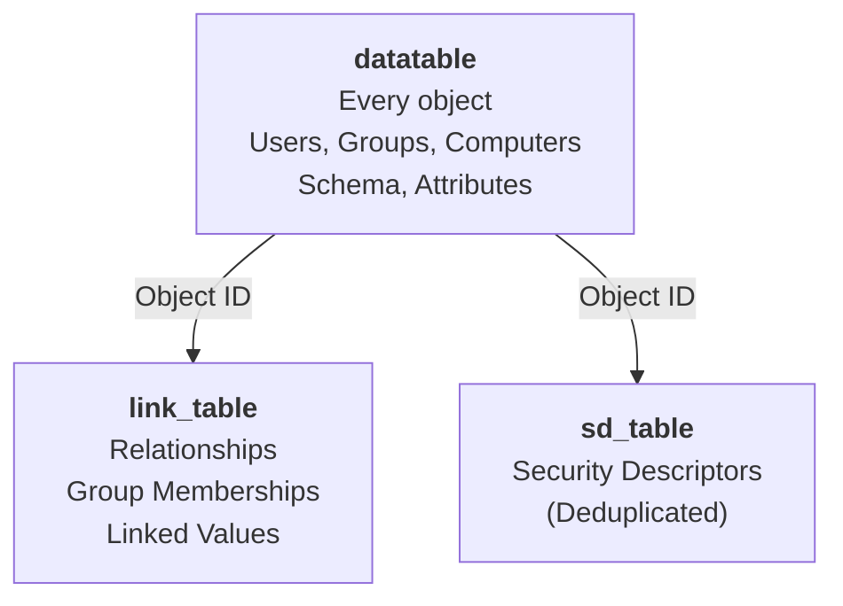
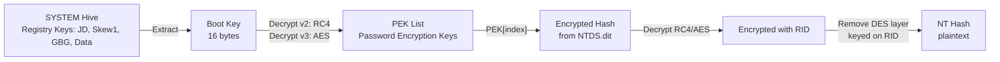

The Slack ping arrives before the command finishes running. A red-team pair, three days into an authorised internal engagement, has reached Domain Admin and goes for the obvious objective: pull `ntds.dit` and the `SYSTEM` hive off a domain controller with `ntdsutil`, take them offline, and demonstrate how many of the client's passwords crack in an afternoon. The `ntdsutil` command has not yet returned when the client's [Wazuh](https://wazuh.com/?utm_source=ambassadors&utm_medium=referral&utm_campaign=ambassadors+program) manager lights up with a level-12 alert — *Possible NTDS.dit file extraction using ntdsutil.exe* — sourced from a Sysmon process-creation event on that exact controller. The blue team sees the grab in seconds. What they will never see is the next four hours.

That asymmetry is the whole subject of this post. Copying `ntds.dit` off a domain controller and decoding what is inside it are separate problems. The first one your sensors can see. The second happens offline, on the operator's own kit, and produces no telemetry at all. This scenario illustrates both halves at once: the acquisition trips a rule that fires instantly, and the offline hash extraction that follows leaves no trace on the client's estate, because there is nothing left on the client's estate to trace. A detection programme that does not understand the split will invest in watching the silent half.

The fired rule is the thread we follow to a deployable detection. A pentester who has pulled `ntds.dit` and the matching hive needs to read them. A Windows administrator running the directory gets asked what an anomalous `ntds.dit` copy means. Both face the same two-part problem from different sides of it.

## ntds.dit is an ESE database, not a Microsoft black box

The `.dit` extension suggests something proprietary and sealed. It is not. `ntds.dit` is a single-file database in Microsoft's Extensible Storage Engine format — [ESE, formerly JET Blue](https://github.com/microsoft/Extensible-Storage-Engine), the same engine behind Exchange mailbox stores and the Windows Search index. One file holds the entire directory: tables, indexes, and a transaction log discipline that makes it a real database rather than a flat dump. That is why a hex editor and grep are useless here. It is paged, B-tree indexed, and, for the parts that matter, encrypted.

The whole of Active Directory on a domain controller lives in three tables. The `datatable` holds every object — users, groups, computers, the schema itself — one row per object, with columns for every attribute the schema defines. The `link_table` holds the relationships that are stored as linked values, group membership being the one everyone cares about. The `sd_table` holds security descriptors, deduplicated so that thousands of objects can share one ACL. An object is a row in `datatable`; who it can reach and who can reach it is spread across the other two. Reproducing Active Directory's own view of an object means joining across all three, which is precisely the work the old tooling pushed onto a separate script.



## What the directory actually stores, and how it is locked

Two attributes decide everything downstream. `objectClass` tells you an object is a user or a computer, but its values are references into that database's own schema records, so they are not portable between two `ntds.dit` files. `sAMAccountType` is an enumeration whose values Active Directory defines globally — `0x30000000` is a user, `0x30000001` a machine account, `0x10000000` a security group. Classifying principals by `sAMAccountType` instead of `objectClass` is what lets a tool label rows correctly without first resolving the schema, and it is the classification `ditjson` uses.

The credentials are the reason anyone extracts this file, and they sit behind a three-layer lock. Each password hash is encrypted with a Password Encryption Key, the `PEK`. The `PEK` list itself is encrypted with the domain controller's boot key. The boot key is not stored as a value anywhere convenient — it is scattered across the class-name metadata of four registry keys, `JD`, `Skew1`, `GBG`, and `Data`, inside the `SYSTEM` hive. Peel the boot key out of `SYSTEM`, use it to decrypt the `PEK`, use the `PEK` to strip the outer layer of each hash, then remove a final per-account DES layer keyed on the account's `RID`, and only then do you hold the NT hash. This is why `ntds.dit` on its own is inert for credential recovery. Without the matching `SYSTEM` hive the boot key is missing, the `PEK` stays sealed, and every hash stays encrypted.



The encryption has two generations, and knowing which one a file uses tells you its vintage. Domain controllers up to Windows Server 2012 R2 wrap the `PEK` with an RC4 construction (PEK list version 2). Server 2016 and later use AES (version 3), and store the per-attribute hashes in an AES-CBC layout Microsoft labels `CRYPTED_HASHW16`. A tool that only knows RC4 silently fails on a modern DC; one that only knows AES fails on the legacy estate you inherited. Both paths have to be implemented.

## Acquisition is the step your sensors can see

Everything above happens offline. The only part of an `ntds.dit` theft that touches your telemetry is acquisition — getting the file, and ideally the `SYSTEM` hive, off a live domain controller. This is [T1003.003, OS Credential Dumping: NTDS](https://attack.mitre.org/techniques/T1003/003/), and it has a small number of well-worn vectors.

The signature one is a living-off-the-land binary. `ntdsutil.exe` ships on every domain controller and exists to manage the directory; its Install-From-Media mode writes a clean, consistent copy of `ntds.dit` and the `SYSTEM` hive to a path of the operator's choosing, which is exactly what an attacker wants. The [LOLBAS project documents the `ntdsutil` IFM technique](https://lolbas-project.github.io/lolbas/OtherMSBinaries/Ntdsutil/) directly. The others rebuild the same outcome by different means: a Volume Shadow Copy created with `vssadmin` or WMI, followed by a copy of `\Windows\NTDS\ntds.dit` out of the snapshot to dodge the file lock; `esentutl.exe` used to snapshot the database; or a raw read of the volume that walks the filesystem underneath the running lock. Each ends with the same two artefacts landing somewhere they should never be.

One vector deserves separation because it breaks the pattern. DCSync ([T1003.006](https://attack.mitre.org/techniques/T1003/006/)) never touches the file. It asks a domain controller to replicate credentials over the directory replication protocol, as a rogue DC would, and the hashes arrive over the wire with no file ever written. If your detection strategy is built entirely around a file appearing off a DC, DCSync walks straight through it. File-based extraction and replication-based extraction are two techniques, and they need two answers.

For the file-based half, MITRE's detection strategy [DET0586](https://attack.mitre.org/detectionstrategies/DET0586/) names the observables worth wiring up: process creation (`EventCode=4688`) for `ntdsutil.exe` and volume-management tooling, Sysmon file creation (`EventCode=11`) for `ntds.dit` appearing outside `%SystemRoot%\NTDS`, and the Volume Shadow Copy creation events, correlated within a short window because a shadow copy immediately followed by an `ntds.dit` read is the tell. A narrower, high-fidelity signal comes from the ESENT application-log events the database itself emits when it is defragmented or backed up; the SigmaHQ rule [`win_esent_ntdsutil_abuse.yml`](https://github.com/SigmaHQ/sigma/blob/master/rules/windows/builtin/application/esent/win_esent_ntdsutil_abuse.yml) keys on those. Deploy both the process-level and the ESENT-level detections; the first catches the common case, the second is harder to evade because the engine, not the operator's chosen binary, raises it.

The alert from the opening is the process-level detection in its simplest deployable form. [Wazuh](https://wazuh.com/?utm_source=ambassadors&utm_medium=referral&utm_campaign=ambassadors+program) collects the Sysmon channel, decodes process-creation events into the `sysmon_event1` group, and a local rule matches `ntdsutil` in the command line:

```xml
<!-- /var/ossec/etc/rules/local_rules.xml on the Wazuh manager -->
<!-- Sysmon Event ID 1 (process creation) is decoded into the sysmon_event1 group -->
<rule id="100801" level="12">
  <if_group>sysmon_event1</if_group>
  <field name="win.eventdata.commandLine" type="pcre2">(?i)NTDSUTIL</field>
  <description>Possible NTDS.dit file extraction using ntdsutil.exe</description>
</rule>
```

The rule this scenario trips is functionally this one; I have moved its ID into the `100000`+ local range so it cannot collide with a future upstream ruleset, which is the only change worth making to it as written. What is not worth pretending is that it is sufficient. A case-insensitive match on the string `ntdsutil` in a command line is the floor of this detection, not its ceiling, and every acquisition vector from the list above walks around it. Rename the binary and the regex misses. Use the `vssadmin`, `esentutl`, or raw-handle path and `ntdsutil` never appears. Run DCSync and no process is created on the DC at all. The rule earns its place because the loud, default `ntdsutil` IFM technique is genuinely common and this catches it cheaply. But it is one condition, and the `4688` command-line variant, the ESENT application-log rule, and a Sysmon `EventCode=11` rule for `ntds.dit` written outside `%SystemRoot%\NTDS` each cover a gap the string match leaves open. A tool-name regex is a tripwire for the careless, not a control against the deliberate.

[MITRE ATT&CK's DET0586](https://attack.mitre.org/detectionstrategies/DET0586/) defines the complete detection strategy for `ntds.dit` extraction, covering process-creation, file-creation, and VSS-activity data components. The [SigmaHQ rule for ESENT abuse](https://github.com/SigmaHQ/sigma/blob/master/rules/windows/builtin/application/esent/win_esent_ntdsutil_abuse.yml) provides a source file for the application-log detection that bypasses command-line obfuscation entirely — the database engine itself raises the alert, not the operator's choice of binary. Translating these to local rules — as the Wazuh rule above does — is the practitioner's work; the framework is already in place.

The payoff of the acquisition/analysis split is a rule of thumb worth stating plainly. Nothing you run against the file afterwards — not `ditjson`, not `secretsdump`, not `ntdsxtract` — will show up on the domain controller. By the time the file is being read, the detection opportunity has already passed. An `ntds.dit` copy resting anywhere other than the live directory path is not a lead to investigate; it is an incident to declare. The silent half is where the rest of this post lives.

## Offline, the file still has to be read — multiple approaches emerged

Back in the scenario, the operators have what they came for: `ntds.dit` and the matching `SYSTEM` hive on the red-team laptop, acquired under a signed scope, the alert already noted for the report's detection-recommendations section. The blue half of the story is over. The offline half — turning two files into a list of crackable hashes — is the focus of this section.

The de facto standard is Impacket's `secretsdump.py`, which fused acquisition and analysis into one tool. It reads the offline pair directly and dumps hashes in one line — it is excellent and remains the most popular choice. The trade-off is a dependency on Python and the full Impacket package. Historical alternatives like BSI's [`dumpntds`](https://github.com/bsi-group/dumpntds) and Csaba Barta's [`ntdsxtract`](https://github.com/csababarta/ntdsxtract) used a two-stage pipeline: `dumpntds` opened the ESE database and wrote `datatable.csv` and `linktable.csv`, then `ntdsxtract` resolved objects, joined the link table, and decrypted hashes against the `SYSTEM` hive. That approach meant a Python 2-era toolchain, two intermediate files written to disk holding decrypted material, and a multi-command dance to get one answer — but it still teaches the internals better than anything. Between these poles sits a smaller field of GUI and single-purpose readers. [TrustedSec's DIT Explorer](https://github.com/trustedsec/DitExplorer) lets you browse the database as a hierarchical tree and inspect attributes visually. A GUI reader gives one thing at a time; `ditjson` to JSON to `jq` gives the whole export in any shape you ask for.

Rather than retread ground already covered well elsewhere, three resources are worth pointing to directly. [TrustedSec's DIT Explorer blog post](https://trustedsec.com/blog/exploring-ntds-dit-part-1-cracking-the-surface-with-dit-explorer) includes screenshots of the tool's interface for browsing the directory hierarchy and extracting credentials interactively. The [Semperis NTDS.dit extraction guide](https://www.semperis.com/blog/ntds-dit-extraction-explained/) provides diagrams of the encryption chain, threat-actor profiles, and detection signatures. The [Netwrix NTDS.dit extraction article](https://blog.netwrix.com/2021/11/30/extracting-password-hashes-from-the-ntds-dit-file/) covers the attack vectors, file-locking mechanics, and why the offline-tooling landscape fragmented around CSVs and Python scripts.

A single self-contained binary that produces JSON output directly, with no intermediate credential files to manage, is a different proposition. That is `ditjson`.

## ditjson reads the database in one self-contained binary

`ditjson` is not a new project. [When I first shared it](https://www.linkedin.com/posts/zbalkan_github-zbalkanditjson-exports-all-ntdsdit-activity-7158917801674518529-NO3V), the proposition was deliberately small: point it at an exported `ntds.dit` and receive one JSON file; that first version also allowed selected table exports. The idea belongs to [Lars Karlslund](https://github.com/lkarlslund), the developer of the excellent [Adalanche](https://github.com/lkarlslund/Adalanche) Active Directory analysis tool; `ditjson` is my implementation of his idea, begun as a fork of `dumpntds`. Both the idea and the wider body of AD work behind it deserve explicit acknowledgement. This release returns to that original aim and carries it further rather than presenting the tool as something invented today.

[`ditjson` 2.0 was released on 11 August 2026](https://github.com/zbalkan/ditjson/releases). It's a single binary file, and just 3.39 MB. That is the version described here: it folds the relevant `ntdsxtract` processing back into the executable, opens the ESE database, classifies objects by `sAMAccountType`, resolves the relationships, decrypts credentials against the `SYSTEM` hive when supplied, and emits one JSON document. No CSVs. No Python. No Impacket package or runtime to install. The release is a single self-contained `.exe`: copy in, run, delete. The executable bundles the .NET 10 runtime, so there are no dependencies to install. The default structured export needs no table or object-selection switches: it always extracts supported users, groups, and computers.

I've bounded the scope deliberately: `ditjson` reads an offline `ntds.dit` and does nothing else. It does not acquire, does not run DCSync, does not touch a live DC, and does not crack anything. It is Windows-only, because `Microsoft.Database.ManagedEsent` calls the Windows `esent.dll` and there is no Linux build. It emits one output format, JSON, and it does not blind-dump every ESE column — it extracts users, groups, computers, decoded attributes, and relationships. For a full raw export, `libesedb` is the right tool.

The reader also handles NTDS tagged values explicitly inside a consistent read transaction. That detail matters for multi-valued attributes: every stored user certificate is retained rather than only the first value encountered.

The command line keeps the database and optional hive as positional arguments, with flags for output, timeline or full-dump mode, help, and version information:

```text
Usage: ditjson [options] <ntds.dit> [SYSTEM]

Options:
  -o, --output <file>   Write JSON to a file instead of stdout
  -t, --timeline        Write a chronological JSON timeline instead of structured objects
      --all             Dump every table and column from NTDS.dit as JSON
  -h, --help            Show help and exit
  -v, --version         Show version and exit
```

Options may appear before, between, or after the paths. Their names are case-insensitive, and output also accepts `--output=<file>` or `-o=<file>`.

The design decision I keep coming back to for composability is stream discipline. Standard output carries only the JSON document. Every status line, warning, and error goes to standard error. The two streams redirect independently, so the document survives a pipe untouched while you still see progress on the console:

```powershell
# JSON to a file, diagnostics to a log, nothing crossing the streams
ditjson C:\evidence\ntds.dit C:\evidence\SYSTEM 2> extraction.log > domain.json
```

Extraction without the hive gives you the directory structure — objects, attributes, relationships — and no credentials, which is the right default when the task is directory analysis rather than hash recovery:

```powershell
ditjson C:\evidence\ntds.dit -o domain.json
```

Supplying the matching `SYSTEM` hive turns on the boot-key-dependent processing: NT and LM hashes, password history, and supplemental credentials including Kerberos keys and any recoverable reversible-encryption cleartext. No switch selects these; the hive's presence is the switch:

```powershell
ditjson C:\evidence\ntds.dit C:\evidence\SYSTEM -o domain.json
```

The exit code is honest about outcomes for scripting: `0` on success, `1` on an input or runtime error, `2` on invalid usage, and a fatal error never leaves a partial JSON document on standard output to be mistaken for a clean run.

For a full database investigation, `--all` retains the structured objects and metadata, then adds a top-level `tables` object containing every raw table and column. Column names remain unchanged and binary values are encoded as lowercase hexadecimal strings:

```powershell
ditjson C:\evidence\ntds.dit --all -o ntds-full.json
```

`--all` and `--timeline` are mutually exclusive. A matching `SYSTEM` hive may still be supplied with `--all`; it enriches the structured users and computers with supported credentials, while the values under `tables` remain an unmodified representation of the ESE data.

## A worked example on Didier Stevens' practice database

Internals are easier to trust against a file with known contents. Didier Stevens published a [practice `ntds.dit` and matching `SYSTEM` hive](https://blog.didierstevens.com/2016/07/12/practice-ntds-dit-file-part-1/) for exactly that — a throwaway Windows Server 2003 forty-user forest. The vintage is deliberate on his part and convenient on ours: Server 2003 still stores LM hashes for short passwords and uses the RC4 `PEK` path, so this fixture exercises the legacy branch end to end. A modern DC would exercise the AES branch and populate Kerberos keys instead.

Fetch it and verify the download before trusting a credential-bearing file — the published hashes are the whole point of publishing them:

```powershell
# https://didierstevens.com/files/data/ntds.zip
# MD5    F20E477D9784E009777F286ABF718FA3
# SHA256 F5EBBF57B3C646FC339ECEEE03063BEDE9E0E7FC8254B0E57A77CC4036134B04
Get-FileHash .\ntds.zip -Algorithm SHA256
Expand-Archive .\ntds.zip -DestinationPath .\ntds
```

I ran `ditjson` over the pair and let the diagnostics stream to the console while the JSON landed in a file. The status lines narrate the crypto chain from the theory section — one boot key out of `SYSTEM`, one `PEK` decrypted, then the hashes:

```text
[*] Extracting structured objects (users, groups, computers)...
[+] Extracted 44 users, 31 groups, 1 computers
[*] Extracting boot-key-dependent credentials...
[+] Decrypted 1 password encryption key(s)
[*] Decrypting password hashes...
[+] Recovered credentials: 43 user hash set(s), 1 computer hash set(s), 0 history hash(es), 0 Kerberos key(s), 0 cleartext password(s)
```

The zeros are correct, not a failure: Didier confirmed the fixture has no password-history data, and Server 2003 predates the AES Kerberos keys and, absent a reversible-encryption policy, the cleartext blobs that a newer domain would carry. The tool reports what is there and nothing it had to invent.

Where the design pays off is the query. Because the output is one JSON document, `jq` does the analysis the old pipeline needed a Python script for. `jq` is available on Windows via Chocolatey, the official `.exe` download, or any standard package manager, and it is valuable enough that any IT professional should have it in their toolkit — it turns JSON into structured answers without leaving the command line. The combined users-and-computers view — account name, NT hash, LM hash, dropping any account with neither — is one expression:

```powershell
ditjson C:\Users\zafer\Downloads\ntds\ntds.dit C:\Users\zafer\Downloads\ntds\system |
  jq '(
    .users[]     | {type: "user",     name: (.SamAccountName // .Name), ntHash: .passwordHashes.ntHash, lmHash: .passwordHashes.lmHash}
  ), (
    .computers[] | {type: "computer", name: (.SamAccountName // .Name), ntHash: .passwordHashes.ntHash, lmHash: .passwordHashes.lmHash}
  ) | select(.ntHash != null or .lmHash != null)'
```

```json
{ "type": "user",     "name": "Administrator", "ntHash": "EB37F9CD74303274CB923442A7348EF4", "lmHash": "111F37ED915C5716AAD3B435B51404EE" }
{ "type": "user",     "name": "krbtgt",        "ntHash": "F031BF1F16BBA6F9DE84DFFCC164E0F8", "lmHash": null }
{ "type": "computer", "name": "ADDEMO$",       "ntHash": "D5D1A3D8E2EE4032EC4831C9F9342309", "lmHash": null }
```

`jq` is not the only consumer stdout-only JSON composes with. On a box without `jq` installed, `ConvertFrom-Json` does the same job natively:

```powershell
$data = ditjson C:\Users\zafer\Downloads\ntds\ntds.dit C:\Users\zafer\Downloads\ntds\system | ConvertFrom-Json

@($data.users; $data.computers) | ForEach-Object {
  [pscustomobject]@{
    name   = if ($_.SamAccountName) { $_.SamAccountName } else { $_.Name }
    ntHash = $_.passwordHashes.ntHash
    lmHash = $_.passwordHashes.lmHash
  }
} | Where-Object { $_.ntHash -or $_.lmHash }
```

Every filter below this point translates the same way: `select()` becomes `Where-Object`, dot-notation becomes property access. The one difference worth knowing before reaching for it on `--all` output: `ConvertFrom-Json` loads the entire document into memory as objects, where `jq` streams, so a full raw-table export is the case where that choice starts to matter.

The rest of this walkthrough continues in `jq`. From there the queries become audit questions. Which accounts still carry an LM hash — a stored-credential weakness that should not survive a modern password policy — is a filter and a list:

```powershell
jq -r '[.users[] | select(.passwordHashes.lmHash != null) | .SamAccountName] | sort | length as $n | "\($n) accounts still store an LM hash", (.[])' domain.json
```

On this fixture that returns the twenty short-password accounts; on a production export it is a finding with a number attached. The NT hashes on their own, ready for a `hashcat -m 1000` run against a cracking rig or a compromised-password wordlist, are a one-liner:

```powershell
jq -r '.users[] | select(.passwordHashes.ntHash != null) | .passwordHashes.ntHash' domain.json
```

And the single hash that matters most for blast-radius reasoning — `krbtgt`, whose compromise enables Golden Ticket forgery — is addressable by name rather than hunted for:

```powershell
jq -r '.users[] | select(.SamAccountName == "krbtgt") | .passwordHashes.ntHash' domain.json
```

The forensic metadata is worth a look before you close the file. `ditjson` reads the ESE header and reports the originating build, which on this fixture lines up with Didier's Server 2003 note and, on a real image, corroborates or contradicts the domain controller a file was claimed to come from:

```powershell
jq '.metadata.database | {fileType, fileFormatVersion, windowsVersion, creationTime}' domain.json
```

For timeline reconstruction rather than credential recovery, the `--timeline` switch emits a chronological event stream instead of the structured export. Every object contributes its creation and modification times; every user adds its logon, logon-timestamp-sync, and password-set times; the whole set is sorted, so the file reads as the domain controller's own biography. On this fixture that biography is legible end to end:

```powershell
ditjson C:\Users\zafer\Downloads\ntds\ntds.dit C:\Users\zafer\Downloads\ntds\system --timeline | jq .
```

```json
[
  { "event": "Created",          "objectName": "Administrator", "objectType": "user",     "recordId": 1815, "timestamp": "2016-07-10T08:13:55.0000000Z" },
  { "event": "Created",          "objectName": "krbtgt",        "objectType": "user",     "recordId": 1861, "timestamp": "2016-07-10T08:15:31.0000000Z" },
  { "event": "Password changed", "objectName": "krbtgt",        "objectType": "user",     "recordId": 1861, "timestamp": "2016-07-10T08:15:31.6718750Z" },
  { "event": "Created",          "objectName": "ADDEMO",        "objectType": "computer", "recordId": 1836, "timestamp": "2016-07-10T08:15:31.0000000Z" },
  { "event": "Password changed", "objectName": "Administrator", "objectType": "user",     "recordId": 1815, "timestamp": "2016-07-10T10:01:44.4375000Z" },
  { "event": "Logged in",        "objectName": "Administrator", "objectType": "user",     "recordId": 1815, "timestamp": "2016-07-10T10:55:22.6406250Z" },
  { "event": "Created",          "objectName": "user01",        "objectType": "user",     "recordId": 3276, "timestamp": "2016-07-10T10:55:29.0000000Z" },
  { "event": "Password changed", "objectName": "user01",        "objectType": "user",     "recordId": 3276, "timestamp": "2016-07-10T10:55:29.3125000Z" }
  /* ... user02 through user40 follow in bursts, each Created then Password changed ... */
]
```

The sequence tells a clean forensic story without a single log line surviving from 2016. The directory was built at `08:13`, `krbtgt` minted and immediately key-rotated two minutes later, then nothing until `10:01`, when the administrator reset their own password, logged in at `10:55`, and scripted the forty test accounts into existence over the next ninety seconds — each `Created` event trailed within milliseconds by a `Password changed`, the signature of an automated provisioning loop rather than interactive administration. That reading comes entirely from the `.dit` file's own attribute timestamps, which is the point: on a real image this is how you place a rogue account's creation against the rest of the domain's history when the security event log has already rolled.

The pivots a responder actually wants are one filter each. A password-change timeline, oldest first:

```powershell
jq -r '.[] | select(.event == "Password changed") | "\(.timestamp)  \(.objectName)"' timeline.json
```

Accounts created inside a suspected compromise window, which is where a persistence account hides among legitimate churn:

```powershell
jq -r '.[] | select(.event == "Created" and .timestamp >= "2016-07-10T10:00:00Z") | "\(.timestamp)  \(.objectType)  \(.objectName)"' timeline.json
```

Because the output is already ISO-8601 and sorted, lexical string comparison is chronological comparison — no date parsing, and the same file drops straight into a Plaso or Timesketch super-timeline alongside the rest of the host's artefacts.

## What you get, and what you have to accept

The value is a collapse of a multi-tool, multi-file, runtime-dependent workflow into one artefact. A single Windows executable produces one machine-readable document that `jq`, PowerShell, or any SIEM ingestion path consumes without a parser. Nothing decrypted is written to an intermediate CSV that then has to be tracked and shredded; the one output file is the one thing to secure and destroy. For a red-team report, an IR triage, or a migration audit, that is fewer moving parts and fewer places for credential material to leak.

The catch outweighs none of that value, but stating it plainly matters. It is Windows-only and always will be while it depends on the Windows ESE API, so a Linux-only evidence workflow stays on Impacket. It reads offline files and does nothing live — it is not a substitute for `secretsdump`'s DCSync path when a lawful remote dump is what the scenario calls for. Neither limitation outranks the third: `ntds.dit`, the `SYSTEM` hive, and the JSON `ditjson` writes are all reusable credential material. The output is not a report you can attach to a ticket; it is a secret to be handled, access-controlled, and destroyed on the same footing as the database it came from. I put the warning in the project's README because the easiest way to cause the breach you were investigating is to leave its evidence lying around.

The applicable line to leave with is the one the whole post turns on. Detection belongs at acquisition, because analysis is silent — so wire `ntdsutil`, shadow-copy, and ESENT-event telemetry to fire on the copy, treat any `ntds.dit` found off its directory path as a declared incident rather than a lead, and keep a single self-contained reader on hand so that when the file does land in your hands, reading it is the fast part.
