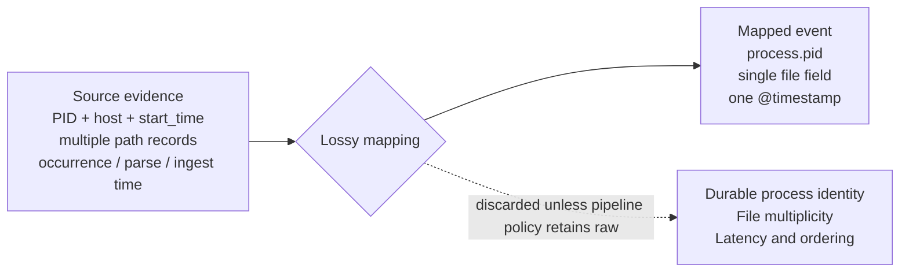

Consider a representative detection team building a rule for suspicious LSASS access. On a modern Windows estate, Sysmon Event ID 10 or an equivalent EDR process-access event is a common collection choice ahead of the standard Security log. Microsoft guidance notes it can be noisy and requires targeted filtering. The team binds the rule to that source. They tune it once against a red-team exercise and deploy it. It fires as expected for a while. Then it stops. It is not disabled. It is not erroring. It is not flagged as broken. The console shows it is enabled. The source shows events are still arriving. The rule produces nothing for anyone to look at.

The console can't say which condition caused that. The technique may not be occurring, in which case the rule is doing its job. The rule may be miscalibrated against a threshold nobody's revisited. Or the evidence stopped arriving in usable form due to a mapping change upstream, a parser failing on a subset of events, or a field that went empty after a fleet update. These three conditions result in the same blank screen because the rule stays enabled and connected to a live source while the specific evidence it needs is no longer valid, and nothing in front of the console flags the difference.

## A rule's evidence, not its enablement status

The vocabulary used to describe detection usually stops at coverage: whether an endpoint runs an agent, whether a cloud service logs, whether a technique maps to any rule at all. MITRE's [Sensor Mappings to ATT&CK](https://ctid.mitre.org/projects/sensor-mappings-to-attack/) formalises this well, connecting ATT&CK data sources to the concrete sensors and events that can provide them. Coverage answers one question: is the asset on the detection surface? It, however, does not answer whether the telemetry crossing that surface still carries what a specific rule needs to discriminate.

The LSASS rule was deployed on a covered endpoint with telemetry flowing. It passed every coverage check available. The endpoint, however, stayed covered while the field the rule actually read stopped carrying what the rule needed. Coverage is a property of the asset. What the rule needs is a property of the rule, and the two diverge exactly in cases like this one.

Sentinel and Google SecOps both document source-level health. Their documentation does not describe a facility that evaluates whether one rule's full set of semantic prerequisites still holds. A source, nevertheless, can pass every documented health check while the one field a rule reads has gone missing, been remapped, or arrived too late. The console has no state for that condition, only for the source's own. A service outage, a failed sensor, and an attacker suppressing the signal look identical there.

A lack of alerts fails to confirm if a system is functioning or broken. A source without alerts provides evidence of health through a recent configuration check, a canary, or a successful scheduler run. It might, however, also fail without any notification. Every declared dependency uses a status of `VALID`, `INVALID`, or `UNKNOWN`. The system assigns the `UNKNOWN` status when no validation occurs within the required timeframe. This status, therefore, depends on the absence of validation data instead of low traffic volume.

Those signals split into two kinds. Current tooling tends to blur them together. The model needs to keep them apart to stay consistent. State evidence is a direct assertion. Examples include a configuration check, a parser-contract test, a canary, or a scheduler run. Only state evidence sets a status of `VALID` or `INVALID`. Diagnostic evidence is what is actually arriving. This includes event counts, field-population rates, and distribution shifts. It flags a path worth examining. It, however, does not set state on its own. It only sets state if the dependency contract explicitly declares an expected cadence or rate. [Sentinel's connector health monitoring](https://learn.microsoft.com/en-us/azure/sentinel/monitor-data-connector-health) tracks connector status. It also tracks volume, latency, and heartbeats. [Google SecOps's ingestion health hub](https://docs.cloud.google.com/chronicle/docs/ingestion/ingestion-overview) tracks source and parser health. It also tracks ingestion timestamps, latency, and silent hosts. [Elastic's ingest-pipeline error handling](https://www.elastic.co/docs/manage-data/ingest/transform-enrich/error-handling) documents processor-level parsing failures and missing fields. It does not document anything broader. None of the three describes a generic per-rule dependency check. That join from fragment to per-rule answer remains undone.

## What a mapping commits a rule to

Capability signals are important regardless of data volume. The loss of information discussed here occurs because a field was never mapped, which is a deliberate design choice rather than an accident. A schema determines the maximum amount of information that can be represented. For example, ECS separates the original timestamp of an event from `event.created`, which is when an agent or pipeline first reads it, and `event.ingested`, which is when it arrives at central storage. UDM includes a `process_ancestors` field, but only after data is exported to BigQuery instead of during live search. A mapping determines which source fields populate that schema for a specific deployment. A pipeline policy then determines if the raw, unmapped event is preserved alongside the structured data so it can be recovered later. If a rule is missing a field, the cause is usually the mapping or a policy that discarded the data, rather than a limitation of the schema itself.



A PID is not a durable identity because operating systems can reuse it after the original process exits. Sysmon uses `ProcessGuid` to make correlation resilient to that reuse. Host, PID, and a reliable start time can serve as a composite identity where no process GUID exists. A mapping that keeps the PID alone, with nothing to anchor it, cannot safely correlate a process across a reuse boundary. The later process that inherits the number, consequently, becomes indistinguishable from the one the rule was tracking.

Linux `auditd` uses a similar method for its boundaries. Multiple records use the same identifier, and `ausearch` uses this identifier to rebuild the entire sequence. This process works as long as the identifier remains with the data. Data loss occurs if a collector deletes the identifier or processes a single record as if it were the entire event. This issue results from how the data is reconstructed rather than a limitation of the original format.

These results are not caused by a bug. Creating a mapping that is narrower than a rule might eventually require is often a practical engineering decision when the code is first written. The issue, however, is not the decision itself. The problem, rather, is that downstream systems do not provide alerts when a rule begins to rely on data that the mapping has already removed.

## Declaring what a rule needs

The mapping discussion above matters only because it explains why a dependency can be `INVALID` even while the source it comes from looks perfectly healthy. Making that checkable, therefore, requires the rule to say, explicitly, what it needs: the required source, the event type, the mandatory fields, any semantic constraint on those fields, the acceptable latency, and the evaluation window. A minimal declaration for the LSASS rule looks like this:

```yaml
rule: lsass-access-suspicious
dependencies:
  - source: sysmon
    event_type: ProcessAccess
    required_fields: [SourceImage, TargetImage, GrantedAccess]
    semantic_constraint: "GrantedAccess includes PROCESS_VM_READ"
    max_latency: 5m
    evaluation_window: 15m
```

`GrantedAccess` here assumes the mapping already resolves the raw access mask to a bit-tested predicate; a pipeline that hands the rule an unresolved hex string needs that resolution declared as its own dependency, not assumed.

Each line defines a specific condition that a check must test rather than a general health score. The `source` and `event_type` fields specify the sensor configuration and parser compatibility that a check confirms. The `required_fields` and `semantic_constraint` fields define the requirements for the mapping output. The `max_latency` and `evaluation_window` fields specify the necessary transport timing and scheduler settings. The system that runs these checks is structured like this:

```yaml
checks:
  - id: sysmon-processaccess-config
    dependency: sysmon-processaccess
    method: config-hash
    expected: ProcessAccess filtering includes the required cohort
    freshness: 24h

  - id: processaccess-parser-contract
    dependency: sysmon-processaccess
    method: fixture-test
    expected_fields: [SourceImage, TargetImage, GrantedAccess]
    freshness: on-parser-deploy

  - id: rule-scheduler
    dependency: lsass-access-suspicious
    method: execution-status
    expected: successful-run
    freshness: 30m
```

A dependency goes `INVALID` only when a check like these fails. It goes `UNKNOWN` only when none has completed within its freshness window. It never reaches these states from event count alone.

A rule with several dependencies rolls up the same way: `INVALID` if any hard dependency is invalid, `VALID` only if every hard dependency is valid, `UNKNOWN` when no dependency is invalid but one or more haven't had a recent direct check.

## Accumulated invalid time

Declaring dependencies this way makes one number countable: the total time a rule's hard dependencies went unmet, summed across dependency-state intervals that open on `INVALID` and close on recovery. Criticality stays a separate weighting rather than folding into the duration. A low-priority rule broken for a month still shows a month, because the point of the number is to be checked, not softened before anyone reads it.

That number, however, isn't sufficient alone. A rule with low invalid time and high *unknown* time looks safe on the same dashboard this was supposed to fix, unless unknown time gets tracked next to it, next to how much of the rule's intended scope was actually assessed. Without that third figure, the metric moves the blind spot one layer down.

This is the most falsifiable proposal in this piece. It converts "the rule went silent" into "the rule was structurally unable to fire for this period," a duration a team can track, alert on, and reduce. It, moreover, requires retained state transitions instead of a point-in-time snapshot. A dashboard that only shows current status cannot compute it. Whether that retention cost is worth it scales with how many rules you are tracking, but it is a cost you can quantify. The alternative is a console that reads absence of alerts as absence of risk.

## Suppression looks the same as drift

Earlier sections described accidental invalidation caused by parser drift, schema changes, or delayed feeds. Deliberate suppression causes the same structural failure through a different method. An attacker who disables Sysmon, clears an audit policy, or removes a log source directly invalidates a capability dependency. The result is that downstream activity becomes silent, stale, or anomalous, even if the signal itself does not show an invalid status. In both cases, the rule designed to detect the technique is silenced. A model that checks if a dependency is satisfied can flag the issue without knowing the cause. For this reason, drift and suppression fit into the same three-state model. These issues only differ during the triage process, which requires a cause field that the validity state does not provide.

This equivalence has a specific limitation. The capability signals this model uses-sensor states, loaded rule sets, configuration hashes-are telemetry collected by infrastructure an attacker could modify with sufficient access. If the model trusts these signals, it will detect configuration changes, most accidental failures, and any suppression attempt that does not also affect the reporting path. However, it will not detect an adversary who can falsify both the capability signal and the evidence simultaneously. Addressing this limitation requires tamper-evident collection-signed heartbeats, attestation from a host outside the adversary's reach-and even then, this only establishes platform state at the last boot, not that every event since was generated, forwarded, parsed, and retained intact. This model does not provide that level of assurance. It is a distinct and challenging problem that should be explicitly identified rather than assumed to be resolved.

## Scope

Attacker attribution stays out of scope: the model determines that a dependency is invalid, not who or what made it so. Analyst throughput, dismissal behaviour, and staffing belong to people and process rather than the evidence path. A rule's own evaluation window is a hard dependency, already covered above; how long raw events persist afterward in the store is a separate retention question, outside live dependency validity even though it still shapes long-window correlation and any retrospective hunt. Whether a rule correctly infers malicious intent when every declared dependency is satisfied is a question of efficacy, not validity, and answering it needs known-malicious and known-benign activity the pipeline cannot supply by itself.

## What this adds

None of this replaces a coverage matrix or a volume dashboard. It, instead, answers a question neither is built to ask: given that a rule is deployed and its source is live, can it still fire? A rule that can't state its own evidence conditions can't be tested against them.

I have not compared this method against existing health and volume monitoring to see if it identifies broken detections more quickly. This comparison would require testing against actual source outages, parser changes, and schema drift. Until that data is available, this should be considered a proposal rather than a replacement.

The cost is practical. Every rule author must now name every hard dependency when they write the rule. This, in turn, replaces the previous method of discovering dependencies only when a mapping changed without notice under an unmonitored rule. The benefit, therefore, is a more precise and accurate system. A rule that does not trigger is no longer treated as evidence. You, therefore, must now classify the rule as valid, invalid, or unknown rather than relying on assumptions.
