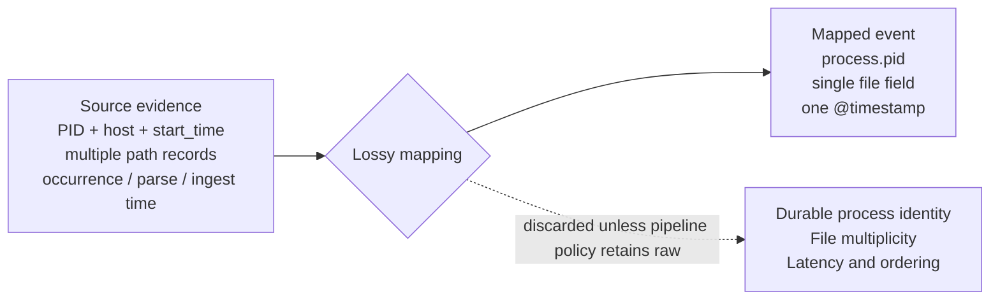

A typical detection team might create a rule to identify suspicious access to the LSASS process. On modern Windows systems, teams often collect Sysmon Event ID 10 or similar EDR process-access events instead of using standard Security logs. Microsoft documentation states that this event type generates a high volume of data and requires specific filtering. The team configures the rule for this data source, adjusts it based on a red-team exercise, and puts it into production. The rule initially generates alerts as intended. Eventually, the rule stops producing alerts. It is not disabled or showing errors, and no system indicates that it is broken. The management console shows the rule is active and the data source continues to provide events. However, the rule no longer generates any output for the team to review.

The console does not specify which condition caused the issue. The activity might not be happening, which means the rule is functioning correctly. The rule might be miscalibrated because of an outdated threshold. Alternatively, the data may no longer arrive in a usable format. This can happen due to an upstream mapping change, a parser failure on specific events, or a field becoming empty after a fleet update. These three different conditions result in the same empty display. The rule remains active and connected to a live source, but the required evidence is no longer valid. Standard detection monitoring platforms do not check for this specific problem.

## A rule's evidence, not its enablement status

The vocabulary used to describe detection usually stops at coverage: whether an endpoint runs an agent, whether a cloud service logs, whether a technique maps to any rule at all. MITRE's [Sensor Mappings to ATT&CK](https://ctid.mitre.org/projects/sensor-mappings-to-attack/) formalises this well, connecting ATT&CK data sources to the concrete sensors and events that can provide them. Coverage answers one question: is the asset on the detection surface? It does not answer whether the telemetry crossing that surface still carries what a specific rule needs to discriminate.

The LSASS rule was deployed on a covered endpoint with telemetry flowing. It passed every coverage check available. The endpoint stayed covered while the field the rule actually read stopped carrying what the rule needed. Coverage is a property of the asset. What the rule needs is a property of the rule, and the two diverge exactly in cases like this one.

Most platforms report the health of data sources well; Sentinel and Google SecOps both provide detailed reports. However, they do not assess whether all the necessary conditions for a rule to function are still met. A data source can pass all health checks while a field that a rule requires is missing, has been changed, or is arriving with a delay. The console only tracks the health of the data source itself, not these conditions. A service outage, a sensor failure, and an attacker blocking the signal all appear the same in the console.

Silence does not prove that a dependency is broken. It only means there is no evidence that the dependency is working. This gap requires a third state. Every declared dependency has a status of `VALID`, `INVALID`, or `UNKNOWN`. The `VALID` and `INVALID` statuses come only from signals that do not rely on volume. `UNKNOWN` is the correct status when no processes have run recently enough to provide more information.

Those signals split into two families that current tooling tends to blur together. Capability signals describe whether the evidence path can produce what the rule needs at all: sensor configuration, loaded audit rules, parser compatibility, field-mapping coverage, transport health, timing guarantees. Activity signals describe what is actually arriving: event counts, field-population rates, distribution shifts. [Sentinel's connector health monitoring](https://learn.microsoft.com/en-us/azure/sentinel/monitor-data-connector-health) tracks connector status, volume, latency, and heartbeat. [Google SecOps's ingestion health hub](https://docs.cloud.google.com/chronicle/docs/ingestion/ingestion-overview) tracks source and parser health, ingestion timestamps, latency, and silent hosts. [Elastic's ingest-pipeline error handling](https://www.elastic.co/docs/manage-data/ingest/transform-enrich/error-handling) catches parsing failures and missing fields at the processor level, nothing broader. Each is real and useful. None of the three documents a facility that checks every declared semantic and operational prerequisite of one specific rule - that join, from fragment to per-rule answer, is what stays undone. A capability signal can be healthy while an activity signal is silent, and a rule-relative model needs both before it moves a dependency out of `UNKNOWN`.

## What a mapping commits a rule to

Capability signals are important regardless of volume because data loss is typically a result of design choices rather than accidents. A schema determines the maximum amount of information that can be represented. For example, ECS separates the original timestamp of an event from the `event.created` field, which records when an agent or pipeline first read it, and the `event.ingested` field, which records when it arrived at central storage. UDM includes a `process_ancestors` field, but this is only available after data is exported to BigQuery and cannot be used in live searches. A mapping determines which source fields populate the schema for a specific deployment. A pipeline policy then determines if the raw, unmapped event is preserved so it can be recovered later. If a rule is missing a field, the cause is rarely the schema itself. The mapping likely excluded it, or the policy discarded the data that the mapping did not use.



A process ID identifies a process only while it is running. Windows reuses these numbers as soon as a process exits. Sysmon uses the ProcessGuid to prevent issues caused by this reuse. If a mapping uses only the PID, or uses the host, PID, and start time without a permanent identifier, it cannot track a process over time. A new process that receives the same number becomes impossible to distinguish from the original process the rule was monitoring.

Linux `auditd` establishes a similar boundary. Multiple records use the same identifier, and `ausearch` uses this identifier to rebuild the full sequence of events. This process works as long as the identifier remains with the data. Data loss occurs if a collector deletes the identifier or interprets an individual record as a finished action. This outcome depends on how the data is reconstructed rather than a limitation of the original format.

These results are not caused by a bug. Creating a mapping that is narrower than future requirements is frequently a practical engineering decision when the code is first written. The issue does not lie with the decision itself. Instead, the problem is that downstream systems do not detect when a rule begins to rely on data that the initial mapping has already removed.

## Declaring what a rule needs

The mapping discussion above matters only because it explains why a dependency can be `INVALID` even while the source it comes from looks perfectly healthy. Making that checkable requires the rule to say, explicitly, what it needs: the required source, the event type, the mandatory fields, any semantic constraint on those fields, the acceptable latency, and the evaluation window. A minimal declaration for the LSASS rule looks like this:

```yaml
rule: lsass-access-suspicious
dependencies:
  - source: sysmon
    event_type: ProcessAccess
    required_fields: [SourceImage, TargetImage, GrantedAccess]
    semantic_constraint: "GrantedAccess includes PROCESS_VM_READ"
    max_latency: 5m
    evaluation_window: 15m
```

`GrantedAccess` here assumes the mapping already resolves the raw access mask to a bit-tested predicate; a pipeline that hands the rule an unresolved hex string needs that resolution declared as its own dependency, not assumed.

Each line monitors a specific signal rather than a general health score. The `source` and `event_type` lines verify sensor configuration and parser compatibility. The `required_fields` and `semantic_constraint` lines verify the schema that the mapping populates. The `max_latency` and `evaluation_window` lines verify transport timing and the scheduler. A dependency becomes `INVALID` only if one of these checks fails. It becomes `UNKNOWN` only if no checks have run recently enough to provide a status. It never changes status based on event count alone.

## Accumulated invalid time

Declaring dependencies in this manner allows for a specific calculation. You can count the total time that the hard dependencies of a rule were not met. This number is the sum of all intervals that begin when a state becomes invalid and end when it recovers. Criticality remains a separate weight instead of being included in the duration. A low-priority rule that is broken for a month will show a duration of one month. The purpose of this number is to provide a clear value for review rather than adjusting it for the reader.

That number is not sufficient by itself. A rule with low invalid time and high unknown time appears safe on the dashboard this was intended to fix. This is only corrected if unknown time is tracked alongside it, along with the percentage of the rule's intended scope that was actually assessed. If that third figure is omitted, the metric simply moves the blind spot to a different layer.

This is the most testable proposal in this article. It changes "the rule went silent" into "the rule was structurally unable to fire for this period," which is a duration a team can monitor, alert on, and decrease. This method requires keeping record of state transitions rather than using a point-in-time snapshot. A dashboard that only displays current status cannot calculate this metric. The cost of retaining that data is small compared to the alternative of using a console that interprets an absence of alerts as an absence of risk.

## Suppression looks the same as drift

The previous sections discussed accidental invalidation caused by parser drift, schema changes, and delayed feeds. Deliberate suppression causes the same structural failure. When an attacker disables Sysmon, clears an audit policy, or removes a log source, they move activity signals to an invalid state in the same way a parser regression does. The rule designed to detect the technique is silenced. A model that checks if a dependency is satisfied can flag the issue without knowing the cause. Drift and suppression belong in the same three-state model for this reason. They differ only during the triage process. Triage requires a cause field because the validity state does not provide that information.

This equivalence has a specific limit. The capability signals this model uses-sensor states, loaded rule sets, configuration hashes-are telemetry collected by the same infrastructure an attacker could modify with sufficient access. If the model trusts those signals, it will detect configuration changes, most accidental failures, and any suppression attempt that does not also affect the reporting path. However, it will not detect an adversary who can falsify both the capability signal and the evidence simultaneously. Addressing this gap requires tamper-evident collection-signed heartbeats, attestation from a host outside the adversary's reach-and even then, this only establishes platform state at the last boot, not that every event since was generated, forwarded, parsed, and retained intact. This model does not provide that level of assurance. This is a difficult, separate problem that should be explicitly identified rather than assumed to be solved.

## Scope

Attacker attribution stays out of scope: the model determines that a dependency is invalid, not who or what made it so. Analyst throughput, dismissal behaviour, and staffing belong to people and process rather than the evidence path. A rule's own evaluation window is a hard dependency, already covered above; how long raw events persist afterward in the store is a separate retention question, outside live dependency validity even though it still shapes long-window correlation and any retrospective hunt. Whether a rule correctly infers malicious intent when every declared dependency is satisfied is a question of efficacy, not validity, and answering it needs known-malicious and known-benign activity the pipeline cannot supply by itself.

## The criterion this replaces

None of this replaces a coverage matrix or a volume dashboard. It answers a question neither is built to ask: given that a rule is deployed and its source is live, can it still fire? A rule that can't state its own evidence conditions can't be tested against them.

I have not compared this method to existing health and volume monitoring to see if it identifies broken detections more quickly. This comparison would require testing against actual source outages, parser changes, and schema drift. Until that data is available, this should be considered a proposal rather than a replacement.

The cost of this approach is significant. Every rule author must now name every hard dependency when they write the rule. This replaces the previous method of discovering dependencies only when a mapping changed without notice under an unmonitored rule. The benefit is more specific and practical. A quiet rule is no longer ambiguous. It can now be verified. 
