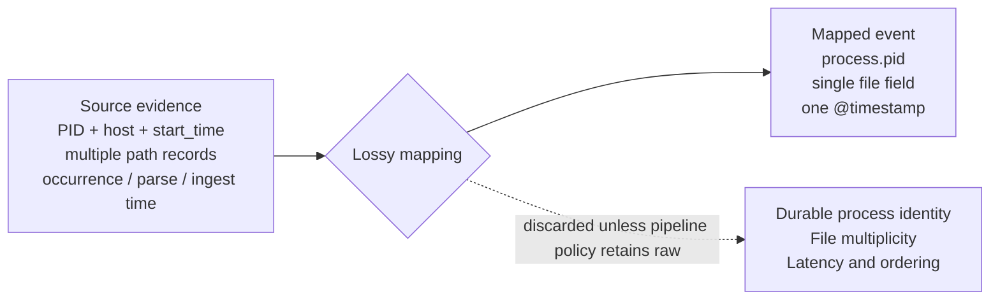

Consider a representative detection team building a rule for suspicious LSASS access. On a modern Windows estate, [Sysmon Event ID 10](https://learn.microsoft.com/en-us/sysinternals/downloads/sysmon) (or an equivalent EDR process-access event) is the collection choice, because the standard Security log has no event for one process opening a handle into another; Microsoft's own guidance notes it can be noisy and wants targeted filtering. The team binds the rule to that source, tunes it once against a red-team exercise, deploys it. It fires as expected for a while. Then it stops: not disabled, not erroring, not flagged anywhere as broken. The console shows it enabled. The source shows events still arriving. The rule simply produces nothing for anyone to look at.

The console can't say which condition caused that. The technique may not be occurring, in which case the rule is doing its job. The rule may be miscalibrated against a threshold nobody's revisited. Or the evidence stopped arriving in usable form: a mapping change upstream, a parser failing on a subset of events, a field that went empty after a fleet update. Three conditions, one identical blank screen, because the rule stays enabled and connected to a live source while the specific evidence it needs is no longer valid, and nothing in front of the console flags the difference.

## The evidence a rule depends on

The vocabulary used to describe detection usually stops at coverage: whether an endpoint runs an agent, whether a cloud service logs, whether a technique maps to any rule at all. MITRE's [Sensor Mappings to ATT&CK](https://ctid.mitre.org/projects/sensor-mappings-to-attack/) formalises this well, connecting ATT&CK data sources to the concrete sensors and events that can provide them. Coverage answers one question: is the asset on the detection surface? Whether the telemetry crossing that surface still carries what a specific rule needs to discriminate is a separate question, and coverage never reaches it.

The LSASS rule was deployed on a covered endpoint with telemetry flowing. It passed every coverage check available. The endpoint stayed covered while the field the rule actually read stopped carrying what the rule needed. Coverage is a property of the asset. What the rule needs is a property of the rule, and the two diverge exactly in cases like this one.

Sentinel and Google SecOps both document genuine depth on source-level health, but neither documents a facility that evaluates whether one rule's full set of semantic prerequisites still holds. A source can pass every documented health check it has while the one field a rule reads has gone missing, been remapped, or arrived too late. The console tracks the source's own health and nothing about this condition. A service outage, a failed sensor, and an attacker suppressing the signal all look identical there too.

The absence of alerts proves neither state on its own. A quiet source can still carry direct evidence of health (a recent config check, a canary, a successful scheduler run) just as easily as it can be silently broken. That's where a third state earns its place: every declared dependency carries a status of `VALID`, `INVALID`, or `UNKNOWN`, and `UNKNOWN` is the honest answer when no direct validation has completed within its freshness window, not when volume merely happens to be low.

Those signals split into two kinds that current tooling tends to blur together, and the model needs to keep them apart to stay consistent. State evidence is a direct assertion (a configuration check, a parser-contract test, a canary, a scheduler run), and only state evidence sets `VALID` or `INVALID`. Diagnostic evidence is what's arriving: event counts, field-population rates, distribution shifts. It flags a path worth examining, but it doesn't set state on its own unless the dependency's contract explicitly declares an expected cadence or rate. [Sentinel's connector health monitoring](https://learn.microsoft.com/en-us/azure/sentinel/monitor-data-connector-health) tracks connector status, volume, latency, and heartbeat. [Google SecOps's ingestion health hub](https://docs.cloud.google.com/chronicle/docs/ingestion/ingestion-overview) tracks source and parser health, ingestion timestamps, latency, and silent hosts. [Elastic's ingest-pipeline error handling](https://www.elastic.co/docs/manage-data/ingest/transform-enrich/error-handling) documents processor-level parsing failures and missing fields, nothing broader. None of the three describes a generic per-rule dependency check. That join, from fragment to per-rule answer, is what stays undone.

## What a mapping commits a rule to

Capability signals matter regardless of volume, because the loss this section is about (a field a mapping never carried) is a design choice, not an accident. A schema sets the ceiling on what can be represented: ECS distinguishes an event's original timestamp from `event.created` (first read by an agent or pipeline) and `event.ingested` (arrival at central storage); UDM carries a `process_ancestors` field, though only once data is exported to BigQuery, not in live search. A mapping decides which source fields fill that schema for a given deployment. A pipeline policy decides whether the raw, unmapped event survives alongside it, recoverable if anyone thinks to look. When a rule lacks a field, the schema rarely did that. The mapping did, or the policy discarded what the mapping left behind.



A PID identifies a process only for as long as it lives, because operating systems can reuse the number once it exits. Sysmon's own answer is `ProcessGuid`, assigned when a process is created and carried through every later event that references it, including ProcessAccess. Windows' own creation event for this, [Security Event ID 4688](https://learn.microsoft.com/en-us/previous-versions/windows/it-pro/windows-10/security/threat-protection/auditing/audit-process-creation), needs one policy just to fire and a second, separate policy ([command-line auditing](https://learn.microsoft.com/en-us/windows-server/identity/ad-ds/manage/component-updates/command-line-process-auditing), off by default even when the first is on) just to capture the command line; even fully configured, it carries no file hash, no parent-process link, and nothing resembling a durable process GUID, all of which Sysmon Event ID 1 carries by default. Host, PID, and a reliable start time can serve as a composite identity where no process GUID exists; a mapping that keeps the PID alone, with nothing to anchor it, can't safely correlate a process across a reuse boundary. The later process that inherits the number becomes indistinguishable from the one the rule was tracking.

Linux `auditd` draws the same boundary elsewhere. Multiple records share one identifier, and `ausearch` reconstructs the full trail from it, as long as the identifier survives downstream. Loss happens when a collector discards it, or treats a single record as the complete action; that's a decision made at reconstruction, not a limit of the source format.

None of this is a bug. A mapping narrower than what a rule will eventually need is often the correct engineering trade-off at the time it's written. The problem isn't the trade-off. It's that nothing downstream registers when a rule comes to depend on evidence the trade-off already discarded.

## Declaring what a rule needs

The mapping discussion above matters only because it explains why a dependency can be `INVALID` even while the source it comes from looks perfectly healthy. Making that checkable requires the rule to say, explicitly, what it needs: the required source, the event type, the mandatory fields, any semantic constraint on those fields, the acceptable latency, and the evaluation window. What follows isn't any product's actual schema; it's pseudocode in YAML's shape, chosen because that shape reads clearly without extra explanation. A minimal declaration for the LSASS rule looks like this:

```yaml
rule: lsass-access-suspicious
dependencies:
  - source: sysmon
    event_type: ProcessAccess
    required_fields: [SourceImage, TargetImage, GrantedAccess]
    semantic_constraint: "GrantedAccess includes PROCESS_VM_READ"
    max_latency: 5m
    evaluation_window: 15m
```

`GrantedAccess` here assumes the mapping already resolves the raw access mask to a bit-tested predicate; a pipeline that hands the rule an unresolved hex string needs that resolution declared as its own dependency, not assumed.

Each line defines a condition a corresponding check must test, not a general health score: `source` and `event_type` name what sensor configuration and parser compatibility a check has to confirm; `required_fields` and `semantic_constraint` name what the mapping's output has to satisfy; `max_latency` and `evaluation_window` name what transport timing and the scheduler have to hold. What runs those checks looks less like a declaration and more like this:

```yaml
checks:
  - id: sysmon-processaccess-config
    dependency: sysmon-processaccess
    method: config-hash
    expected: ProcessAccess filtering includes the required cohort
    freshness: 24h

  - id: processaccess-parser-contract
    dependency: sysmon-processaccess
    method: fixture-test
    expected_fields: [SourceImage, TargetImage, GrantedAccess]
    freshness: on-parser-deploy

  - id: rule-scheduler
    dependency: lsass-access-suspicious
    method: execution-status
    expected: successful-run
    freshness: 30m
```

A dependency goes `INVALID` only when a check like these fails, and `UNKNOWN` only when none has completed within its freshness window, never from event count alone.

A rule with several dependencies rolls up the same way: `INVALID` if any hard dependency is invalid, `VALID` only if every hard dependency is valid, `UNKNOWN` when no dependency is invalid but one or more haven't had a recent direct check.

## Accumulated invalid time

Declaring dependencies this way makes one number countable: the total time a rule's hard dependencies went unmet, summed across dependency-state intervals that open on `INVALID` and close on recovery. Criticality stays a separate weighting rather than folding into the duration: a low-priority rule broken for a month still shows a month, because the point of the number is to be checked, not softened before anyone reads it.

That number isn't sufficient alone. A rule with low invalid time and high *unknown* time looks safe on the same dashboard this was supposed to fix, unless unknown time gets tracked next to it, next to how much of the rule's intended scope was assessed. Skip that third figure and the metric just moves the blind spot one layer down.

This is the most falsifiable proposal in this piece. It converts "the rule went silent" into "the rule was structurally unable to fire for this period," a duration a team can track, alert on, and reduce. It requires retained state transitions instead of a point-in-time snapshot: a dashboard that only shows current status can't compute it. Whether that retention cost is worth it scales with how many rules you're tracking, but it's a cost you can quantify, unlike the alternative: a console that keeps reading absence of alerts as absence of risk.

## Suppression looks the same as drift

The previous sections focused on accidental invalidation: parser drift, schema changes, delayed feeds. Deliberate suppression produces the same structural failure through a different door. An attacker who disables Sysmon, clears an audit policy, or drops a log source invalidates a capability dependency directly; the fallout is activity going silent, stale, or anomalous downstream, not the activity signal itself flipping to `INVALID`. Either way, the rule meant to catch the technique is the one now silenced, and a model that only checks whether a dependency is satisfied doesn't need to know why to flag it. Drift and suppression belong in the same three-state model for that reason. They diverge only in what happens after detection, where triage needs a cause field the validity state itself doesn't hold.

This equivalence has a specific limit. The capability signals this model uses (sensor states, loaded rule sets, configuration hashes) are telemetry collected by the same infrastructure an attacker could modify given enough access. Trust those signals and the model catches configuration changes, most accidental failures, and any suppression attempt that doesn't also touch the reporting path; it won't catch an adversary capable of falsifying the capability signal and the evidence at once. Closing that gap needs tamper-evident collection (signed heartbeats, attestation from a host outside the adversary's reach), and even that only establishes platform state at last boot, not that every event since was generated, forwarded, parsed, and retained intact. This model doesn't provide that layer. It's a harder, separate problem, worth naming rather than quietly assuming solved.

## Scope

Attacker attribution stays out of scope: the model determines that a dependency is invalid, not who or what made it so. Analyst throughput, dismissal behaviour, and staffing belong to people and process rather than the evidence path. A rule's own evaluation window is a hard dependency, already covered above; how long raw events persist afterward in the store is a separate retention question, outside live dependency validity even though it still shapes long-window correlation and any retrospective hunt. Whether a rule correctly infers malicious intent when every declared dependency is satisfied is a question of efficacy, not validity, and answering it needs known-malicious and known-benign activity the pipeline cannot supply by itself.

## What this adds

None of this replaces a coverage matrix or a volume dashboard. It answers a question neither is built to ask: given that a rule is deployed and its source is live, can it still fire? A rule that can't state its own evidence conditions can't be tested against them.

Whether this actually catches a broken detection faster than existing health and volume monitoring is an empirical question, and I haven't run that comparison here. Until someone has (against real source outages, parser changes, schema drift), call this a proposal, not a replacement.

The cost is concrete: every rule author now names every hard dependency at write time, instead of discovering them the week a mapping quietly changes underneath a rule nobody's watching. What it buys back is narrower and more honest. A quiet rule stops reading as evidence of anything. It becomes something you classify (valid, invalid, or genuinely unknown) instead of something you assume.
 
