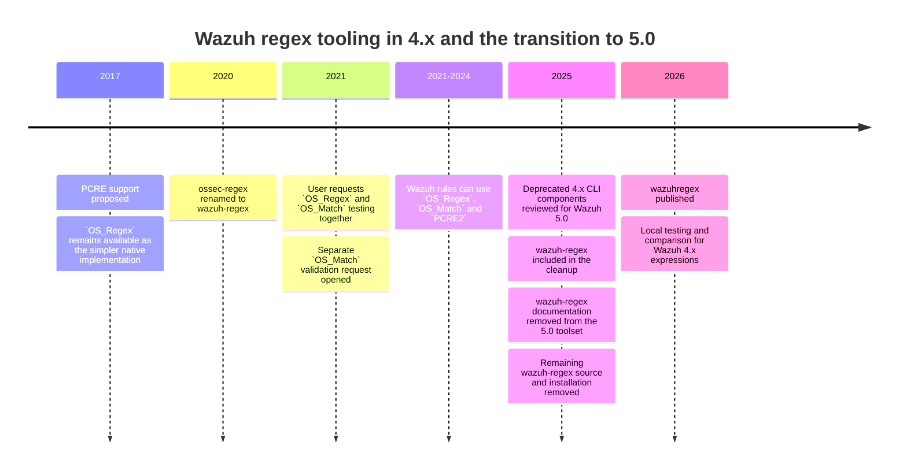

While working on [Wazuh](https://wazuh.com/?utm_source=ambassadors&utm_medium=referral&utm_campaign=ambassadors+program) rules, I kept repeating the same task: testing regular expressions locally without returning to a manager for every change. Wazuh 4.x uses [three pattern engines](https://documentation.wazuh.com/current/user-manual/ruleset/ruleset-xml-syntax/regex.html), `OS_Regex`, `OS_Match` and `PCRE2`. Their syntax and semantics overlap, but a match in a generic PCRE2 tester does not show how the condition will behave in the two simpler Wazuh engines.

Wazuh provides [`wazuh-regex`](https://documentation.wazuh.com/current/user-manual/reference/tools/wazuh-regex.html) under `/var/ossec/bin/` on the manager, primarily for the original Wazuh regex implementation. It did not fit my workflow. When I am editing a rule locally with representative logs beside it, SSHing to a manager for each change adds a step and still does not compare the three engines.

I wrote [`wazuhregex`](https://github.com/zbalkan/wazuhregex) for that purpose. It began as a utility for my own rule-development workflow, but became useful enough to clean up, test and publish on [PyPI](https://pypi.org/project/wazuhregex/). It tests and compares Wazuh 4.x expressions locally without pretending to replace Wazuh itself.

## Why this is specific to Wazuh 4.x

Although all three engines match text, they solve somewhat different problems. `OS_Regex` is Wazuh's relatively small C regex implementation. `OS_Match`, based on `sregex`, is closer to a substring-and-anchor matcher than a general regular-expression engine, while `PCRE2` provides the richer syntax most people will recognise from modern regex tooling. A literal may behave identically in all three, but grouping, escaping, character classes, anchors and more advanced constructs can behave differently or simply be unavailable in one of them.

Historically, developers have raised the same inconvenience more than once. [PCRE support was proposed in 2017](https://github.com/wazuh/wazuh/issues/205), while [issue #7280](https://github.com/wazuh/wazuh/issues/7280) requested combined `OS_Regex` and `OS_Match` testing in 2021. Wazuh acknowledged the limitation and opened [#7288](https://github.com/wazuh/wazuh/issues/7288) for `OS_Match` validation.



I also decided to publish the tool now because Wazuh 5.0 changes the detection model substantially. The [4.x to 5.x migration guide](https://github.com/wazuh/wazuh/blob/main/docs/guide/migration/rules-4x-to-5x.md) describes the move from XML detection rules to YAML rules based on Sigma with Wazuh extensions, together with changes to decoders and the surrounding content architecture. At the same time, the [Wazuh 4.14 tool reference](https://documentation.wazuh.com/current/user-manual/reference/tools/index.html) lists fifteen command-line utilities, while the [5.0 beta reference](https://documentation.wazuh.com/5.0-beta/user-manual/reference/tools/index.html) lists eight and no longer includes `wazuh-regex` or `wazuh-logtest`. Wazuh also tracked the remaining deprecated regex CLI code in [#32104](https://github.com/wazuh/wazuh/issues/32104), and merged [PR #32136](https://github.com/wazuh/wazuh/pull/32136) removes the remaining `parallel-regex` and `wazuh-regex` code and stops installing `wazuh-regex`.

For that reason, I consider `wazuhregex` a tool for the remaining Wazuh 4.x lifecycle. I still work with 4.x rules, other people do as well, and the utility is useful in that context. Once that context disappears, the scope of the tool may simply be complete.

## Installing and using it

For command-line use, I install the package from its [PyPI project page](https://pypi.org/project/wazuhregex/) with [`pipx`](https://pipx.pypa.io/), which keeps its Python dependencies isolated from the system environment. The package requires Python 3.11 or newer, with Python 3.13 recommended.

```bash
pipx install wazuhregex
```

Existing users can upgrade from `0.1.0` with `pipx upgrade wazuhregex`. If several Python interpreters are installed, `pipx install --python python3.13 wazuhregex` selects the recommended version explicitly.

```bash
wazuhregex '<PATTERN>'
python -m wazuhregex '<PATTERN>'
```

Both forms accept one pattern and read records from standard input. Version `0.2.0` accepts at most 20 physical input lines per run and gives each non-empty line 100 ms to complete. Blank and whitespace-only lines are skipped, while leading and trailing whitespace in other records is preserved. The fixed limits are also shown by `wazuhregex --help`.

As a result, I can use the same basic workflow whether I am typing a few lines interactively, redirecting a sample file, or piping data from another command. A minimal example looks like this:

```bash
printf '%s\n' \\
  'sshd: error found in log' \\
  'info: all good' \\
  | wazuhregex 'error'
```

Although a literal such as `error` is not an interesting regex example, it makes the basic behaviour easy to see. The tool evaluates the input against `OS_Regex`, `OS_Match` and `PCRE2`, then reports each result, the matching spans, and captured substrings where the engine supports them. Plain non-empty literals remain unclassified because assigning one engine as the "original" would not add useful information.

For actual rule work, I normally keep several representative records in a file:

```bash
cat ssh-samples.log | wazuhregex '<PATTERN>'
```

Alternatively, I can take records from an existing log:

```bash
grep sshd auth.log | wazuhregex 'authentication failure'
```

In practice, I prefer this to repeatedly testing one hand-written positive case. A small sample set can contain records that should match, records that should not, malformed input where relevant, and edge cases I found while writing the rule. When I change the expression, I can run the same input again and see whether the behaviour changed somewhere I did not intend. It is a small form of regression testing, but for regex development that is often enough to catch mistakes early.

## Comparing the engines

However, comparing the engines requires more than sending the same string to three implementations because each defines a different language. Some `PCRE2` expressions have equivalent `OS_Regex` or `OS_Match` forms, while others depend on syntax those engines cannot express.

`wazuhregex` first tries to identify the likely source form of the expression and then produces alternatives for the other engines where its supported model can represent the same condition. The source detection is heuristic because a pattern string does not contain the original Wazuh `type` attribute or any other metadata explaining where it came from. More distinctive syntax can provide a reasonable indication, while plain literals remain unclassified and ambiguous regex syntax defaults to PCRE2.

To avoid semantic drift, the conversion layer does not rely on textual substitution. Replacing one token with something that looks similar in another regex language can produce a syntactically valid expression with different semantics, which is worse than returning no alternative at all. Instead, the comparer parses the subset it understands into an intermediate representation, emits another expression only where the target engine can represent that model, and round-trip checks generated alternatives within that representation. When it cannot produce an alternative safely, it leaves the result unavailable.

When reviewing existing rules, the comparison shows whether `OS_Regex` or `OS_Match` can represent a `PCRE2` condition. Still, a simpler engine is not automatically the better choice. PCRE2 may be clearer, and compatibility with an existing ruleset may matter more. The tool presents alternatives; the replacement remains a rule-maintenance decision.

## Invalid expressions and non-matches

During debugging, `wazuhregex` keeps invalid syntax separate from a valid expression that does not match. Treating both outcomes as `false` would hide whether the problem lies in the expression or the input. Successful matches include their spans, and `OS_Regex` and `PCRE2` can expose captured substrings. Because `OS_Match` has no capture groups, the output follows that limitation.

Spans become particularly useful when I work with several sample records at once. A pattern may match every positive case while also consuming unexpected text around the match. A boolean result hides that, whereas the spans show when an expression is broader than I thought.

## Python API

For programmatic use, the package can be installed into a project's environment and imported directly:

```bash
python -m pip install wazuhregex
```

Once installed, the main matcher exposes the three implementations:

```python
from wazuhregex import WazuhRegex

tool = WazuhRegex(r"(\d+)")
is_match, spans = tool.os_regex("30 Agustos 2020")

if is_match:
    print(spans)
    print(tool.get_substrings())
```

Meanwhile, the comparison component is available separately when another program needs to inspect an expression rather than only execute it:

```python
from wazuhregex import Engine, RegexComparer

comparer = RegexComparer()
parsed = comparer.parse(r"\d+", Engine.PCRE2)
```

Separating these interfaces allows other rule-analysis tools to use the comparison logic without broadening `wazuhregex` into a general ruleset analyser. Its scope remains expression behaviour, comparison where possible, and access through a CLI and Python API.

## Limits and final validation

After I confirm the pattern works as expected, I test the full rule within Wazuh. The `wazuhregex` tool is a compatibility implementation rather than the original runtime. `OS_Regex` expressions are translated and then compiled using the Python `pcre2` backend. This backend has more capabilities than the original C implementation used by Wazuh, which means complex edge cases may behave differently. `OS_Match` also has specific limitations. For any logic intended for production detection, the version of Wazuh that runs the rule is the final reference.

Although I am a [Wazuh Ambassador](https://wazuh.com/ambassadors-program/?utm_source=ambassadors&utm_medium=referral&utm_campaign=ambassadors+program), this is my own project and not an official Wazuh utility. I use it during development and treat the actual Wazuh implementation as authoritative if the two differ.

## The current alpha release

Version `0.2.0` remains an alpha. Although the test suite includes cases based on Wazuh's C test coverage and additional engine edge cases, real rulesets inevitably contain expressions I would not think to write myself. Rules accumulate syntax through copying, inheritance, old documentation, previous versions and years of incremental changes. Therefore, some of the most useful compatibility tests are likely to come from existing rules rather than synthetic examples.

When a pattern behaves differently in Wazuh and `wazuhregex`, a useful issue contains the expression, representative input, expected and observed behaviour, and the Wazuh version used for comparison. The same applies when the comparer generates an incorrect alternative, misses one that should be possible, or identifies the likely source engine incorrectly. Those are specific behaviours I can reproduce and turn into tests.

So, if you still work with Wazuh 4.x rules, try the [`0.2.0` alpha release](https://pypi.org/project/wazuhregex/) while it remains applicable. Run it against expressions and representative logs from your own ruleset, and report any reproducible difference from Wazuh. That feedback is the most useful way to improve the tool during its remaining 4.x lifecycle.

## Contributions and maintenance

Under GPL-2.0-only, `wazuhregex` remains open source while upstream development is owner-maintained. Issues, behavioural reports and suggestions are welcome, particularly when they contain reproducible compatibility cases, but I do not accept unsolicited pull requests.[^1] For a small compatibility project like this, I prefer to limit what I maintain upstream and spend that time on behaviour I can reproduce and test.[^2]

[^1]: The contribution policy does not restrict the rights granted by the licence. The project can still be used, studied, modified and forked under GPL-2.0-only. It only describes what I am prepared to accept and maintain in the upstream repository. SQLite describes a similar distinction as ["open-source, not open-contribution"](https://www.sqlite.org/copyright.html).

[^2]: Merging a contribution also means taking responsibility for its future maintenance, compatibility and edge cases. Mike McQuaid discusses the broader maintainer relationship in [Open Source Maintainers Owe You Nothing](https://mikemcquaid.com/open-source-maintainers-owe-you-nothing/), while John Lowin covers the practical maintenance side in his [guide to saying no](https://jlowin.dev/blog/oss-maintainers-guide-to-saying-no).
