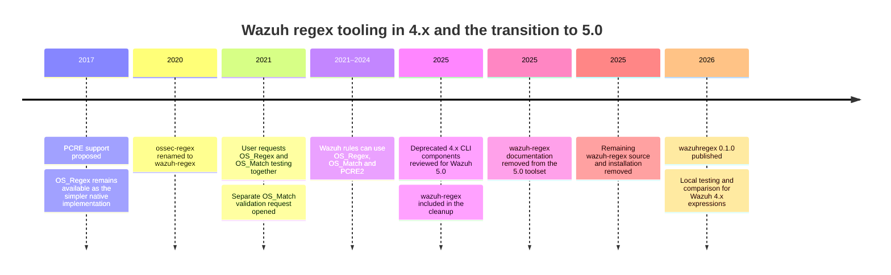

---

title: "Testing Wazuh 4.x regular expressions locally"
tags:
  - Wazuh
  - Detection engineering
  - Detection-as-Code
  - Regular expressions
  - Python
  - Open Source

---

While working on [Wazuh](https://wazuh.com/?utm_source=ambassadors&utm_medium=referral&utm_campaign=ambassadors+program) rules, I kept running into a small but repetitive problem: I wanted to test regular expressions locally without going back to a manager for every change. The expression itself was usually not difficult. What made the process less straightforward was that Wazuh 4.x uses [three different pattern engines](https://documentation.wazuh.com/current/user-manual/ruleset/ruleset-xml-syntax/regex.html): OS_Regex, OS_Match and PCRE2. They overlap enough that simple expressions often work in more than one of them, but they are not the same language and they do not have the same semantics. A pattern that behaves correctly in a generic PCRE2 tester does not necessarily tell me how the same condition will behave when a Wazuh rule is using OS_Regex, while OS_Match has a considerably simpler matching model again.

Wazuh already provides [`wazuh-regex`](https://documentation.wazuh.com/current/user-manual/reference/tools/wazuh-regex.html), but it is installed on the manager under `/var/ossec/bin/` and is primarily useful for the original Wazuh regex implementation. That is perfectly reasonable for what the utility was designed to do, but it did not fit the way I was working. If I am editing a rule locally and already have representative logs beside it, SSHing to a manager for each small pattern change adds an unnecessary step. I also wanted to see how a condition related to the other Wazuh pattern engines instead of testing them independently.

I wrote [`wazuhregex`](https://github.com/zbalkan/wazuhregex) for that purpose. It started as a utility for my own rule-development workflow rather than something I planned as a separate project. Over time it became useful enough that I cleaned up the interface, added tests, packaged it properly, and published it on [PyPI](https://pypi.org/project/wazuhregex/). Its scope is still the same: provide a local way to test and compare Wazuh 4.x expressions without pretending to replace Wazuh itself.

## Why this is specific to Wazuh 4.x

The three engines solve somewhat different problems. OS_Regex is Wazuh's relatively small C regex implementation. OS_Match, also referred to as `sregex`, is closer to a substring-and-anchor matcher than a general regular-expression engine. PCRE2 provides the richer syntax most people will recognise from modern regex tooling. A literal may behave identically in all three, while grouping, escaping, character classes, anchors and more advanced constructs can behave differently or simply be unavailable in one of them.

This has been a known development inconvenience for some time. In 2017, [PCRE support was proposed](https://github.com/wazuh/wazuh/issues/205) alongside the existing OS_Regex implementation. The old `ossec-regex` utility was later renamed to `wazuh-regex`, but that still did not provide a common place to reason about the different pattern types used by rules. In January 2021, a user opened [issue #7280](https://github.com/wazuh/wazuh/issues/7280) asking for a tester that could handle both OS_Regex and OS_Match because it would make decoder and rule development easier. Wazuh acknowledged the limitation and opened [#7288](https://github.com/wazuh/wazuh/issues/7288) for OS_Match validation.

That history is useful context for why I ended up writing my own tool, but there is another reason I decided to publish it now rather than keep it as a local utility. Wazuh 5.0 changes the detection model substantially. The [4.x to 5.x migration guide](https://github.com/wazuh/wazuh/blob/main/docs/guide/migration/rules-4x-to-5x.md) describes the move from XML detection rules to YAML rules based on Sigma with Wazuh extensions, together with changes to decoders and the surrounding content architecture. The command-line tooling is changing at the same time. The [Wazuh 4.14 tool reference](https://documentation.wazuh.com/current/user-manual/reference/tools/index.html) lists fifteen utilities, while the [5.0 beta reference](https://documentation.wazuh.com/5.0-beta/user-manual/reference/tools/index.html) lists eight. `wazuh-regex` and `wazuh-logtest` are no longer part of the documented 5.0 toolset.

The source history shows the same transition. Wazuh tracked the remaining deprecated regex CLI code in [#32104](https://github.com/wazuh/wazuh/issues/32104), and merged [PR #32136](https://github.com/wazuh/wazuh/pull/32136) removes the remaining `parallel-regex` and `wazuh-regex` code and stops installing `wazuh-regex`. I therefore consider `wazuhregex` a tool for the remaining Wazuh 4.x lifecycle rather than something that needs to follow the platform indefinitely. I still work with 4.x rules, other people do as well, and the utility is useful in that context. Once that context disappears, the scope of the tool may simply be complete.



## Installing and using it

For command-line use, I install the package with [`pipx`](https://pipx.pypa.io/), which keeps its Python dependencies isolated from the system environment. The package requires Python 3.11 or newer, with Python 3.13 recommended.

```bash
pipx install wazuhregex
```

The interface is intentionally small. The command takes one pattern as an argument and reads records from standard input:

```bash
wazuhregex '<PATTERN>'
```

That gives me the same basic workflow whether I am typing a few lines interactively, redirecting a sample file, or piping data from another command. A minimal example looks like this:

```bash
printf '%s\n' \
  'sshd: error found in log' \
  'info: all good' \
  | wazuhregex 'error'
```

A literal such as `error` is not an interesting regex example, but it makes the basic behaviour easy to see. The input is evaluated against OS_Regex, OS_Match and PCRE2, and the output reports the result for each engine, the matching spans, and captured substrings where the engine supports them. Plain non-empty literals are treated as literals because assigning one of the engines as the "original" would not add useful information.

For actual rule work, I normally keep several representative records in a file:

```bash
cat ssh-samples.log | wazuhregex '<PATTERN>'
```

I can also take records from an existing log:

```bash
grep sshd auth.log | wazuhregex 'authentication failure'
```

I prefer this to repeatedly testing one hand-written positive case. A small sample set can contain records that should match, records that should not, malformed input where relevant, and edge cases I found while writing the rule. When I change the expression, I can run the same input again and see whether the behaviour changed somewhere I did not intend. It is a small form of regression testing, but for regex development that is often enough to catch mistakes early.

## Comparing the engines

The comparison is more complicated than simply sending the same string to three implementations. OS_Regex, OS_Match and PCRE2 do not define the same expression language, so identical text does not necessarily represent the same condition. A PCRE2 expression may have an equivalent OS_Regex representation, while another may depend on syntax OS_Regex cannot express. Something written as a regular expression may reduce to a simple OS_Match condition. In other cases there is no useful conversion at all.

`wazuhregex` first tries to identify the likely source form of the expression and then produces alternatives for the other engines where its supported model can represent the same condition. The source detection is heuristic because a pattern string does not contain the original Wazuh `type` attribute or any other metadata explaining where it came from. More distinctive syntax can provide a reasonable indication, while plain literals remain unclassified.

I did not want the conversion layer to be based on textual substitution. Replacing one token with something that looks similar in another regex language can produce a syntactically valid expression with different semantics, which is worse than returning no alternative at all. The comparer therefore parses the subset it understands into an intermediate representation, emits another expression only where the target engine can represent that model, and round-trip checks generated alternatives within that representation. When it cannot produce an alternative safely, it leaves the result unavailable.

This is also useful when reviewing existing rules. If a rule uses PCRE2, I can see whether the richer engine is actually required or whether the same condition can be represented by OS_Regex or OS_Match. I do not automatically treat the simpler representation as better. Sometimes PCRE2 is clearer even when another representation is possible, and sometimes compatibility with an existing ruleset matters more than reducing the expression. The tool shows the alternatives; deciding whether one should replace another remains a rule-maintenance decision.

## Invalid expressions and non-matches

One behaviour I wanted explicitly was to keep syntax errors separate from ordinary non-matches. If an expression is valid but a record does not match, I need to inspect either the condition or the input. If the expression is not valid for that engine, the problem is different. Treating both outcomes as `false` makes the debugging process unnecessarily ambiguous.

The tool therefore validates the pattern independently for each engine. Invalid syntax is reported separately from a valid expression that happens not to match. Successful matches include their spans so I can see exactly which part of the record was consumed. OS_Regex and PCRE2 results can also expose captured substrings. OS_Match does not provide capture groups, so the output follows that limitation rather than adding behaviour that does not exist in the underlying model.

This is one of the parts I find most useful when working with several sample records at once. A pattern may technically match every positive case while also consuming unexpected text around the match. A boolean result hides that. Looking at the spans makes it easier to notice when an expression is broader than I thought.

## Python API

The package can also be imported directly. The main matcher exposes the three implementations:

```python
from wazuhregex import WazuhRegex

tool = WazuhRegex(r"(\d+)")

is_match, spans = tool.os_regex("30 Agustos 2020")

if is_match:
    print(spans)
    print(tool.get_substrings())
```

The comparison component is available separately when another program needs to inspect an expression rather than only execute it:

```python
from wazuhregex import Engine, RegexComparer

comparer = RegexComparer()
parsed = comparer.parse(r"\d+", Engine.PCRE2)
```

I kept these interfaces separate because I can see uses for the comparison logic in other rule-analysis tools, but I do not want `wazuhregex` itself to become a general Wazuh ruleset analyser. Its current responsibility is narrow enough: model the relevant expression behaviour, compare representations where possible, and make that functionality available through a CLI and a Python API.

## Where I use it

My own workflow starts with logs rather than the expression. I collect a few positive and negative examples, run the candidate pattern locally, inspect which engines accept it and what they actually match, then look at any alternative representations the comparer can produce. If an alternative is simpler or easier to understand, I can consider it. If there is no safe conversion, I leave the expression in the engine that can represent it correctly.

Once the pattern behaves the way I expect, I still test the complete rule in Wazuh. `wazuhregex` is a compatibility implementation, not the original runtime. OS_Regex expressions are translated before being compiled through the Python `pcre2` backend, which is more capable than Wazuh's original C implementation, so sufficiently complex edge cases can behave differently. OS_Match has its own limitations as well. For anything that will become production detection logic, the Wazuh version that executes the rule remains the reference.

I am a [Wazuh Ambassador](https://wazuh.com/ambassadors-program/?utm_source=ambassadors&utm_medium=referral&utm_campaign=ambassadors+program), but this is my own project rather than an official Wazuh utility. I wrote it because I work with Wazuh rules and wanted a local tool for a workflow I repeat frequently. That is also how I treat its results: useful during development, but subordinate to the actual Wazuh implementation when there is a difference.

## The first public version

The current release is `0.1.0`, and I am treating it as an alpha. The test suite includes cases based on Wazuh's C test coverage, but real rulesets inevitably contain expressions I would not think to write myself. Rules accumulate syntax through copying, inheritance, old documentation, previous versions and years of incremental changes. Some of the most useful compatibility tests are likely to come from those existing rules rather than from synthetic examples.

If a pattern behaves differently in Wazuh and `wazuhregex`, a useful issue contains the expression, representative input, expected and observed behaviour, and the Wazuh version used for comparison. The same applies when the comparer generates an incorrect alternative, fails to generate one that should be possible, or identifies the likely source engine incorrectly. Those are specific behaviours I can reproduce and turn into tests.

I do not have a goal of making this package relevant to Wazuh 5.x by default. The 5.x detection model is different enough that I would rather look at its actual development workflow before deciding whether any part of this tool belongs there. For now, the package solves the problem I wrote it for: local testing and comparison of Wazuh 4.x pattern expressions.

## Contributions and maintenance

`wazuhregex` is GPL-2.0-only and upstream development is owner-maintained. Issues, behavioural reports and suggestions are welcome, particularly when they contain reproducible compatibility cases, but I do not accept unsolicited pull requests.[^1] For a small compatibility project like this, I prefer to keep the upstream maintenance surface limited and spend that time on behaviour I can reproduce, test and maintain.[^2]

[^1]: The contribution policy does not restrict the rights granted by the licence. The project can still be used, studied, modified and forked under GPL-2.0-only. It only describes what I am prepared to accept and maintain in the upstream repository. SQLite describes a similar distinction as ["open-source, not open-contribution"](https://www.sqlite.org/copyright.html).

[^2]: Merging a contribution also means taking responsibility for its future maintenance, compatibility and edge cases. Mike McQuaid discusses the broader maintainer relationship in [Open Source Maintainers Owe You Nothing](https://mikemcquaid.com/open-source-maintainers-owe-you-nothing/), while John Lowin covers the practical maintenance side in his [guide to saying no](https://jlowin.dev/blog/oss-maintainers-guide-to-saying-no).
