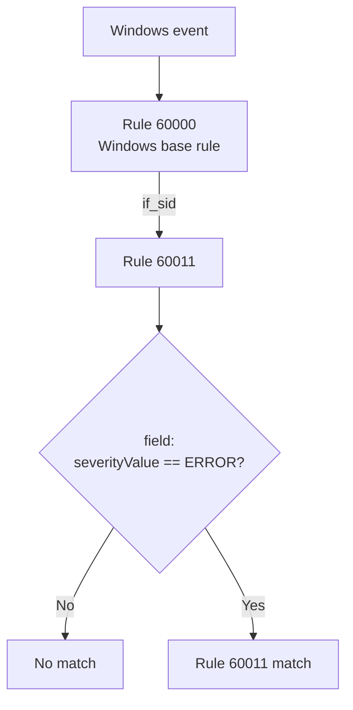
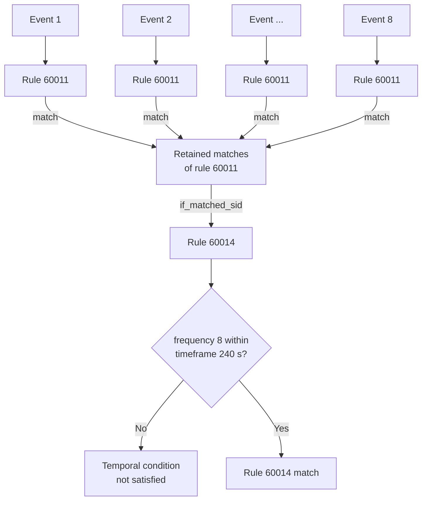
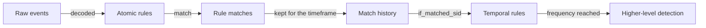

When I wrote [Understanding Wazuh rules](https://zaferbalkan.com/wazuh-rules/) last year, I deliberately skipped part of the rule syntax. That article was about how rules relate to each other: `if_sid`, `if_group`, `if_matched_sid`, and `if_matched_group`, and the parent-child relationships they create. It argued that a [Wazuh](https://wazuh.com/?utm_source=ambassadors&utm_medium=referral&utm_campaign=ambassadors+program) ruleset is easier to understand as a graph than as a flat collection of independent rules. I briefly mentioned the conditions that inspect individual events, then left them aside because they were not the subject of the article.

This time, I want to go back to that missing part. Instead of asking where a rule sits in the ruleset, I want to ask what a single rule contains once you open it, and how the same structure tells you what to write when the rule does not exist yet.

The official [Wazuh 4.x rule syntax documentation](https://documentation.wazuh.com/4.14/user-manual/ruleset/ruleset-xml-syntax/rules.html) is comprehensive, but a syntax reference has to document every attribute and element separately. That is useful when you already know what you are looking for. It is less useful when you are trying to build a mental model of the language itself.

I find Wazuh 4.x rules much easier to reason about if I reduce their detection logic to this:

```text
Rule
├── Metadata
└── Conditions
    ├── AtomicCondition
    └── TemporalCondition
```

This is not Wazuh 4.x terminology or a replacement syntax. It is a way to read the existing XML. It is also not Wazuh-specific. The same concepts appear in Sigma, YARA-L, Elastic Security, Splunk SPL, and Microsoft Sentinel KQL, which I come back to briefly once the Wazuh 4.x model is in place. Their syntax differs, but detections still need to describe themselves and define the conditions under which something becomes interesting. Wazuh 4.x adds one twist that the reduction above does not show and that decides how rules have to be written: its temporal conditions count the matches other rules produced, not the logs behind them.

This article covers Wazuh 4.x rule syntax, using the `4.14.9` branch of the official repository. The most recent release at the time of writing is [4.14.7](https://documentation.wazuh.com/current/release-notes/release-4-14-7.html), so at least two further patch releases are expected on that line. Wazuh 5.0 is already in [beta](https://documentation.wazuh.com/5.0-beta/index.html) and replaces XML detection rules with YAML rules based on Sigma, as the [4.x to 5.x migration guide](https://github.com/wazuh/wazuh/blob/main/docs/guide/migration/rules-4x-to-5x.md) describes. Nothing below should be read as documentation for the next major version.
{: .notice--info}

## Two rules from the official ruleset

The [Windows base rules in Wazuh 4.14.9](https://github.com/wazuh/wazuh/blob/4.14.9/ruleset/rules/0575-win-base_rules.xml) contain a useful pair of rules. The first one is straightforward:

```xml
<rule id="60011" level="5">
  <if_sid>60000</if_sid>
  <field name="win.system.severityValue">^ERROR$</field>
  <options>no_full_log</options>
  <description>Windows error event.</description>
  <group>gdpr_IV_35.7.d,gpg13_4.3,system_error,</group>
</rule>
```

Even without knowing every detail of the Wazuh 4.x syntax, most of it reads directly. The rule is identified as `60011`, carries level `5`, applies after rule `60000` has matched the current event, and requires the decoded `win.system.severityValue` field to match `ERROR`. If those conditions are satisfied, Wazuh classifies the event as a Windows error event and associates it with the listed groups.

A little later in the same file, under a comment appropriately named `Rules about multiple events`, there is another rule:

```xml
<rule id="60014" level="10" frequency="8" timeframe="240">
  <if_matched_sid>60011</if_matched_sid>
  <options>no_full_log</options>
  <description>Multiple Windows error events.</description>
</rule>
```

This rule is different. It is not interested in one Windows error event. It is interested in a pattern developing over time. Rule `60011` has to match eight times within a 240-second window before rule `60014` triggers.

Rule `60011` can be evaluated from the current event and the current Wazuh 4.x rule-evaluation path, while rule `60014` needs retained history, so I call the first **atomic** and the second **temporal**.

## Metadata and conditions

Ignore the XML for a moment and rule `60011` reduces to:

```text
Rule 60011
│
├── Metadata
│   ├── id = 60011
│   ├── level = 5
│   ├── description = "Windows error event."
│   └── groups = ...
│
└── Conditions
    └── AtomicCondition
        ├── rule 60000 matched
        └── win.system.severityValue matches ERROR
```

The two halves form a conditional. If the conditions hold, the rule matches, and the metadata says what that match means: the identity, the severity, the classification and the context carried into the result. Conditions decide whether the detection logic is satisfied, and nothing in the metadata takes part in that decision.

For most Wazuh rules, `id`, `description`, `group`, `mitre`, and `info` are straightforward metadata. `level` is more interesting because it describes [severity](https://documentation.wazuh.com/4.14/user-manual/ruleset/rules/rules-classification.html) but also has operational consequences elsewhere in Wazuh. Similarly, `id` and `group` are metadata that other rules can reference through constructs such as `if_sid` and `if_group`.

That does not make `id` itself a condition. It means a condition can refer to metadata belonging to another rule: `<rule id="60011">` defines an identity, and a later rule can name that identity in `if_sid` or `if_matched_sid`. The same applies to groups, where a `<group>` element classifies a rule and `if_group` or `if_matched_group` uses that classification when evaluating another rule.

This distinction matters because Wazuh 4.x mixes descriptive information, rule relationships, matching expressions, temporal state, and some output-related behaviour in the same XML structure. Reading every tag as an equivalent "rule property" makes different concepts look more similar than they really are.

Neither table below replaces the official syntax reference. Both are reading aids, and attributes carry their parent element in parentheses.

### Metadata names and classifies the rule

Metadata answers what the rule represents once it fires. None of it is consulted when deciding whether the rule fires, although other rules can refer to it.

| Keyword | Written as | Role |
| --- | --- | --- |
| `rule` | tag | Declares the rule and encloses everything below it |
| `id` | attr. (`rule`) | Identifies the rule so that other rules can refer to it |
| `level` | attr. (`rule`) | Severity, with operational consequences elsewhere in Wazuh |
| `description` | tag | States in words what a match means |
| `group` | tag | Classifies the alert and gives `if_group` something to refer to |
| `mitre` | tag | ATT&CK technique IDs carried into the alert |
| `info` | tag | Additional reference information |
| `cve` | tag | A CVE identifier recorded alongside `info` |

### Conditions decide whether the rule fires

Conditions divide by the state they need. An atomic condition is answered by the current event and the path that reached it. A temporal condition needs matches Wazuh retained across a window. `if_sid`, `if_group` and `if_level` are a special case: they are resolved when the ruleset loads, each attaching the rule as a child of the rules it names, so at match time the only question is whether the parent matched this event.[^1]

| Keyword | Written as | Type | Role |
| --- | --- | --- | --- |
| `location` | tag | Atomic | Restricts the rule to logs from a given source ([source](https://github.com/wazuh/wazuh/blob/4.14.9/src/analysisd/rules.c#L760-L766)) |
| `decoded_as` | tag | Atomic | Restricts the rule to events a named decoder handled |
| `category` | tag | Atomic | Restricts the rule to a decoder type |
| `match` | tag | Atomic | Pattern over the event, `OS_Match` by default |
| `regex` | tag | Atomic | Pattern over the event, `OS_Regex` by default |
| `field` | tag | Atomic | Pattern over a named dynamic field |
| `srcip`, `dstip`, `srcport`, `dstport`, `protocol`, `action`, `id`, `url`, `data`, `extra_data`, `status`, `system_name`, `srcgeoip`, `dstgeoip` | tag | Atomic | One element per static decoder field[^2] |
| `user` | tag | Atomic | Matches the decoded `dstuser`, falling back to `srcuser` |
| `hostname`, `program_name` | tag | Atomic | Pre-decoded values from the log header |
| `maxsize` | attr. (`rule`) | Atomic | Caps the size of the log the rule will match |
| `compiled_rule` | tag | Atomic | Delegates the test to a compiled C function |
| `list` | tag | Atomic | CDB lookup |
| `time` | tag | Atomic | Restricts the rule to a time range |
| `weekday` | tag | Atomic | Restricts the rule to given weekdays |
| `if_sid` | tag | Atomic | Attached under the named rule, which must have matched this event |
| `if_group` | tag | Atomic | Attached under every rule carrying the group |
| `if_level` | tag | Atomic | Attached under every rule at the given level |
| `if_matched_sid` | tag | Temporal | Counts previous matches of a rule ID |
| `if_matched_group` | tag | Temporal | Counts previous matches of a group |
| `if_matched_regex` | tag | Temporal | Pattern applied to previously matched events |
| `frequency` | attr. (`rule`) | Temporal | Number of matches required |
| `timeframe` | attr. (`rule`) | Temporal | Window in seconds |
| `same_*`, `different_*` | tag | Temporal | Constrain the counted matches by a static field[^2] |
| `same_field`, `different_field` | tag | Temporal | Constrain the counted matches by a dynamic field[^2] |
| `same_agent`, `not_same_*` | tag | Temporal | Older spellings of the same constraints |
| `check_diff` | tag | Temporal | Fires when a value differs from the one stored last time |
| `if_fts` | tag | Temporal | Fires the first time a combination is seen |
| `global_frequency` | tag | Temporal | Lets matches from different agents on one manager count together; despite the name it is not cluster-wide ([source](https://github.com/wazuh/wazuh/blob/4.14.9/src/analysisd/eventinfo.c#L148-L156)) |

A handful of constructs sit outside both tables, because **matching a rule and emitting an alert are related but not identical operations**. `noalert` lets a rule take part in further processing without producing an alert of its own, and `ignore` suppresses repeated alerts for a period after the rule triggers. `options` carries values such as `no_full_log` that change what an alert contains rather than whether one is produced. `check_if_ignored` works with `ignore` rather than against the event. Two more are directives to the loader rather than to the matcher: `overwrite` replaces an existing rule instead of adding one, and `accuracy` affects where a rule sits in the evaluation order, as the placement keywords above do. None of them decides whether the event satisfies the detection, and none of them describes the rule, so I do not force every Wazuh 4.x XML keyword into the core semantic model. These behaviours are documented in the official [rule syntax reference](https://documentation.wazuh.com/4.14/user-manual/ruleset/ruleset-xml-syntax/rules.html); the model is intended to explain detection logic, not to recreate the complete Wazuh grammar.

## Atomic conditions: everything the current event can answer

An atomic condition can be evaluated against the current event and its current rule-evaluation context without keeping historical events across a time window, which is more precise than saying "one log equals one alert." Wazuh 4.x rules can form chains, and an event may pass through several rules before reaching the final alert. The important property is that nothing from several seconds or minutes ago has to be remembered.

Consider again:

```xml
<rule id="60011" level="5">
  <if_sid>60000</if_sid>
  <field name="win.system.severityValue">^ERROR$</field>
  ...
</rule>
```

The rule asks two questions about the current evaluation, and what it produces when both hold is a rule match:



Those are atomic conditions, and every keyword marked atomic in the table above narrows the same thing. Some restrict which events reach the rule, some inspect the contents of one event, and some depend on the path that reached it. A pattern inside `match`, `regex` or `field` is one component of such a condition. Wazuh 4.x evaluates those patterns with three engines that do not share a language, so the pattern is worth testing on its own before the rule around it exists.[^3] They look different in XML, but semantically they are variations of the same question:

```text
Does the current event satisfy this predicate?
```

### `if_sid` and `if_matched_sid` are not interchangeable

Both refer to another rule ID, but they operate on different state.

```xml
<if_sid>60000</if_sid>
```

means that the current event has followed a rule-evaluation path that includes `60000`. It creates a relationship in the Wazuh 4.x rule graph, but it does not by itself require retained historical event state.

```xml
<if_matched_sid>60011</if_matched_sid>
```

uses previous matches and therefore participates in temporal correlation.

So:

```text
if_sid          →  current evaluation path  →  AtomicCondition
if_matched_sid  →  retained rule matches    →  TemporalCondition
```

The evaluation path is also state, but it exists only while the current event is being processed. A rule that declares `if_sid` becomes a child node in the rule tree, and `analysisd` reaches it by descending into the children of the parent rule while still evaluating the same event. A rule that declares `if_matched_sid` is compiled differently, flagged as a context rule and given a search function that walks a list of previously matched events, comparing their timestamps against `timeframe` until `frequency` is reached.[^4] The first kind of state dies with the event, while the second outlives it, and that is the line the model draws. [Michael Muenz](https://wazuh-blog.max-it.de/mehrere-bedingungen-in-wazuh-regeln-korrekt-umsetzen-if_sid-if_matched_sid-und-korrelationsdesign-richtig-einsetzen/) reaches the same split from the operational side, describing `if_sid` as inheritance within the same event and `if_matched_sid` as time-based correlation per rule ID. He also shows why stacking several `if_matched_sid` elements does not produce the AND a reader might expect.

I covered the graph relationships created by these constructs in [Understanding Wazuh rules](https://zaferbalkan.com/wazuh-rules/) and later used the same model in [RuleVis](https://zaferbalkan.com/rulevis/). That is also why the previous article's graph model and this article's atomic/temporal model are related but not identical. One describes relationships between rules. The other describes the state required to evaluate their conditions. For the purpose of reading one rule, the simpler distinction is enough: following another rule in the current evaluation path is still atomic; looking backwards into retained matches is temporal.

### An initial filter is still a condition

Wazuh 4.x asks the same question of its own syntax. A rule can restrict which logs may reach it at all:

```xml
<location>syslog</location>
```

and it can restrict which decoder must have handled them:

```xml
<decoded_as>json</decoded_as>
```

Neither element describes the rule, and neither is consulted after the fact. Both decide whether an event can satisfy the detection, which makes them conditions, and both are answered from the current event alone, which makes them atomic. `category` behaves the same way. This is one reason I prefer the broader concept of conditions rather than creating a separate conceptual category for every section exposed by a particular rule language.

Sigma raises the same question and deserves the same answer, which is why the point is easier to see if you come from there:

```yaml
title: Windows Failed Logon Event
name: failed_logon
logsource:
  product: windows
  service: security
detection:
  selection:
    EventID: 4625
  condition: selection
```

It is tempting to treat `logsource` as metadata because it appears alongside fields such as `title`, `author`, and `level`. Semantically it does what `location` and `decoded_as` do in Wazuh 4.x, so the logic flattens to something like:

```text
product == windows
AND
service == security
AND
EventID == 4625
```

Nothing in that flattening is metadata. Every line is a predicate the current event either satisfies or does not, which is where the boundary belongs: a rule's source restriction is the first of its conditions rather than a label attached to it.

## Temporal conditions: when one event is not enough

Some detections do not make sense as atomic rules. One failed authentication can be a typo, while twenty in a few minutes is a different claim about the same log source.

This is the distinction Jack Naglieri discusses in [SIEM Correlation Techniques](https://www.detectionatscale.com/p/siem-correlation-techniques). I use the terms somewhat more narrowly here: an atomic condition does not require retained event history, while a temporal condition does. Counting matches inside a window is only one temporal pattern. Engines elsewhere also express order, where A must precede B, absence, where an expected B never follows A, and duration, where a state persists longer than some period. Wazuh 4.x has no dedicated construct for any of the three, so counting is the pattern the examples below use, alongside the narrower cases of `check_diff` and `if_fts`.

For Wazuh 4.x, temporal rules are often easy to recognise before reading their child elements:

```xml
<rule id="60014" level="10" frequency="8" timeframe="240">
```

Both attributes that matter are already there: `frequency` is the threshold and `timeframe` is the window. The rest of rule `60014` tells Wazuh what historical activity contributes to that condition:

```xml
<if_matched_sid>60011</if_matched_sid>
```

We can therefore read the rule conceptually as:

```text
TemporalCondition
├── input     = previous matches of rule 60011
├── threshold = 8
└── window    = 240 seconds
```

Or, more compactly:

```text
COUNT(matches(rule 60011), 240 seconds) >= 8
```

That is not Wazuh 4.x syntax; it is a compact representation of the same detection logic.

Rule `60014` does not repeat the `win.system.severityValue` predicate, and it does not gather Windows events to inspect each one. Rule `60011` has already done that work. What `60014` evaluates is the history of `60011` matches:



The atomic rule classifies an event, and the temporal rule works over the classifications it retained:



A Wazuh 4.x temporal rule counts the matches of another rule, not the logs those matches came from. A generic single-event-versus-multiple-events picture loses that intermediate step.
{: .notice--info}

The official documentation describes `if_matched_sid` and `if_matched_group` specifically in conjunction with `frequency` and `timeframe`. Wazuh 4.x also provides `same_*`, `different_*`, `same_field`, and `different_field` constructs for constraining which historical matches contribute to a correlation.[^2]

For example:

```xml
<same_srcip/>
```

means that correlated events must share the same source IP, which reads as:

```text
COUNT(
    previous matches
    with the same srcip
    within the timeframe
) >= frequency
```

`same_srcip` therefore adds `srcip` as a correlation key.

The general shape becomes:

```text
TemporalCondition
├── historical input
│   ├── if_matched_sid
│   └── if_matched_group
│
├── threshold
│   └── frequency
│
├── window
│   └── timeframe
│
└── optional correlation constraints
    ├── same_*
    ├── different_*
    ├── same_field
    └── different_field
```

I would not treat those as separate fundamental rule categories. They are components of the temporal condition.

## The same distinction appears elsewhere

None of this is unique to Wazuh, and the useful part of the atomic/temporal model is that it survives when the syntax changes. What varies between platforms is the unit being correlated. YARA-L groups the events themselves inside one rule, while rule `60014` counts the matches of rule `60011`, and Sigma sits between the two. A Sigma correlation names the base rules it operates over, which is closer to Wazuh 4.x's layering. A Sigma rule is still atomic by construction, though, and the correlation compiles into a single query over events rather than feeding on what those base rules produced. The composition is something the backend resolves, whereas in Wazuh 4.x it is authored: a detection engineer writes `if_sid`, `if_group` and `if_matched_sid` by hand, and the graph those references form is the composition.

The comparisons below are not intended as full translations. They are analogies for readers who already know one of these languages, and nothing in the Wazuh model depends on them.

### Sigma separates rules and correlations

Sigma makes the distinction visible because ordinary Sigma rules describe event-level detections, while stateful logic is expressed through [Sigma Correlations](https://sigmahq.io/docs/meta/correlations.html). An atomic rule might identify failed logons:

```yaml
title: Windows Failed Logon Event
name: failed_logon
logsource:
  product: windows
  service: security
detection:
  selection:
    EventID: 4625
  condition: selection
```

A correlation can then operate over those detections:

```yaml
title: Multiple failed logons for a single user
correlation:
  type: event_count
  rules:
    - failed_logon
  group-by:
    - TargetUserName
  timespan: 5m
  condition:
    gte: 10
```

Under our model:

```text
AtomicCondition
    EventID == 4625

TemporalCondition
    input     = failed_logon
    key       = TargetUserName
    window    = 5 minutes
    threshold >= 10
```

Sigma separates these syntactically, whereas Wazuh 4.x expresses both atomic and temporal behaviour through the same `<rule>` element.

### YARA-L keeps both inside the language

Google SecOps YARA-L is structurally closer to Wazuh 4.x in this respect. A [multiple event rule](https://cloud.google.com/chronicle/docs/detection/yara-l-2-0-overview) can contain event predicates, a match window, and a threshold in the same rule:

```yaral
rule failed_logins {
  events:
    $e.metadata.event_type = "USER_LOGIN"
    $e.security_result.action = "FAIL"
    $user = $e.target.user.userid

  match:
    $user over 10m

  condition:
    #e >= 5
}
```

This separates cleanly under the same model:

```text
AtomicCondition
├── event_type == USER_LOGIN
└── action == FAIL

TemporalCondition
├── key    = user
├── window = 10 minutes
└── count >= 5
```

The syntax is different, but the detection idea is similar to a Wazuh 4.x frequency rule, and the difference is where the correlation gets its input rather than what it computes.

## Reading a rule, then writing one

After reducing the syntax this way, I normally read an unfamiliar Wazuh 4.x rule in three passes. First, I read the `<rule>` tag and descriptive elements. I want to know the rule ID, level, description, groups, and ATT&CK or other enrichment. At the same time, I look for `frequency` and `timeframe`. Their presence is an immediate sign that historical state is probably involved.

Second, I read the atomic predicates. What has to be true about the current event? Which decoder or existing rule provides the initial context? Which fields are tested? Which pattern engine is being used? Are there negations, CDB lookups, time restrictions, or other predicates?

Third, if the rule is temporal, I work out the retained state. Which previous rule or group is being counted? What is the window? What is the threshold? Does a user, IP address, port, or dynamic field have to remain the same or change? Is the correlation agent-local or manager-wide?

Returning to our original examples, rule `60011` becomes almost trivial:

```text
Metadata
    Windows error event
    level 5

AtomicCondition
    rule 60000 matched
    AND severityValue == ERROR
```

Rule `60014` becomes equally straightforward:

```text
Metadata
    Multiple Windows error events
    level 10

TemporalCondition
    previous matches of rule 60011
    8 times
    within 240 seconds
```

The XML is no simpler than it was, but our representation of what it means is.

The same three passes run backwards when I write a rule instead of reading one. I start from what the alert should mean, which fixes the description, the level and the groups. I then decide what has to be true of a single event, which fixes the atomic predicates together with the decoder or parent rule that supplies their context. Only when the detection needs historical state do I reach for `frequency`, `timeframe` or another temporal construct, and at that point I also have to identify which earlier rule or group provides the matches being correlated. A temporal rule needs a lower-level rule or group underneath it, whether I have just written one or the ruleset already contains it.

Restricting which events reach a rule is usually a choice of parent rather than a filter I write myself. Mapping a Sigma `logsource` to Wazuh, which I did throughout the [RMM detections](https://zaferbalkan.com/rmm-detection/), mostly meant finding the existing rule or group that already establishes that context instead of converting syntax, because Wazuh 4.x expresses part of that intent through its rule hierarchy.

### Conditions still have to be tested

Understanding a rule is not the same as proving that it behaves as intended. Once a rule has been reduced to its conditions, those conditions should be tested with representative telemetry.

The same split organises the test itself. The conditions define the input: which event, how many of them, within what window, sharing which correlation key. The metadata defines the expected outcome: the rule ID that should fire, the level it should carry, and the description, groups and ATT&CK mapping that should appear in the alert.

```text
Conditions  →  test input     (which events, how many, within what window)
Metadata    →  test assertion (which rule ID, level, description, groups)
```

A test that feeds the right events and then only checks that something fired has exercised the conditions and left the expected outcome unverified. That gap matters most where a rule sits in a chain, because an ancestor firing instead of the intended rule still produces an alert.

Atomic rules lend themselves naturally to individual positive and negative log samples. Temporal rules require multiple events and therefore need tests that preserve their count, timing, and correlation keys. I discussed this in more detail in [Detection-as-Code for Wazuh 4.x](https://zaferbalkan.com/wazuh-devenv/), where some built-in regression tests require multiple logs because temporal detections cannot be validated by repeatedly testing isolated single events. Representative telemetry matters as well, which is why tools such as [`wazuhevtx`](https://zaferbalkan.com/wazuhevtx/) and log replay workflows exist. Detections are evaluated against actual event structures rather than the simplified examples we keep in our heads while writing them.

The same principle applies whether the rule is written in Wazuh 4.x XML, Sigma, YARA-L, SPL, KQL, or another language: if the atomic predicates are wrong, the temporal logic aggregates the wrong events. If the temporal condition is wrong, perfectly valid atomic matches can still produce noisy or silent detections.

## Conclusion

Wazuh 4.x's XML rule syntax contains many elements, but the underlying detection model is considerably smaller than the reference page makes it appear. In the [previous article](https://zaferbalkan.com/wazuh-rules/), I described Wazuh rules as building blocks connected into a graph. That model still stands. This article adds another way to look at the same blocks. Each one contains descriptive information and logic, and that logic either works with the current evaluation or depends on state retained from earlier matches.

Once those two views are combined, an unfamiliar Wazuh 4.x ruleset becomes easier to approach. First find where the rule sits in the graph, then open the node and ask two questions: **what does this rule describe, and what conditions make it true?** Those questions work in both directions, because answering them for a rule that does not exist yet is how the rule gets written. The second answer tells you whether the rule can be evaluated from the current event or needs state retained from earlier matches. Elastic Security, Splunk and Microsoft Sentinel draw the same boundary in their own vocabulary, mostly over raw events rather than over rule matches.

None of this outlives 4.x unchanged. Wazuh 5.0 replaces the XML with Sigma-based YAML, so the keywords in both tables go with it, though a rule will still have to say what it means and when it holds.

I am a [Wazuh Ambassador](https://wazuh.com/ambassadors-program/?utm_source=ambassadors&utm_medium=referral&utm_campaign=ambassadors+program). This article is my own reading of the 4.x rule syntax rather than official documentation, and the version of Wazuh that runs the rule remains the final reference.

[^1]: `_AddtoRule` in [rules_list.c](https://github.com/wazuh/wazuh/blob/4.14.9/src/analysisd/rules_list.c#L178-L202) attaches a rule to its parents when the ruleset is read, so none of the three is evaluated again per event.

[^2]: The static fields are a remnant of OSSEC, where the decoder wrote into a fixed set of hardcoded slots. Dynamic fields replaced that arrangement and the static set survives for backwards compatibility, which has a practical consequence: each static field is matched by its own element, so `<action>DROP</action>` is valid while `<field name="action">DROP</field>` is not. The dashboard refuses to save a rule written the second way, and editing the file locally to get around that breaks `wazuh-analysisd`. See the official [dynamic fields](https://documentation.wazuh.com/4.14/user-manual/ruleset/decoders/dynamic-fields.html) and [rule syntax](https://documentation.wazuh.com/4.14/user-manual/ruleset/ruleset-xml-syntax/rules.html) documentation.

[^3]: `OS_Regex`, `OS_Match` and PCRE2 differ in both syntax and capability. I cover the practical differences in [Testing Wazuh 4.x regular expressions locally with `wazuhregex`](https://zaferbalkan.com/wazuhregex/), and the definitions are in the official [regular expression syntax](https://documentation.wazuh.com/4.14/user-manual/ruleset/ruleset-xml-syntax/regex.html) documentation.

[^4]: `if_matched_sid` sets the rule's `context` flag and installs `Search_LastSids` as its `event_search` function, which counts previously matched events against `frequency` and `timeframe`. A rule declaring `if_sid` gets neither. See [rules.c](https://github.com/wazuh/wazuh/blob/4.14.9/src/analysisd/rules.c#L1942-L1950) and [eventinfo.c](https://github.com/wazuh/wazuh/blob/4.14.9/src/analysisd/eventinfo.c#L99).
