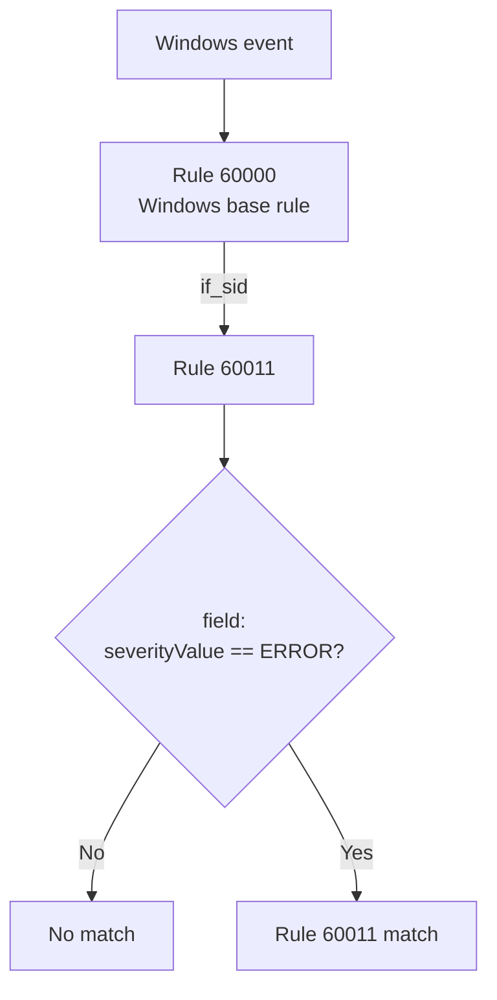
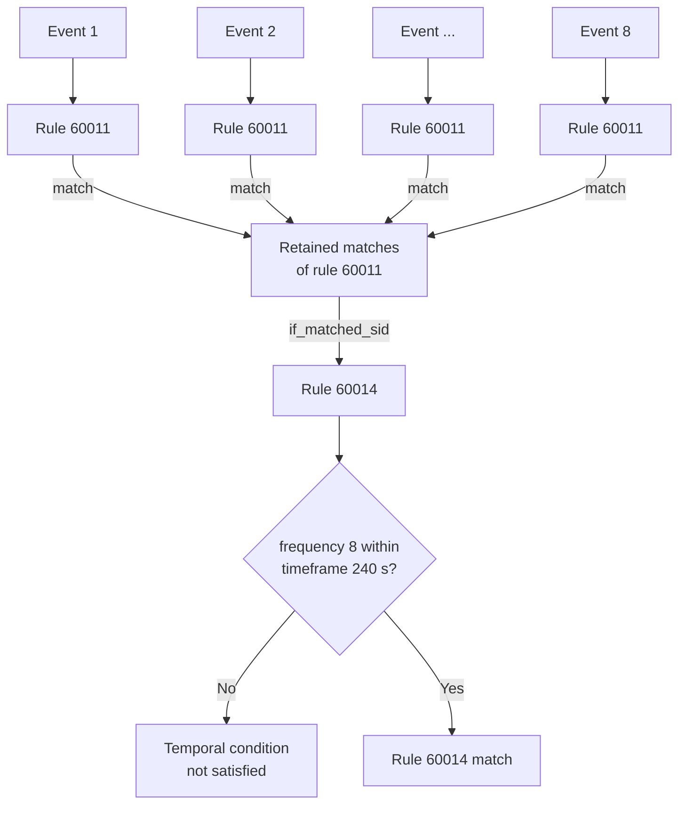
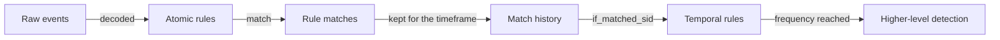

When I wrote [Understanding Wazuh rules](https://zaferbalkan.com/wazuh-rules/) last year, I deliberately skipped part of the rule syntax. That article was about how rules relate to each other: `if_sid`, `if_group`, `if_matched_sid`, and `if_matched_group`, and the parent-child relationships they create. It argued that a [Wazuh](https://wazuh.com/?utm_source=ambassadors&utm_medium=referral&utm_campaign=ambassadors+program) ruleset is easier to understand as a graph than as a flat collection of independent rules. I briefly mentioned the conditions that inspect individual events, then left them aside because they were not the subject of the article.

This time, I want to go back to that missing part. Instead of asking where a rule sits in the ruleset, I want to ask what a single rule contains once you open it, and how the same structure tells you what to write when the rule does not exist yet.

I want to open up one of those nodes now, to see what a rule contains and how that structure helps when you need to write a rule that does not exist yet.

The official [Wazuh 4.x rule syntax documentation](https://documentation.wazuh.com/4.14/user-manual/ruleset/ruleset-xml-syntax/rules.html) lists the elements and attributes in detail and is useful when you need to look up a particular tag. To understand how the pieces work together, I use a smaller model:

```text
Rule
├── Metadata
└── Conditions
    ├── AtomicCondition
    └── TemporalCondition
```

These are my terms for reading the existing XML, not Wazuh syntax, and they divide conditions by the state needed to evaluate them. An atomic condition uses only the current event and the path that event has taken through the ruleset. A temporal condition needs history retained from earlier events, such as matches counted within a window. One failed authentication may be a typo, whereas twenty in a few minutes make a different detection claim, and only a temporal condition can express the second.

Because the split follows state rather than technique, it differs from the vocabulary in Jack Naglieri's [*SIEM Correlation Techniques*](https://www.detectionatscale.com/p/siem-correlation-techniques). He uses atomic for a correlation over a single technique, even one containing a short sequence of events, and temporal for several techniques observed within one timeframe in no particular order. A count of repeated failures from one behaviour is therefore temporal here, although it would be a single-technique correlation in his terms. Google SecOps draws a boundary closer to mine by separating [single and multiple event rules](https://docs.cloud.google.com/chronicle/docs/yara-l/yara-l-2-0-examples) in YARA-L, and similar distinctions help when reading Sigma, though it organises detections differently. The unit being counted also needs watching, because in the frequency example below Wazuh counts matches from other rules rather than raw logs.

In detection engineering, an atomic alert on its own is usually a weak signal, because it reports one matching event and rarely describes attacker behaviour by itself. Atomics on high-fidelity data remain useful when the behaviour is dangerous in isolation, but, as Naglieri notes, they can also produce many alerts that are security-relevant without being malicious. Wazuh 4.x adds a constraint here. Rules are building blocks, as I described in [Understanding Wazuh rules](https://zaferbalkan.com/wazuh-rules/), and a frequency rule counts matches of another rule through `if_matched_sid` or `if_matched_group`. That temporal rule therefore needs an atomic rule beneath it, even when the atomic rule's own alert has little value. Other SIEMs, such as Google SecOps with YARA-L, can correlate normalised events directly without an intermediate rule match.
{: .notice--warning}

This article covers Wazuh 4.x rule syntax, using the `4.14.9` branch of the official repository. The most recent release at the time of writing is [4.14.7](https://documentation.wazuh.com/current/release-notes/release-4-14-7.html), so at least two further patch releases are expected on that line. Wazuh 5.0 is already in [beta](https://documentation.wazuh.com/5.0-beta/index.html) and replaces XML detection rules with YAML rules based on Sigma, as the [4.x to 5.x migration guide](https://github.com/wazuh/wazuh/blob/main/docs/guide/migration/rules-4x-to-5x.md) describes. Nothing below should be read as documentation for the next major version.
{: .notice--info}

## Two rules from the official ruleset

The [Windows base rules in Wazuh 4.14.8](https://github.com/wazuh/wazuh/blob/4.14.8/ruleset/rules/0575-win-base_rules.xml) include a useful pair. Wazuh rule files can have multiple top-level XML elements, which is relevant when validating them outside Wazuh.[^5] The first identifies a Windows error event:

```xml
<rule id="60011" level="5">
  <if_sid>60000</if_sid>
  <field name="win.system.severityValue">^ERROR$</field>
  <options>no_full_log</options>
  <description>Windows error event.</description>
  <group>gdpr_IV_35.7.d,gpg13_4.3,system_error,</group>
</rule>
```

Even without knowing every detail of the Wazuh 4.x syntax, most of it reads directly. The rule is identified as `60011`, carries level `5`, applies after rule `60000` has matched the current event, and requires the decoded `win.system.severityValue` field to match `ERROR`. If those conditions are satisfied, Wazuh classifies the event as a Windows error event and associates it with the listed groups.

A little later in the same file, under a comment appropriately named `Rules about multiple events`, there is another rule:

```xml
<rule id="60014" level="10" frequency="8" timeframe="240">
  <if_matched_sid>60011</if_matched_sid>
  <options>no_full_log</options>
  <description>Multiple Windows error events.</description>
</rule>
```

Rule `60014` needs eight matches of rule `60011` within 240 seconds, so it looks back at a pattern of matches rather than deciding everything from the current event. In the terms above, `60011` is atomic and `60014` is temporal.

## Metadata and conditions

Ignore the XML for a moment and rule `60011` reduces to:

```text
Rule 60011
│
├── Metadata
│   ├── id = 60011
│   ├── level = 5
│   ├── description = "Windows error event."
│   └── groups = ...
│
└── Conditions
    └── AtomicCondition
        ├── rule 60000 matched
        └── win.system.severityValue matches ERROR
```

The conditions say what must happen for the rule to match, and the metadata gives that match its identity, severity, classification, and context. Wazuh does not keep those roles perfectly separate, since `id`, `group`, and `level` also affect relationships or evaluation behaviour.

For most rules, `id`, `description`, `group`, `mitre`, and `info` are easy to recognise as metadata. `level` describes [severity](https://documentation.wazuh.com/4.14/user-manual/ruleset/rules/rules-classification.html) and has operational consequences elsewhere in Wazuh. Other rules can refer to an `id` through `if_sid` or `if_matched_sid`, or to a `group` through `if_group` or `if_matched_group`.

The ID itself does not become a condition because another rule refers to it. `<rule id="60011">` defines an identity; `<if_matched_sid>60011</if_matched_sid>` in another rule uses that identity to select matches. The same distinction applies to groups, and it helps when reading XML that mixes descriptions, relationships, event predicates, temporal state, and output controls in one structure.

Neither table below replaces the official syntax reference. Both are reading aids, and attributes carry their parent element in parentheses.

### Metadata names and classifies the rule

These keywords describe what a match represents, although the engine also uses some of them, and IDs, groups, and levels can all affect other rules.

| Keyword | Written as | Role |
| --- | --- | --- |
| `rule` | tag | Declares the rule and encloses everything below it |
| `id` | attr. (`rule`) | Identifies the rule so that other rules can refer to it |
| `level` | attr. (`rule`) | Severity, with operational consequences elsewhere in Wazuh |
| `description` | tag | States in words what a match means |
| `group` | tag | Classifies the alert and gives `if_group` something to refer to |
| `mitre` | tag | ATT&CK technique IDs carried into the alert |
| `info` | tag | Additional reference information |
| `cve` | tag | A CVE identifier recorded alongside `info` |

### Conditions decide whether the rule fires

The Type column applies the atomic and temporal split defined above. Wazuh resolves `if_sid`, `if_group`, and `if_level` when loading the ruleset, attaching each rule as a child of the rules it names, so during evaluation the relevant parent must have matched the current event.[^1]

| Keyword | Written as | Type | Role |
| --- | --- | --- | --- |
| `location` | tag | Atomic | Restricts the rule to logs from a given source ([source](https://github.com/wazuh/wazuh/blob/4.14.9/src/analysisd/rules.c#L760-L766)) |
| `decoded_as` | tag | Atomic | Restricts the rule to events a named decoder handled |
| `category` | tag | Atomic | Restricts the rule to a decoder type |
| `match` | tag | Atomic | Pattern over the event, `OS_Match` by default |
| `regex` | tag | Atomic | Pattern over the event, `OS_Regex` by default |
| `field` | tag | Atomic | Pattern over a named dynamic field |
| `srcip`, `dstip`, `srcport`, `dstport`, `protocol`, `action`, `id`, `url`, `data`, `extra_data`, `status`, `system_name`, `srcgeoip`, `dstgeoip` | tag | Atomic | One element per static decoder field[^2] |
| `user` | tag | Atomic | Matches the decoded `dstuser`, falling back to `srcuser` |
| `hostname`, `program_name` | tag | Atomic | Pre-decoded values from the log header |
| `maxsize` | attr. (`rule`) | Atomic | Caps the size of the log the rule will match |
| `compiled_rule` | tag | Atomic | Delegates the test to a compiled C function |
| `list` | tag | Atomic | CDB lookup |
| `time` | tag | Atomic | Restricts the rule to a time range |
| `weekday` | tag | Atomic | Restricts the rule to given weekdays |
| `if_sid` | tag | Atomic | Attached under the named rule, which must have matched this event |
| `if_group` | tag | Atomic | Attached under every rule carrying the group |
| `if_level` | tag | Atomic | Attached under every rule at the given level |
| `if_matched_sid` | tag | Temporal | Counts previous matches of a rule ID |
| `if_matched_group` | tag | Temporal | Counts previous matches of a group |
| `if_matched_regex` | tag | Temporal | Pattern applied to previously matched events |
| `frequency` | attr. (`rule`) | Temporal | Number of matches required |
| `timeframe` | attr. (`rule`) | Temporal | Window in seconds |
| `same_*`, `different_*` | tag | Temporal | Constrain the counted matches by a static field[^2] |
| `same_field`, `different_field` | tag | Temporal | Constrain the counted matches by a dynamic field[^2] |
| `same_agent`, `not_same_*` | tag | Temporal | Older spellings of the same constraints |
| `check_diff` | tag | Temporal | Fires when a value differs from the one stored last time |
| `if_fts` | tag | Temporal | Fires the first time a combination is seen |
| `global_frequency` | tag | Temporal | Lets matches from different agents on one manager count together; despite the name it is not cluster-wide ([source](https://github.com/wazuh/wazuh/blob/4.14.9/src/analysisd/eventinfo.c#L148-L156)) |

Some XML constructs sit outside these tables. `noalert` lets a rule participate in further processing without emitting its own alert. The rule attribute `ignore` suppresses repeated alerts for a period after a trigger. Values in `options`, such as `no_full_log`, change alert content. The 4.14.8 parser also accepts field-list `<ignore>` and `<check_if_ignored>` elements, which differ from the `ignore` cooldown attribute. `overwrite` tells the loader to replace an existing rule, while `accuracy` affects evaluation priority. These behaviours matter, but they do not describe event predicates, so I leave them to the official [rule syntax reference](https://documentation.wazuh.com/4.14/user-manual/ruleset/ruleset-xml-syntax/rules.html), which documents them in detail.

## Atomic conditions: everything the current event can answer

An atomic condition can still depend on rules that matched earlier in the *same event's* evaluation, so one event can pass through several rules before the final alert, which makes "one log equals one alert" a poor definition.

Rule `60011` asks whether the current event reached it through rule `60000` and whether the severity field matches `ERROR`:

```xml
<rule id="60011" level="5">
  <if_sid>60000</if_sid>
  <field name="win.system.severityValue">^ERROR$</field>
  ...
</rule>
```

The rule asks two questions about the current evaluation, and what it produces when both hold is a rule match:



Those are atomic conditions, and every keyword marked atomic in the table above narrows the same thing. Some restrict which events reach the rule, some inspect the contents of one event, and some depend on the path that reached it. A pattern inside `match`, `regex` or `field` is one component of such a condition. Wazuh 4.x evaluates those patterns with three engines that do not share a language, so the pattern is worth testing on its own before the rule around it exists.[^3] They look different in XML, but semantically they are variations of the same question:

```text
Does the current event satisfy this predicate?
```

### `if_sid` and `if_matched_sid` are not interchangeable

Both refer to another rule ID, but they operate on different state.

```xml
<if_sid>60000</if_sid>
```

means that the current event has followed a rule-evaluation path that includes `60000`. It creates a relationship in the Wazuh 4.x rule graph, but it does not by itself require retained historical event state.

```xml
<if_matched_sid>60011</if_matched_sid>
```

uses previous matches and therefore participates in temporal correlation.

So:

```text
if_sid          →  current evaluation path  →  AtomicCondition
if_matched_sid  →  retained rule matches    →  TemporalCondition
```

The current evaluation path is state too, but it lasts only while Wazuh processes that event. Wazuh attaches an `if_sid` rule as a child of the referenced rule and reaches it by descending through the parent's children. For `if_matched_sid`, `analysisd` flags the rule as a context rule and searches previously matched events, comparing their timestamps with `timeframe` until it reaches `frequency`.[^4] That difference in how long state survives puts `if_sid` on the atomic side and `if_matched_sid` on the temporal side. [Michael Muenz](https://wazuh-blog.max-it.de/mehrere-bedingungen-in-wazuh-regeln-korrekt-umsetzen-if_sid-if_matched_sid-und-korrelationsdesign-richtig-einsetzen/) describes the same operational distinction and shows why stacking several `if_matched_sid` elements does not produce the AND a reader might expect.

I covered the graph relationships created by these constructs in [Understanding Wazuh rules](https://zaferbalkan.com/wazuh-rules/) and later used the same model in [RuleVis](https://zaferbalkan.com/rulevis/). That is also why the previous article's graph model and this article's atomic/temporal model are related but not identical. One describes relationships between rules. The other describes the state required to evaluate their conditions. For the purpose of reading one rule, the simpler distinction is enough: following another rule in the current evaluation path is still atomic; looking backwards into retained matches is temporal.

### An initial filter is still a condition

Wazuh 4.x asks the same question of its own syntax. A rule can restrict which logs may reach it at all:

```xml
<location>syslog</location>
```

and it can restrict which decoder must have handled them:

```xml
<decoded_as>json</decoded_as>
```

Both decide whether the current event can satisfy the rule, and `category` plays a similar role. For that reason I include source and decoder restrictions among atomic conditions, even though their syntax differs from a field comparison.

Sigma raises the same question and deserves the same answer, which is why the point is easier to see if you come from there:

```yaml
title: Windows Failed Logon Event
name: failed_logon
logsource:
  product: windows
  service: security
detection:
  selection:
    EventID: 4625
  condition: selection
```

It is tempting to treat `logsource` as metadata because it appears alongside fields such as `title`, `author`, and `level`. Semantically it does what `location` and `decoded_as` do in Wazuh 4.x, so the logic flattens to something like:

```text
product == windows
AND
service == security
AND
EventID == 4625
```

This is a conceptual reading rather than literal Sigma compilation, but it shows that source selection determines the candidate events and does more than describe the rule.

## Temporal conditions: when one event is not enough

Counting matches within a window is one way to use retained history, and other engines can also express order, absence, and duration. Wazuh 4.x has no dedicated construct for those three patterns, so the examples here use counting, along with the narrower stateful cases of `check_diff` and `if_fts`.

For Wazuh 4.x, temporal rules are often easy to recognise before reading their child elements:

```xml
<rule id="60014" level="10" frequency="8" timeframe="240">
```

Both attributes that matter are already there: `frequency` is the threshold and `timeframe` is the window. The rest of rule `60014` tells Wazuh what historical activity contributes to that condition:

```xml
<if_matched_sid>60011</if_matched_sid>
```

We can therefore read the rule conceptually as:

```text
TemporalCondition
├── input     = previous matches of rule 60011
├── threshold = 8
└── window    = 240 seconds
```

Or, more compactly:

```text
COUNT(matches(rule 60011), 240 seconds) >= 8
```

That notation is only an explanation of the rule. Rule `60011` has already checked `win.system.severityValue`, and rule `60014` works from the history of its matches without repeating the field predicate or inspecting a fresh collection of raw Windows events:



The atomic rule classifies an event, and the temporal rule works over the classifications it retained:



A Wazuh 4.x temporal rule counts how many times another rule has matched. It does not count the original logs that caused those matches. A simple comparison between single and multiple events ignores this intermediate process.
{: .notice--info}

The official documentation describes `if_matched_sid` and `if_matched_group` specifically in conjunction with `frequency` and `timeframe`. Wazuh 4.x also provides `same_*`, `different_*`, `same_field`, and `different_field` constructs for constraining which historical matches contribute to a correlation.[^2]

For example:

```xml
<same_srcip/>
```

means that correlated events must share the same source IP, which reads as:

```text
COUNT(
    previous matches
    with the same srcip
    within the timeframe
) >= frequency
```

A frequency rule can therefore be read as a combination of historical input, threshold, window, and optional constraints, with the constraints belonging to the temporal condition rather than forming a separate kind of rule:

```text
TemporalCondition
├── historical input
│   ├── if_matched_sid
│   └── if_matched_group
│
├── threshold
│   └── frequency
│
├── window
│   └── timeframe
│
└── optional correlation constraints
    ├── same_*
    ├── different_*
    ├── same_field
    └── different_field
```

## The same distinction appears elsewhere

The atomic/temporal distinction is useful across rule languages, but you have to watch what each language correlates. YARA-L groups events within one rule. Sigma correlations name base rules that select the events to count; `event_count` counts those selected events rather than alerts emitted by the base rules, and backend support determines the translation. In the Wazuh example, rule `60014` counts matches of rule `60011`. Wazuh engineers write references such as `if_sid`, `if_group`, and `if_matched_sid` directly, building the composition into the ruleset graph. The comparisons below are analogies for reading the languages rather than complete translations.

### Sigma separates rules and correlations

Sigma makes the distinction visible because ordinary Sigma rules describe event-level detections, while stateful logic is expressed through [Sigma Correlations](https://sigmahq.io/docs/meta/correlations.html). An atomic rule might identify failed logons:

```yaml
title: Windows Failed Logon Event
name: failed_logon
logsource:
  product: windows
  service: security
detection:
  selection:
    EventID: 4625
  condition: selection
```

A correlation can then operate over those detections:

```yaml
title: Multiple failed logons for a single user
correlation:
  type: event_count
  rules:
    - failed_logon
  group-by:
    - TargetUserName
  timespan: 5m
  condition:
    gte: 10
```

Under our model:

```text
AtomicCondition
    EventID == 4625

TemporalCondition
    input     = failed_logon
    key       = TargetUserName
    window    = 5 minutes
    threshold >= 10
```

Sigma gives event selection and correlation separate syntax, whereas Wazuh 4.x uses the same `<rule>` element for both kinds of logic.

### YARA-L keeps both inside the language

In Google SecOps YARA-L, a [multiple event rule](https://docs.cloud.google.com/chronicle/docs/yara-l/yara-l-2-0-examples) can put event predicates, a match window, and a threshold together:

```json
rule failed_logins {
  events:
    $e.metadata.event_type = "USER_LOGIN"
    $e.security_result.action = "FAIL"
    $user = $e.target.user.userid

  match:
    $user over 10m

  condition:
    #e >= 5
}
```

This separates cleanly under the same model:

```text
AtomicCondition
├── event_type == USER_LOGIN
└── action == FAIL

TemporalCondition
├── key    = user
├── window = 10 minutes
└── count >= 5
```

The detection resembles a Wazuh frequency rule, although YARA-L correlates events within this rule and the Wazuh example draws its input from matches of another rule.

## Reading a rule, then writing one

I read a new Wazuh 4.x rule in three steps. First, I look at the `<rule>` tag and the descriptive information, including the ID, level, description, groups, and any ATT&CK or other enrichment data. I also check the `frequency` and `timeframe` settings, because these indicate the rule might be searching for previous matches. Next I read the atomic predicates: the decoder or parent rule that establishes the context, the fields and patterns tested and the pattern engine each uses, and any negations, CDB lookups, time restrictions, or other current-event predicates. If the rule is temporal, I then identify the retained input and its constraints. That means the rule or group being counted, the window and threshold, the user, IP address, port, or dynamic field that must stay the same or change, and whether the correlation stays agent-local or counts across agents on one manager.

Returning to our original examples, rule `60011` becomes almost trivial:

```text
Metadata
    Windows error event
    level 5

AtomicCondition
    rule 60000 matched
    AND severityValue == ERROR
```

Rule `60014` becomes equally straightforward:

```text
Metadata
    Multiple Windows error events
    level 10

TemporalCondition
    previous matches of rule 60011
    8 times
    within 240 seconds
```

The XML is no simpler than it was, but our representation of what it means is.

The same three passes run backwards when I write a rule instead of reading one. I start from what the alert should mean, which fixes the description, the level and the groups. I then decide what has to be true of a single event, which fixes the atomic predicates together with the decoder or parent rule that supplies their context. Only when the detection needs historical state do I reach for `frequency`, `timeframe` or another temporal construct, and at that point I also have to identify which earlier rule or group provides the matches being correlated. A temporal rule needs a lower-level rule or group underneath it, whether I have just written one or the ruleset already contains it.

Restricting which events reach a rule is usually a choice of parent rather than a filter I write myself. Mapping a Sigma `logsource` to Wazuh, which I did throughout the [RMM detections](https://zaferbalkan.com/rmm-detection/), mostly meant finding the existing rule or group that already establishes that context instead of converting syntax, because Wazuh 4.x expresses part of that intent through its rule hierarchy.

### Conditions still have to be tested

Understanding a rule is not the same as proving that it behaves as intended. Once a rule has been reduced to its conditions, those conditions should be tested with representative telemetry.

The same split organises the test itself. The conditions define the input: which event, how many of them, within what window, sharing which correlation key. The metadata defines the expected outcome: the rule ID that should fire, the level it should carry, and the description, groups and ATT&CK mapping that should appear in the alert.

```text
Conditions  →  test input     (which events, how many, within what window)
Metadata    →  test assertion (which rule ID, level, description, groups)
```

Checking only that *something* fired leaves the expected outcome untested, since in a chain an ancestor rule may fire while the intended child does not. Individual positive and negative log samples work well for atomic rules, whereas temporal rules need multiple events with the required count, timing, and correlation keys preserved.

I discuss the multi-log tests in [Detection-as-Code for Wazuh 4.x](https://zaferbalkan.com/wazuh-devenv/), because repeatedly running isolated single events cannot validate a temporal detection. Tests also need representative telemetry, and tools such as [`wazuhevtx`](https://zaferbalkan.com/wazuhevtx/) and log replay workflows help test the event structures Wazuh actually receives.

The same principle applies whether the rule is written in Wazuh 4.x XML, Sigma, YARA-L, SPL, KQL, or another language: if the atomic predicates are wrong, the temporal logic aggregates the wrong events. If the temporal condition is wrong, perfectly valid atomic matches can still produce noisy or silent detections.

## Conclusion

In the [previous article](https://zaferbalkan.com/wazuh-rules/), I looked at the graph of relationships between Wazuh 4.x rules. Opening one node adds another view, in which the metadata describes the match and its atomic or temporal conditions say when that match occurs.

None of this outlives 4.x unchanged. Wazuh 5.0 replaces the XML with Sigma-based YAML, so the keywords in both tables go with it, though a rule will still have to say what it means and when it holds.

I am a [Wazuh Ambassador](https://wazuh.com/ambassadors-program/?utm_source=ambassadors&utm_medium=referral&utm_campaign=ambassadors+program). This article is my own reading of the 4.x rule syntax rather than official documentation, and the version of Wazuh that runs the rule remains the final reference.

[^1]: `_AddtoRule` in [rules_list.c](https://github.com/wazuh/wazuh/blob/4.14.9/src/analysisd/rules_list.c#L178-L202) attaches a rule to its parents when the ruleset is read, so none of the three is evaluated again per event.

[^2]: The static fields are a remnant of OSSEC, where the decoder wrote into a fixed set of hardcoded slots. Dynamic fields replaced that arrangement and the static set survives for backwards compatibility, which has a practical consequence: each static field is matched by its own element, so `action` has to be written as `<action>DROP</action>`. The dashboard refuses to save a rule that uses `<field name="action">DROP</field>` instead, and editing the file locally to get around that breaks `wazuh-analysisd`. See the official [dynamic fields](https://documentation.wazuh.com/4.14/user-manual/ruleset/decoders/dynamic-fields.html) and [rule syntax](https://documentation.wazuh.com/4.14/user-manual/ruleset/ruleset-xml-syntax/rules.html) documentation.

[^3]: `OS_Regex`, `OS_Match` and PCRE2 differ in both syntax and capability. I cover the practical differences in [Testing Wazuh 4.x regular expressions locally with `wazuhregex`](https://zaferbalkan.com/wazuhregex/), and the definitions are in the official [regular expression syntax](https://documentation.wazuh.com/4.14/user-manual/ruleset/ruleset-xml-syntax/regex.html) documentation.

[^4]: `if_matched_sid` sets two things that `if_sid` leaves unset: the rule's `context` flag, and `Search_LastSids` as its `event_search` function, which counts previously matched events against `frequency` and `timeframe`. See [rules.c](https://github.com/wazuh/wazuh/blob/4.14.8/src/analysisd/rules.c#L1941-L1949) and [eventinfo.c](https://github.com/wazuh/wazuh/blob/4.14.8/src/analysisd/eventinfo.c#L99).

[^5]: Wazuh 4.14.8's [rules config](https://github.com/wazuh/wazuh/blob/4.14.8/ruleset/rules/0010-rules_config.xml) has several top-level `<group>` elements, and its [decoder file](https://github.com/wazuh/wazuh/blob/4.14.8/ruleset/decoders/0005-wazuh_decoders.xml) has several top-level `<decoder>` elements. The distributed files omit an XML declaration; follow that convention rather than adding a prologue. Such files are valid for Wazuh but are not well-formed standalone XML documents. `xmllint --noout` may reject them for lacking one document root, while passing it would not verify Wazuh-specific semantics. A script using a standard XML parser can wrap the content in a synthetic root in memory, but must never write that wrapper back. Within the fragment, normal XML rules still apply: matching case-sensitive tags, correct nesting, quoted and unique attributes, escaped `<` and `&`, and comments without `--` inside. Validate manager rules and decoders with [`wazuh-analysisd -t`](https://documentation.wazuh.com/current/user-manual/reference/ossec-conf/verifying-configuration.html) and test representative events with [`wazuh-logtest`](https://documentation.wazuh.com/current/user-manual/reference/tools/wazuh-logtest.html). Other configuration sections have their own validation commands.
