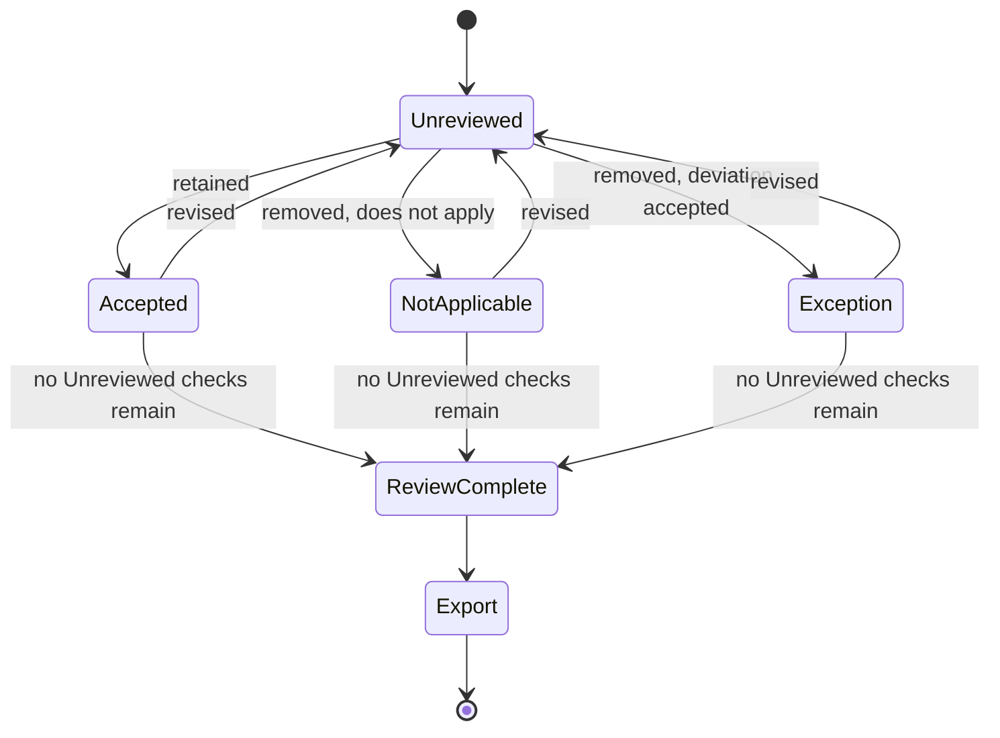
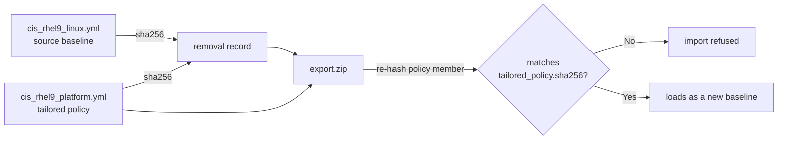

The CIS Red Hat Enterprise Linux 9 policy that ships with [Wazuh](https://wazuh.com/?utm_source=ambassadors&utm_medium=referral&utm_campaign=ambassadors+program) 4.14 contains 159 checks and implements v1.0.0 of the [CIS Red Hat Enterprise Linux 9 Benchmark](https://www.cisecurity.org/benchmark/red_hat_linux). CIS has since published v2.0.0 and v3.0.0, and recommendation numbers move between editions, so the numbers below are v1.0.0's.

On a real server, some of those checks will fail because the environment deliberately departs from the benchmark: a package the build standard requires, a mount option the storage layer will not accept, or a service the application depends on. The fastest way to stop those failures appearing on the dashboard is to open `cis_rhel9_linux.yml` and delete the checks. The scan then passes, the compliance percentage rises, and the policy itself no longer records what was removed or why.

A deleted check can mean that the control genuinely does not apply, that its risk was accepted, or that a different control addresses its objective, and once the check is gone those three decisions look identical. The tailored policy records the configuration change, but the reason it differs from the baseline is a separate decision that also needs a record. [wazuhscatune](https://github.com/zbalkan/wazuhscatune) keeps the two together. It takes a trusted SCA baseline and forces every check to be reviewed as retained, not applicable, or an exception with a justification. It exports the tailored policy together with a record of every departure from the baseline it came from.

It runs locally for one person and never executes an SCA check. A policy it accepts is structurally valid and nothing more. Wazuh decides whether its checks behave correctly on an endpoint, and whether an exception is acceptable remains a decision for whatever process already owns that risk.

The examples in this article use `cis_rhel9_linux.yml` from Wazuh v4.14.8. Wazuh 5.0 is still in [beta](https://documentation.wazuh.com/5.0-beta/index.html), and its transition from 4.x requires deploying a new 5.x environment rather than upgrading the central components in place. I have not tested whether the SCA policy format and this workflow remain compatible with that transition, so the claims here are limited to Wazuh 4.x.
{: .notice--info}

## Hardening as the baseline, exceptions as the record

The principle came before the tool. `sca_guide`, the terminal application this was renamed from, was built on a simple idea: start with a hardening guide, analyse your own requirements, then document the factors that require you to loosen it.

In most environments a loosening guide is more honest than a hand-made hardening guide. Red Hat argues the same inversion from the vendor side in [Exploring security by design and loosening guides](https://www.redhat.com/en/blog/exploring-security-by-design-and-loosening-guides). CISA's [Secure by Design](https://www.cisa.gov/resources-tools/resources/secure-by-design) criteria similarly call for vendors to track and reduce hardening-guide size by moving secure configuration into product defaults.

The inversion also changes the goal. A conformance percentage is not, on its own, an adequate target, because it says nothing about which controls are missing, whether they matter, or whether anyone explicitly decided to omit them. Zero undocumented deviations is reachable because deviations are enumerable, and it is testable because an undocumented one becomes a defect rather than an unexplained shortfall. That makes the register of deviations the real deliverable, and the tailored policy follows from it.

Wazuh's own content supports this better than its documentation suggests. In the RHEL 9 policy shipped with Wazuh v4.14.8, 32 of the 159 implemented checks carry an *impact* field describing what enforcing the control may cost, while all 159 contain compliance mappings:

```yaml
- id: 28000
  title: "Ensure /tmp is a separate partition."
  impact: "By design files saved to /tmp should have no expectation of surviving
    a reboot of the system. […] Running out of /tmp space is a problem regardless
    of what kind of filesystem lies under it, […]"
  compliance:
    - cis: ["1.1.2.1"]
    - nist_sp_800-53: ["CM-7"]
    - pci_dss_v4.0: ["1.2.5", "2.2.4", "6.4.1"]
    # […] further frameworks omitted
```

The *impact* field appears in no table in the [SCA policy documentation](https://documentation.wazuh.com/4.14/user-manual/capabilities/sec-config-assessment/creating-custom-policies.html), which lists fields such as `rationale`, `remediation` and `compliance` but not this one. It is one of the most useful fields during review because it describes the operational cost of enforcing a control at the point where somebody has to decide whether to retain it, so `wazuhscatune` reads it, displays it in the review pane and gives it its own search field.

## Installing and running it

The current release is "0.2.2" and requires Python 3.11 or newer, with Python 3.11 through 3.13 tested on Windows, macOS and Linux. `pipx` keeps its dependencies out of the system environment, and the command starts a server on `127.0.0.1:5000` and opens a browser:

```bash
pipx install wazuhscatune
wazuhscatune
```

The starting point is a baseline you trust. That normally means a copy of a policy from `/var/ossec/ruleset/sca` rather than modifying the installed file in place, since Wazuh states that installations and updates do not preserve the contents of that [directory](https://documentation.wazuh.com/4.14/user-manual/capabilities/sec-config-assessment/how-to-configure.html).

## The review

A check begins unreviewed and must end in one of three decision states before export:



Accepted means the check remains in the tailored policy, while the other two states remove it for different reasons.

Not Applicable means the check has no subject in the target system or role. The decision still needs a justification because applicability is itself a claim, and it should be reconsidered if the system's role, scope, software or platform changes.

Exception means the check applies, but the deviation is intentionally accepted. That may be straightforward risk acceptance, or the justification may point to an alternative control that the organization considers sufficient for the underlying objective. `wazuhscatune` records that decision and leaves any judgement about equivalence to the people reviewing it.

For example, an organization might decide not to use a benchmark-prescribed integrity-monitoring mechanism because another mechanism already covers the objective for its environment. That remains a departure from the benchmark, so the useful record states that the recommendation was deliberately removed and gives the reason, which lets a later reviewer determine whether that reason still holds.

Both removing decisions therefore require a justification. It runs between ten and a thousand characters and must contain at least four distinct letters, with no single character making up more than half of its non-whitespace characters. I added that last rule because people fill a justification field that has no floor with entries such as "aaaa" and "-". It blocks padding, and a weak justification can still be written, but it has to be written as something another person can review.

The server enforces the review requirement as well as the interface. With work outstanding, the approval page redirects back to the review and the export endpoint refuses the request. Export also refuses a policy from which every check has been removed.

A partially reviewed baseline therefore produces no export bundle, and that property gives the record its meaning, because a list of exceptions is only evidence of a complete review if the checks not on the list were also explicitly decided.

The terminal version had no such gate: a walkthrough could be abandoned halfway and still write a file, making its output a record of attention that fell short of a record of review. I moved to a browser interface because reading well over a hundred checks benefits from filtering, searching and a detail pane, and a web application was never the goal.

## What it exports

The export is a ZIP containing three files:

- the tailored SCA policy;
- a machine-readable removal record;
- the same record rendered as Markdown for human review.

The uploaded baseline is never modified. The tailored policy is produced by round-tripping the original YAML and removing the checks that were classified as Exception or Not Applicable, so the surrounding document structure remains suitable for comparison with the baseline.

The record pins the baseline and the tailored policy:

```yaml
baseline:
  name: CIS Red Hat Enterprise Linux 9 Benchmark v1.0.0.
  id: cis_rhel9_linux
  file: cis_rhel9_linux.yml
  sha256: 4f2c…

tailored_policy:
  name: CIS RHEL 9, platform team baseline
  id: cis_rhel9_platform
  file: cis_rhel9_platform.yml
  sha256: 9a37…

generated_by:
  tool: wazuhscatune
  version: 0.2.2

generated_at: '2026-09-29T14:14:22+00:00'

exceptions:
  accepted_risk:
    - check_id: 28000
      title: Ensure /tmp is a separate partition.
      justification: The image ships a single root volume by build standard, and
        repartitioning is not accepted for this fleet.
      compliance:
        - cis: ['1.1.2.1']
        - nist_sp_800-53: ['CM-7']
        - pci_dss_v4.0: ['1.2.5', '2.2.4', '6.4.1']
        # […]

  not_applicable:
    - check_id: 28053
      title: Ensure Avahi Server is not installed.
      justification: This server role does not include Avahi and the build
        standard does not permit the package.
      compliance:
        - cis: ['2.2.2']
        - nist_sp_800-53: ['CM-7']
        - pci_dss_v4.0: ['1.2.5', '2.2.4', '6.4.1']
        # […]
```

The record files Exception decisions under `accepted_risk`, including those whose justification points to an alternative control, so the key name should not be read as a claim that a risk was formally accepted. The compliance mappings are abridged in both examples above.

The two digests cover different files, and only one of them can be checked using the exported ZIP alone:



`baseline.sha256` fingerprints the exact baseline bytes against which the decisions were taken. To recheck that digest later, retain the baseline alongside the tailored policy and its records.

`tailored_policy.sha256` fingerprints the policy contained in the export. When an exported ZIP is uploaded again, `wazuhscatune` compares the policy member with that recorded digest and refuses the import if they do not match.

Neither digest authenticates anything, since someone able to alter both the policy and its record can simply recompute the hash. They are integrity and provenance links between artefacts and carry no signature.

## Deploying the tailored policy

The right home for the exported files depends on internal process, and I would not prescribe one. I keep a directory per agent group in Git, holding the vendored baseline, the tailored policy, both records and the configuration fragment, so the record goes through the same pull-request review as the configuration change.

Git supplies change attribution and timestamps, and pull-request approval can carry governance meaning if the repository process deliberately assigns it that meaning. The `wazuhscatune` record itself claims neither ownership nor approval.

The tailored policy is enabled by path, and the original policy needs to be disabled at the same time:

```xml
<sca>
  <policies>
    <policy enabled="no">ruleset/sca/cis_rhel9_linux.yml</policy>
    <policy>etc/shared/cis_rhel9_platform.yml</policy>
  </policies>
</sca>
```

Both paths are relative to the Wazuh installation directory. Using the wrong path for the shipped policy can therefore leave it enabled while the tailored copy is loaded as well. The agent startup log is the final check, because it shows which policies were loaded or disabled.

Disabling the original is a correctness requirement. Wazuh requires policy and check IDs to be unique across policy files, while the tailored copy deliberately retains the IDs inherited from its baseline, so loading both breaks that requirement, and the documentation does not say what the agent does in that case. The safe deployment invariant is therefore simple: load the tailored policy and explicitly disable the baseline it replaces.

Distributing the file through configuration management or a golden image keeps the SCA policy local to the endpoint and avoids the remote-command question entirely. Enabling `sca.remote_commands` permits `c:` command rules in centrally distributed SCA policies to execute on the endpoint. Wazuh disables that capability by default because it increases what a compromised or misused manager can cause agents to execute.

This matters for the RHEL 9 baseline: 119 of its 159 implemented checks contain at least one command rule, counting negated `not c:` rules. A useful tailored copy distributed through agent groups will therefore normally require remote SCA commands unless all such checks have been removed. Deploying the policy locally through configuration management does not require that setting for manager distribution.

If you enable it, treat the decision in your deployment or risk process as an explicit security change rather than an incidental configuration detail. Kevin Branch discusses the wider implications of Wazuh's remote-command settings in [Don't give your Wazuh manager a master key to every endpoint](https://bluewolfninja.com/2026/06/20/dont-give-your-wazuh-manager-a-master-key-to-every-endpoint/).
{: .notice--warning}

## Limits

Each removed-check record contains the check ID, title, justification and compliance mappings inherited from the baseline, and nothing about ownership, approval or review dates. Adding those fields would imply guarantees the application cannot provide: a local single-user tool can record a review decision, but it cannot establish who is authorized to accept it or enforce when it must be reconsidered. Those belong to the surrounding governance process.

The exported removal-record format currently has no schema-version field, and alpha releases carry no backward-compatibility guarantee for it. Scripts can parse the records, but they should not assume the structure has stabilized before 1.0.0. Internal persisted drafts are versioned separately because recovering application state has different compatibility requirements.

The project remains an alpha. Its tests cover validation, draft persistence, ZIP import and digest checking, the three decision states, deterministic export behavior and the export gate. Real-world SCA policies can still expose assumptions that the supplied test corpus does not.

It also does not execute or emulate SCA. Passing `wazuhscatune` validation does not establish that a rule is valid to the Wazuh SCA engine or that it returns the intended result on an endpoint.

## Reading the result

The SCA pass percentage is a poor number to watch. It can improve simply because failing checks were removed, so it does not explain why the policy was tailored, which controls no longer apply, or what residual risk remains.

The artefact to read is the Markdown record. It separates accepted exceptions from not-applicable checks and shows the title, compliance mappings and justification for each. That file is the loosening guide, written for the people who should not need to open the YAML policy to understand why it differs from its baseline.

To inspect a previous export, upload its ZIP back into `wazuhscatune`. If it contains a removal record with `tailored_policy.sha256`, the tool verifies the policy member against that digest before accepting it. Older exports without that digest remain importable but cannot receive the consistency check.

The tailored policy then becomes a new baseline. Every check that survived the previous tailoring appears in a fresh review, so the process can continue from there.

If a policy has intentionally been edited outside the tool, upload the edited YAML directly, or a ZIP containing only that policy, and treat it as a new baseline rather than pretending it is still the old reviewed bundle.

Full benchmark conformance is not always appropriate for a working estate. Zero undocumented deviations is a different and more useful target: every check in the chosen baseline was either retained or its removal was written down. The register covers that baseline only, so it says nothing about CIS recommendations Wazuh does not implement, and a retained check can still fail on an endpoint. Within that scope, the export gate makes the statement true at the moment of export.

It stops being sufficient when the baseline changes. A new Wazuh policy, a new CIS benchmark revision, or a change in the system's role can invalidate earlier decisions even if the tailored policy itself has not changed, which is why the record fingerprints the baseline: it identifies exactly which starting point the review described.

I am a [Wazuh Ambassador](https://wazuh.com/ambassadors-program/?utm_source=ambassadors&utm_medium=referral&utm_campaign=ambassadors+program). `wazuhscatune` is my own project rather than an official Wazuh utility, and the version of Wazuh that actually evaluates the policy remains the final reference.
{: .notice--info}
