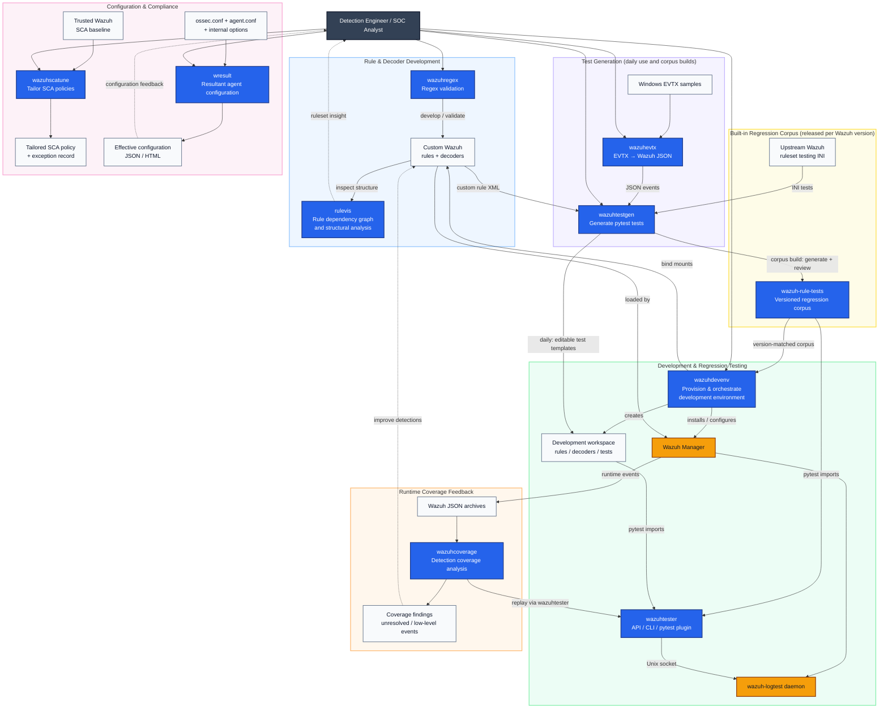

Over time I have published a small tool whenever my Wazuh work hit a gap. [`wazuhevtx`](https://zaferbalkan.com/wazuhevtx/) turned Windows EVTX samples into input for `wazuh-logtest`. [`rulevis`](https://zaferbalkan.com/rulevis/) drew the rule graph that Wazuh keeps in memory. [`wresult`](https://zaferbalkan.com/wresult/) showed the configuration an agent applies after all its files are merged. [`wazuhregex`](https://zaferbalkan.com/wazuhregex/) moved regex checks off the manager. More tools followed, and they now depend on each other. This post introduces them again as one toolkit and walks one rule through all of them.

The walkthrough follows the model from my two articles on reading rules. [Understanding Wazuh rules](https://zaferbalkan.com/wazuh-rules/) described a [Wazuh](https://wazuh.com/?utm_source=ambassadors&utm_medium=referral&utm_campaign=ambassadors+program) 4.x ruleset as a graph. Users build that graph themselves through `if_sid`, `if_group` and their temporal counterparts. [Part II](https://zaferbalkan.com/wazuh-rules-metadata-conditions/) opened one node of the graph and split the rule into metadata, which gives a match its identity and severity, and conditions, which decide whether the match happens. It also divided conditions into atomic and temporal, by the state they need. Part II ended where this post starts. Reading a rule tells you what it should do, while only a test tells you what it does. The conditions define the test input, and the metadata defines the expected outcome.

Everything here targets Wazuh 4.x. As part II notes, Wazuh 5.0 is in beta and [replaces the XML rules with Sigma-based YAML](https://github.com/wazuh/wazuh/blob/main/docs/guide/migration/rules-4x-to-5x.md), so none of this carries over to 5.0 unchanged.

## The toolkit follows the parts of a rule

Each part of the reading model raises a question that the XML cannot answer alone. Each tool answers one of those questions with evidence from the Wazuh component that consumes the artefact. The table pairs them, and the sections after the diagram take them in the order I use them.

| Part of the model | Question the XML cannot answer | Tool | Evidence |
|---|---|---|---|
| Pattern inside `match`, `regex` or `field` | Does the engine that runs it match what I expect? | [`wazuhregex`](https://github.com/zbalkan/wazuhregex) | Per-engine match, spans, captures and validity |
| Relationships in the rule graph | Where does the rule sit, and is the structure sound? | [`rulevis`](https://github.com/zbalkan/rulevis) | Dependency graph, cycles, isolated rules, ID usage |
| Atomic conditions and metadata | Does one event reach the rule and produce the intended ID and level? | [`wazuhtester`](https://github.com/zbalkan/wazuhtester), [`wazuhtestgen`](https://github.com/zbalkan/wazuhtestgen) | pytest assertions against `wazuh-logtest` |
| Temporal conditions | Do enough matches, in one session, within the window, fire the correlation? | `wazuhtester` | Multi-event tests in a single daemon session |
| Built-in parents your rules build on | Does the base ruleset still behave as it did? | [`wazuh-rule-tests`](https://github.com/zbalkan/wazuh-rule-tests) | Version-matched regression corpus |
| Representative telemetry | Does the test input look like what the agent sends? | [`wazuhevtx`](https://github.com/zbalkan/wazuhevtx) | JSON events converted from EVTX |
| All of the above, in one place | Where do these tests run? | [`wazuhdevenv`](https://github.com/zbalkan/wazuhdevenv) | A provisioned manager with workspace bind mounts |
| The deployed ruleset | What did the engine do with real events? | [`wazuhcoverage`](https://github.com/zbalkan/wazuhcoverage) | Classified archive events, findings replayed through logtest, and metrics |
| Collection and agent configuration | Which events can reach the rules at all? | [`wresult`](https://github.com/zbalkan/wresult) | The agent's effective configuration |

The diagram shows how the projects depend on each other. `wazuhtestgen` and `wazuhevtx` serve two paths. Day to day, they turn custom rules and EVTX samples into editable tests in the `wazuhdevenv` workspace, while at release time the same generator turns the upstream INI tests into the regression corpus. Workspace tests and the corpus import the same public client, and `wazuhcoverage` replays its findings through that client too.



I drew the boundaries between the projects by responsibility. The corpus owns expected rule and decoder behaviour, and `wazuhdevenv` owns environment preparation. `wazuhtester` owns the logtest protocol, and `wazuhtestgen` owns test generation, as the [`wazuh-rule-tests` README](https://github.com/zbalkan/wazuh-rule-tests#ownership-boundary) records. Generated tests import the public `wazuhtester` API and nothing from the development environment, so they run wherever `wazuhtester`, pytest and a reachable logtest daemon exist. I made that change after the environment in [Detection-as-Code for Wazuh 4.x: A Practical Implementation Model](https://zaferbalkan.com/wazuh-devenv/) carried its own logtest module. That module tied the test content to one way of provisioning a manager.

## Prepare a development manager

The walkthrough needs a Linux host with a Wazuh manager that you can change freely. `wazuhdevenv` builds that host and the workspace around it. It succeeds the environment from my [earlier Detection-as-Code posts](https://zaferbalkan.com/detection-engineering/).

### Initialise a workspace

`wazuhdevenv init` installs or verifies Wazuh Manager and creates `rules/`, `decoders/` and `tests/` in the workspace. It bind-mounts the workspace rules and decoders into `/var/ossec/etc` and persists the mounts in `/etc/fstab`. It creates a workspace virtual environment with pytest and `wazuhtester`, and it enables JSON archive output. It also adds you to the `wazuh` group, validates the configuration with Wazuh's `-t` checks, and restores the backed-up state if host configuration fails. Finally, it downloads the regression corpus whose version exactly matches the installed manager.

```bash
# Run as your own user. wazuhdevenv calls sudo itself; do not prefix it with sudo.
# init expects a fresh Wazuh installation and refuses to adopt existing custom rules.
pipx install "git+https://github.com/zbalkan/wazuhdevenv.git@main"
mkdir my-wazuh-rules && cd my-wazuh-rules
wazuhdevenv init --wazuh-version 4.14.8
# init fails if no corpus matches the installed version; add --skip-corpus to proceed without one.
# Log out and back in afterwards so your shell picks up the wazuh group.
```

`init` runs once, and a second invocation prints the recorded state and exits instead of repairing anything. `wazuhdevenv update` handles the corpus alone. It verifies the SHA-256 digest and the manifests, rejects unsafe ZIP content, and repoints `current-corpus` atomically. `wazuhdevenv uninstall` removes only what it can attribute to itself and ends with an inventory of what it removed, restored, preserved and left behind.

### Confirm that logtest answers

`wazuhtester` talks to the manager through the `wazuh-logtest` Unix socket. It reads one log per line from stdin, and all lines in one invocation share one daemon session. The sample below comes from Wazuh's own `sshd.ini` regression tests, which expect the `sshd` decoder and rule 5710 at level 5.

```bash
# jq is only used to pick the rule ID out of the NDJSON output.
printf '%s\n' \
  'Jul  3 21:44:07 vmi189193 sshd[26279]: Failed password for invalid user sammy from 82.202.219.155 port 51676 ssh2' |
  .venv/bin/python -m wazuhtester --json | jq -r .rule_id
```

The command prints `5710`. If it fails with a connection error, the socket is not reachable from your shell. The usual cause is a session that started before `init` added you to the `wazuh` group. The socket path defaults to `/var/ossec/queue/sockets/logtest`, and the `WAZUH_LOGTEST_SOCKET` environment variable overrides it.

Each response carries one of four statuses: `RuleMatch`, `NoRule`, `NoDecoder` or `Error`. A valid event that matches no rule is still a successful run of the CLI. Communication and protocol failures exit with status 1 and usage errors with status 2, so the CLI also works inside shell pipelines and scripts.

## Write the rule and check its parts

The example rule builds on 5710. Rule 5710 fires on any login attempt with a non-existent user. I want a higher level when the user name is `admin`, and a correlation when one source repeats that attempt.

### Test the pattern with wazuhregex

Part II lists `match` as `OS_Match` by default and `regex` as `OS_Regex` by default. The three engines Wazuh 4.x uses do not share a language. A pattern checked in a PCRE-based online tester has therefore been checked against the wrong engine, unless the element declares `type="pcre2"`. Wazuh ships its own [`wazuh-regex`](https://documentation.wazuh.com/current/user-manual/reference/tools/wazuh-regex.html) binary under `/var/ossec/bin/`, but it needs a manager for every check. [`wazuhregex`](https://zaferbalkan.com/wazuhregex/) runs the same check locally, against all three engines at once.

```bash
pipx install wazuhregex
printf '%s\n' \
  'Failed password for invalid user admin from 82.202.219.155 port 51676 ssh2' \
  'Failed password for invalid user administrator from 82.202.219.155 port 51676 ssh2' |
  wazuhregex 'invalid user admin from'
```

The output shows matches, spans and captures for each engine side by side. The first line matches and the second does not, which is the point of including ` from` in the pattern. The tool also separates invalid syntax from a valid non-match, which is the first thing to settle when a rule does not fire.

`wazuhregex` is an emulator, and its README documents where it can diverge. It translates `OS_Regex` to PCRE2 for execution. Complex expressions with several `*` or `+` classes may therefore behave differently where PCRE2 backtracks and the native engine does not. Spans on non-ASCII input are character offsets, whereas Wazuh reports byte offsets. Version 0.3.0 is still alpha, so confirm any pattern that matters for security against the manager version you run.

### Add the rules

The first rule is atomic and narrows 5710 with one more `match`. The second is temporal: it counts matches of the first through `if_matched_sid` and requires the same source IP, as the built-in rule 5712 does for 5710.

```bash
cat > rules/local_ssh.xml <<'XML'
<group name="local,sshd,">
  <rule id="100100" level="8">
    <if_sid>5710</if_sid>
    <match>invalid user admin from</match>
    <description>sshd: login attempt with the non-existent user admin</description>
  </rule>

  <rule id="100101" level="12" frequency="4" timeframe="120">
    <if_matched_sid>100100</if_matched_sid>
    <same_source_ip />
    <description>sshd: repeated admin login attempts from one source</description>
  </rule>
</group>
XML

# Validate the ruleset, then restart so live events and new logtest sessions use it.
sudo /var/ossec/bin/wazuh-analysisd -t
sudo systemctl restart wazuh-manager
```

The file lives in the workspace, and the bind mount makes it visible under `/var/ossec/etc/rules`. You keep it in Git like any other source file.

### Inspect the graph with rulevis

Part I showed that `wazuh-analysisd` keeps rules in `RuleNode` structures linked to siblings and children. Part II added that `if_sid`, `if_group` and `if_level` are resolved once, when the ruleset loads. The structure is fixed before the first event arrives, so you can check it without sending one. [`rulevis`](https://zaferbalkan.com/rulevis/) parses the rule directories, builds the graph with `networkx`, and opens an interactive view in the browser.

```bash
pipx install rulevis
# Built-in rules need read access through the wazuh group; workspace rules are your own files.
rulevis --path /var/ossec/ruleset/rules,rules
```

Search for 100100 and it appears as a child of 5710. The statistics panel lists the rules with the most children, the most descendants and the most complex dependencies, together with isolated rules and cycles. Part I's footnote describes why cycles matter: a rule that refers to itself creates a cycle that the linked Wazuh issue associates with out-of-memory conditions. The heatmap of the rule ID space shows which ranges are free for custom rules.

`rulevis` omits `if_level` because no built-in rule uses it. Part II lists `if_level` among the load-time attachments, though, so a custom ruleset that relies on it will show fewer edges than the engine builds. For a production ruleset, follow part I's advice and run it locally against downloaded copies of the rule directories, since analysis takes longer as the custom ruleset grows.

## Turn conditions into tests

Part II reduced a test to two sides. The input side covers which events, how many, within what window and sharing which key. The assertion side covers the rule ID, level, description and groups. Part II also warned that checking only whether something fired leaves the outcome untested. An ancestor in a chain can fire while the intended child does not.

### Generate templates with wazuhtestgen

`wazuhtestgen` writes pytest modules. It has three modes, for Wazuh's INI regression tests, for rule XML and for EVTX files. The rule mode writes one skipped template per rule. Each template carries the rule ID from the XML and a placeholder log, because the XML says what would match but not which log you intend to match. The engineer supplies the log, reviews the expectations and removes the skip marker.

```bash
pipx install wazuhtestgen
wazuhtestgen rule --input_dir rules --output_dir tests/generated
```

The generator never invents a matching log, an expected detection or an ATT&CK technique. An invented expectation would turn a template into false evidence. INI and rule generation run on any operating system. The INI mode is the one that built the regression corpus from Wazuh's upstream tests, and `wazuhtestgen ini --input_dir INPUT_DIR --output_dir OUTPUT_DIR` converts any directory of INI files in the same format.

### Write the atomic and temporal tests

The templates are a starting point, and the finished tests for the example rules look like this. Each test builds its input from the rule's conditions and asserts its metadata.

```python
# tests/test_local_ssh.py
import pytest

from wazuhtester import LogtestStatus, send_log, send_multiple_logs

pytestmark = pytest.mark.wazuh_logtest

ADMIN_ATTEMPT = (
    "Jul  3 21:44:07 vmi189193 sshd[26279]: "
    "Failed password for invalid user admin from 82.202.219.155 port 51676 ssh2"
)


def test_admin_attempt_is_classified():
    response = send_log(ADMIN_ATTEMPT)
    assert response.status is LogtestStatus.RuleMatch
    assert response.decoder == "sshd"
    assert response.rule_id == "100100"
    assert response.rule_level == 8


def test_repeated_admin_attempts_from_one_source_correlate():
    responses = send_multiple_logs([ADMIN_ATTEMPT] * 6)
    fired = next((r for r in responses if r.rule_id == "100101"), None)
    assert fired is not None
    # A direct comparison, so `wazuhdevenv coverage` counts rule 100101 as tested.
    assert fired.rule_id == "100101"


def test_admin_attempts_from_different_sources_do_not_correlate():
    logs = [
        ADMIN_ATTEMPT.replace("82.202.219.155", f"198.51.100.{i}")
        for i in range(1, 7)
    ]
    responses = send_multiple_logs(logs)
    assert all(r.rule_id != "100101" for r in responses)
```

The session model is where part II's atomic and temporal split matters. `send_log()` creates a session for one event and removes it afterwards, which suits an atomic rule. A temporal rule keeps its history inside the daemon session, so `send_multiple_logs()` sends the whole sequence in one session. The same six events sent through six sessions would test six atomic matches and no correlation. The temporal tests send more events than the frequency and look for the correlation anywhere in the responses, which keeps them independent of the exact event on which the counter fires. The third test changes the one condition that `<same_source_ip />` constrains, and expects no correlation.

### Run your tests with the built-in corpus

Most custom rules hang from built-in parents, as 100100 hangs from 5710. A change in a parent between Wazuh versions changes which events reach every child. The [4.14.8 release](https://documentation.wazuh.com/current/release-notes/release-4-14-8.html) is an example. It fixed the Fortigate and FortiAuth decoders, which changes the fields available to every rule below them. It also replaced ATT&CK tactic IDs with technique IDs in the Microsoft Graph rules, which changes metadata without touching a single condition. A custom rule below either change can behave differently after an upgrade, even though its own XML is unchanged.

`wazuh-rule-tests` is the regression corpus for that base. It holds Wazuh's upstream INI tests, converted by `wazuhtestgen` and corrected by hand where generated expectations disagreed with actual Wazuh behaviour. The inventory records 107 upstream INI files, of which 94 became rule-test modules and 13 are documented exclusions. Each release names the Wazuh version it passes on, and corpora exist for 4.14.7 and 4.14.8. The release workflow installs that Wazuh version and runs the extracted archive against `wazuh-logtest` before it publishes anything.

Each release also pins its provenance to an immutable upstream commit and the exact generator commit, recorded independently of the version. The 4.14.8 corpus, for example, draws its INI files from the 4.14.10 development line and passes on a 4.14.8 manager. The version names the manager the tests pass on, and the commit names where the test content came from. Run both suites together, so a failure in a built-in parent shows up next to the custom rule it affects.

```bash
.venv/bin/python -m pytest \
  tests \
  "${WAZUHDEVENV_HOME:-$HOME/.wazuhdevenv}/current-corpus/tests" \
  --wazuh-require-logtest
```

`--wazuh-require-logtest` comes from the pytest plugin that `wazuhtester` registers. Without the flag, tests marked `wazuh_logtest` are skipped when the daemon is unreachable. With it, an unreachable daemon fails the session, which is what CI needs.

### Check which rules have tests

`wazuhdevenv coverage` counts which custom rule IDs in `rules/` appear in test assertions. It reads the files statically and recognises direct comparisons, such as `assert response.rule_id == "100100"`, along with a few other common forms.

```bash
wazuhdevenv coverage
```

The report lists the uncovered rule IDs, and its percentage measures how much of the metadata side has been asserted. It says nothing about real traffic, which is the job of `wazuhcoverage` further down, and the two numbers answer different questions.

## Bring in Windows samples

Test input has to resemble what the agent sends, which for Windows means EventChannel records. [`wazuhevtx`](https://zaferbalkan.com/wazuhevtx/) converts EVTX files into the JSON form a 4.x agent produces. Attack samples such as [EVTX-ATTACK-SAMPLES](https://github.com/sbousseaden/EVTX-ATTACK-SAMPLES) then become usable test input, and [log replay](https://zaferbalkan.com/log-replay/) covers the wider behavioural case.

### Convert and generate on Windows

`wazuhevtx` depends on `win32evtlog`, so it runs on Windows only, and `wazuhtestgen` pulls it in automatically there. The EVTX mode writes one skipped scenario test per file, containing the converted events. You add the assertions, because the generator does not guess which detections a sample should produce.

```powershell
# On a Windows host. Copy the generated modules into the workspace's tests/ directory afterwards.
pipx install wazuhtestgen
wazuhtestgen evtx --input_dir .\samples --output_dir .\generated

# Optional: inspect the converted events of one file directly.
pipx install wazuhevtx
wazuhevtx .\samples\sample.evtx -o .\sample.json
```

On Linux or macOS, the `evtx` command stops before touching the filesystem and prints an error that names the Windows requirement, while `ini` and `rule` keep working. Formatted messages also depend on the provider being installed on the converting host. When it is missing, the converter omits `win.system.message`, as Wazuh does, so a rule that matches on the message will not fire on that sample.

### Know what the JSON form proves

The JSON form has a consequence for part II's own example, where rule 60011 attaches to the Windows base rule 60000 through `if_sid`. Testing converted events requires rule 60000 to decode as JSON instead of through the `windows_eventchannel` decoder. `wazuhdevenv` applies that change during provisioning. Tests in that environment therefore cover everything below rule 60000 for JSON-shaped events. The production path through the EventChannel decoder into rule 60000 stays outside what they prove.

## Measure what the manager did with real events

Tests prove behaviour for the inputs I chose. `wazuhcoverage` looks at the events the manager received. It reads `archives.json` and `archives.json.gz` from [JSON archiving](https://documentation.wazuh.com/current/user-manual/manager/event-logging.html#archiving-event-logs) without modifying them. `wazuhdevenv` enables that output, and a production manager needs it enabled too.

```bash
pipx install wazuhcoverage
# Needs read access to the archives and to the logtest socket: root, or the wazuh group.
wazuhcoverage --html report.html "/var/ossec/logs/archives/2026/**/*.json.gz"

# An archive from another manager can be streamed in.
# Replay then runs against the local manager's ruleset.
ssh manager "cat /var/ossec/logs/archives/2026/Sep/ossec-archive-18.json.gz" | wazuhcoverage
```

Every parsed event lands in one outcome: a rule matched and alerted at or above the threshold, a rule matched without an alert at level 0 or below the threshold, the event decoded and no rule matched, no decoder parsed it, or the evidence is incomplete and the event stays unverified. The threshold comes from `<alerts><log_alert_level>` in `ossec.conf` when that file is available. Otherwise the tool assumes Wazuh's default of 3, and the report states which source it used. Part II noted that `level` has operational consequences elsewhere in Wazuh. The below-threshold outcome is where they show, since those events matched a rule and produced no alert.

An archive record without a rule does not prove that no rule was evaluated. A level-0 match and an uncovered event can leave the same trace. `wazuhcoverage` therefore replays one representative event per finding through `wazuh-logtest`, using `wazuhtester` as the client. Replay is required, so if the socket cannot be used, the CLI reports the reason and exits with status 3. That requirement is also why the package runs on Linux only, like `wazuhtester`.

Findings group events so that the report stays readable. Below-threshold events group by rule ID. Undecoded and unmatched events group by log type and a mined message template, except Windows EventChannel records, which group by channel, provider and event ID. Each finding keeps one real source log for replay. Every metric keeps its numerator and denominator, and the report marks replay-dependent metrics as unavailable when evidence is incomplete. It does not fold them into a composite score. For automation, `wazuhcoverage --json` emits the same metrics, one JSON object per archive when you pass several.

Every figure has limits. Replay reflects the manager and ruleset you query now, which may differ from those that wrote the archive. A single representative event cannot reproduce a temporal rule, which by part II's definition needs retained history. EventChannel findings replay only on a manager whose rule 60000 decodes JSON, so on a production manager they stay unverified. The metrics also start at the archive. Events that were never collected sit outside them, which is the blindness I wrote about in [The silence that reads as safety](https://zaferbalkan.com/silence/).

## Check the agent side

A rule's conditions can only match events the agent collects. The last two tools run on the agent side of that boundary.

### See the effective agent configuration with wresult

The agent's collection settings come from three places: the local `ossec.conf`, the `agent.conf` from the manager, applied in sequence with [conditional options](https://documentation.wazuh.com/current/user-manual/reference/centralized-configuration.html#options) deciding which blocks apply, and `local_internal_options.conf`, which overrides internal defaults. [`wresult`](https://zaferbalkan.com/wresult/) reconstructs the resulting configuration, in the way `gpresult` shows the resultant set of policy on Windows. It supports Windows and Linux agents and needs root or Administrator rights to read the files.

```bash
# On a Linux agent. pipx does not work well with sudo, so install and run as root.
sudo -i
pipx install wresult
wresult | jq .
wresult --output report.html
```

The JSON output suits automation, and the HTML report suits a review. Conditions such as `location` depend on how the agent labels its sources. The effective `localfile` entries show which sources exist before you write a rule against them.

### Tailor SCA baselines with wazuhscatune

The same separation between a declared artefact and a reviewed outcome applies to Security Configuration Assessment. [`wazuhscatune`](https://github.com/zbalkan/wazuhscatune) is a local, single-user application. It opens a browser interface on `http://127.0.0.1:5000` and needs Python 3.11 or newer.

```bash
pipx install wazuhscatune
wazuhscatune
```

Upload a trusted Wazuh SCA policy, then mark every check. Accepted checks stay in the tailored policy, while Exception and Not Applicable both remove a check and need a justification. Export stays blocked until no check is left unreviewed, and at least one check must remain. The export is a ZIP with the tailored policy, a machine-readable removal record, and a human-readable report with the baseline's compliance mappings. The uploaded baseline is never modified. The application validates structure only and does not execute checks or emulate the SCA engine.

I treat full hardening as the baseline and every deviation as a documented decision. Zero undocumented deviations is then the reachable goal, in place of a conformance percentage.

## What's the value, and what's the catch

The value is a piece of evidence for each part of a rule, and you can attach each piece to a change. A pattern has a result from the engine that runs it. A rule has a reviewed place in the graph. Its conditions become test input and its metadata becomes assertions, its built-in parents have a regression run, and its behaviour on real traffic has an archive measurement. None of it replaces reading the rule, because part II's model still tells you which test to write.

The catch starts with operating systems. `wazuhevtx` and the EVTX mode of `wazuhtestgen` need Windows. Every tool that talks to the logtest daemon (`wazuhtester`, `wazuhdevenv`, the corpus and `wazuhcoverage`) needs Linux, because the socket exists only where the manager runs. An EVTX-to-test pipeline therefore spans Windows and Linux, either as two machines or as one Windows host running a Linux distribution under WSL.

The rule 60000 change means the development environment proves the Windows chain for JSON input only. The corpus is exact-version, so every Wazuh patch release waits for a matching corpus before `wazuhdevenv` will select it. Until then, a manager upgraded ahead of that release needs `--skip-corpus` and runs without a built-in regression suite. Maturity also varies across the set.

| Tool | Version | Distribution | OS support |
|---|---|---|---|
| `wazuhregex` | 0.3.0 (alpha) | PyPI | Windows, macOS, Linux |
| `rulevis` | 1.0.5 | PyPI | Windows, macOS, Linux |
| `wazuhevtx` | 1.2.0 | PyPI | Windows |
| `wazuhtester` | 0.1.1 | PyPI | Linux |
| `wazuhtestgen` | 0.4.1 | PyPI | Windows, macOS, Linux; EVTX mode on Windows only |
| `wazuh-rule-tests` | 4.14.7, 4.14.8 | GitHub releases | Linux, with a running manager |
| `wazuhdevenv` | 0.4.0.dev0 | Git `main` | Linux (APT, DNF or YUM) |
| `wazuhcoverage` | 0.10.0 | PyPI | Linux |
| `wresult` | 1.1.2 | PyPI | Windows, Linux |
| `wazuhscatune` | 0.2.2 | PyPI | Windows, macOS, Linux |

The whole set is bound to Wazuh 4.x. With 5.0 moving to Sigma-based YAML rules and a different engine, the rule graph, the XML keywords and the logtest behaviour these tools model will change. I have made no commitment to follow. These are independent projects maintained by one person, and none of them is an official Wazuh product. `wazuhregex` states the policy I apply across them. Issues are welcome and unsolicited pull requests are not accepted. There is no commitment to support, response times, fixes or continued maintenance.

The criterion I apply before promoting a rule follows the model from the earlier articles. I should be able to point to four things: a pattern result from the engine the rule uses, a review of where the rule sits in the graph, a test whose input reproduces the conditions and whose assertion names the intended rule ID and level, and, once the rule is deployed, the archive's account of what it did. For a temporal rule, the test input arrives in one session with the correlation keys preserved. A missing item marks the part of the rule I have read but not yet proved.

I am a [Wazuh Ambassador](https://wazuh.com/ambassadors-program/?utm_source=ambassadors&utm_medium=referral&utm_campaign=ambassadors+program). These tools and this article are my own work rather than official Wazuh material. The version of Wazuh that runs the rule remains the final reference.
{: .notice--info}
